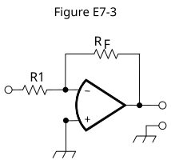

### Section 3.3: Operational Amplifiers

A very large amplifier gain sounds useful until a tiny input error drives the output to its limit. An operational amplifier makes that large gain useful by applying negative feedback. External components then set a predictable gain or filter response.

#### Amplifying a Difference

An *operational amplifier*, or *op-amp*, has two inputs. A positive change at the non-inverting (+) input drives the output positive. A positive change at the inverting (−) input drives the output negative. *The amplifier responds to the voltage difference between those inputs.*

> **Key Information:** An operational amplifier is a high-gain, direct-coupled differential amplifier with very high input impedance and very low output impedance.   

*Direct-coupled* means its internal signal path can amplify DC as well as changing signals. *Differential* means it amplifies a difference. High input impedance draws little current from the signal source; low output impedance allows the output to hold its voltage while supplying load current within its rating.

An ideal op-amp is a mathematical model without real-world limits. *Its gain does not fall as frequency rises.*

> **Key Information:** The gain of an ideal operational amplifier does not vary with frequency. 

Real op-amps do have limits. With no external feedback, their *open-loop gain* falls at higher frequencies. The usable gain of a feedback circuit must fit within that response.

> **Key Information:** The op-amp gain-bandwidth value in the exam is the frequency at which open-loop gain equals one. 

*This is the unity-gain frequency: unity means a gain of one.* For many common op-amps, gain multiplied by bandwidth is approximately constant over much of the useful range. Ask the circuit for more gain and it can keep up over a smaller range of frequencies. The exact relationship depends on the device and its feedback circuit.

Tiny internal mismatches create another departure from the ideal model. Even when both inputs have the same voltage, the output may tend toward one direction. *A small differential correction would be needed to bring it to zero.*

> **Key Information:** Input offset voltage is the differential input voltage needed to bring the open-loop output voltage to zero. 

Offset matters most when the desired DC signal is itself small. If you are trying to measure a millivolt, an input error of a millivolt is no small detail. Offset describes the amplifier's own imbalance, not the normal signal being amplified.

#### The Inverting Circuit

Figure E7-3 connects the non-inverting input to ground. R1 carries the input signal to the inverting input, and $R_F$ returns the output to that same point.

{.img-centered .img-xlarge .img-bw caption="Figure E7-3: Negative feedback sets the inverting gain."}

If the inverting-input voltage rises above zero, the op-amp drives its output negative. Through $R_F$, that pulls the inverting input back toward zero. While the amplifier is operating linearly, negative feedback holds that input nearly at the grounded input's voltage. We call this a *virtual ground*: the voltage is near ground, but it is not a physical ground connection that can absorb arbitrary current.

Very little current enters the op-amp input. Current arriving through R1 must therefore leave through $R_F$. Because one end of R1 is near zero, its current is approximately $V_{\mathrm{in}}/R_1$. The output must create an equal current through $R_F$ in the opposite direction, giving

$$A_v=\frac{V_{\mathrm{out}}}{V_{\mathrm{in}}}=-\frac{R_F}{R_1}.$$

The minus sign means inversion. If asked for *absolute gain*, report only the positive magnitude. Before dividing, put both resistors in the same units. Otherwise a kilohm-to-ohm mismatch can make your answer a thousand times too small or too large.

| R1 | $R_F$ | Calculation | Absolute gain |
| --- | --- | --- | --- |
| 10 Ω | 470 Ω | $470/10$ | *47* |
| 1800 Ω | 68 kΩ = 68,000 Ω | $68{,}000/1800=37.78$ | *About 38* |
| 3300 Ω | 47 kΩ = 47,000 Ω | $47{,}000/3300=14.24$ | *About 14* |
{.table-scroll}

> **Key Information:** For Figure E7-3:
> - R1 = 10 ohms and $R_F$ = 470 ohms give a gain magnitude of 47. 
> - R1 = 1800 ohms and $R_F$ = 68 kilohms give an absolute gain of about 38. 
> - R1 = 3300 ohms and $R_F$ = 47 kilohms give an absolute gain of about 14. 

To find output voltage, retain the sign. With R1 = 1000 Ω and $R_F$ = 10,000 Ω, gain is −10. *Applying +0.23 V gives $V_{\mathrm{out}}=-10(0.23\ \mathrm{V})=-2.3\ \mathrm{V}$.*

> **Key Information:** With those resistor values and a +0.23 V DC input, Figure E7-3 produces −2.3 V. 

These calculations assume suitable power supplies and operation within the op-amp's voltage, current, and frequency limits. The supply connections are omitted from the simplified figure.

#### Frequency-Dependent Feedback

Place a capacitor across $R_F$. At low frequencies it has high reactance, leaving the resistor to set gain. At higher frequencies its reactance falls and the effective feedback impedance decreases. Since gain magnitude depends on feedback impedance divided by R1, gain falls with frequency.

> **Key Information:** Adding a capacitor across the feedback resistor in Figure E7-3 makes a low-pass filter. 

More elaborate op-amp filters can have sharp resonances. A sudden input can start a fading oscillation called *ringing*: a brief click may leave a short tone behind it. Excessive Q makes that response linger. Gain also matters because internal phase shifts can turn intended negative feedback into reinforcement and make the filter unstable.

> **Key Information:** Restricting both gain and Q prevents unwanted ringing and audio instability in an op-amp audio filter. 

A sharp filter on paper is useful only if the op-amp can keep up with it. Choose gain, Q, and frequency together, then check the device's limits.
