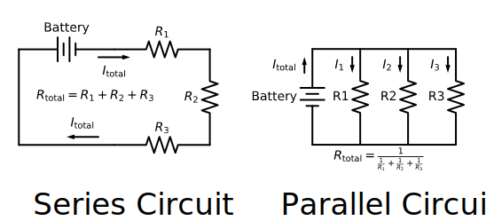

### Section 1.1: Series and Parallel Circuits

Did you ever use those old Christmas lights where one burned-out bulb killed the whole string? That's an example of a series circuit—components connected end-to-end in a single path. Now think about the outlets in your home: unplug the lamp and your radio keeps playing. That's a parallel circuit—each device has its own path to power.

These two arrangements determine how every circuit behaves. Parallel capacitors add together for more filtering, but series capacitors actually decrease in total value. Understanding why components combine differently in series versus parallel unlocks every circuit in your station, from filters to antenna matching networks.

#### Understanding Current and Voltage in Series and Parallel Circuits





We can visualize electricity like water flowing through pipes. Let's take a look:

##### Series Circuits:

In series circuits, imagine garden hoses connected end-to-end: every drop must flow through each section in sequence. Every bit of current that goes in one end has to pass through every part of the hose (circuit), so current stays the same everywhere. The pressure (voltage) will be the highest at the source, decreasing slightly as it travels through the hose and dropping more abruptly at each connection or joint.

* **One Path:** Components connected end-to-end in a single loop—current must flow through each in turn.
* **Same Current Everywhere:** Like our garden hose example, the same current flows through every component.
* **Voltage Divides:** Total voltage splits among components. Each creates a voltage drop; all drops sum to source voltage.
* **Ohm's Law:** Since current is constant, voltage drop depends on resistance: $E = I \times R$. Higher resistance = larger voltage drop.
* **Failure Modes:** Open component (burned bulb) = circuit dead. Shorted component = bypassed, more current flows through remaining parts.

##### Parallel Circuits:

With a parallel circuit it's more like your home's plumbing, where the main line branches to different rooms. Each branch gets the full house pressure (same voltage), but only some of the current flows to each part of the house (current divides). Close one valve and the others keep flowing.

* **Multiple Paths:** Components connected side-by-side—current can flow through any branch.
* **Same Voltage Everywhere:** Like home plumbing, each branch gets full source voltage.
* **Current Divides:** Total current splits among branches based on resistance. Branch currents sum to total current.

> **Key Information:** In a circuit of parallel resistors, the total current equals the sum of the currents through each branch. 

* **Ohm's Law:** Since voltage is constant, current through each branch depends on its resistance: $I = \frac{E}{R}$. Lower resistance = more current.
* **Independent Operation:** One branch fails, others continue—like your home outlets working independently.

#### How Different Components Combine

Now that we understand current and voltage behavior, let's see how components combine. Each type follows patterns that actually make sense once you know their physical properties. We'll cover this in more detail below, but here is the short version:


| Component | Series Connection | Parallel Connection |
|-----------|------------------|---------------------|
| Resistors | Direct Sum:  $$R_{total} = R_1 + R_2 + R_3 + \ldots$$ | Reciprocal Method:  $$\frac{1}{R_{total}} = \frac{1}{R_1} + \frac{1}{R_2} + \frac{1}{R_3} + \ldots$$|
| Capacitors | Reciprocal Method:  $$\frac{1}{C_{total}} = \frac{1}{C_1} + \frac{1}{C_2} + \frac{1}{C_3} + \ldots$$| Direct Sum:  $$C_{total} = C_1 + C_2 + C_3 + \ldots$$ |
| Inductors | Direct Sum:  $$L_{total} = L_1 + L_2 + L_3 + \ldots$$ | Reciprocal Method:  $$\frac{1}{L_{total}} = \frac{1}{L_1} + \frac{1}{L_2} + \frac{1}{L_3} + \ldots$$|


**Memory tip:** Resistors and inductors follow the same rules (add in series, reciprocal in parallel) because both create opposition that increases with more components. Capacitors flip the pattern—they add in parallel because parallel plates mean more storage area. Now let's explore each type with practical examples.

#### Resistors in Combination

> **Key Information:** When resistors are in series, their values add. When resistors are in parallel, the total resistance is always less than the smallest resistor in the group.

##### **Resistors in Series (Direct Sum Method):**
When resistors are connected end-to-end, their values simply add:

$$ R_\text{total} = R_1 + R_2 + R_3 + \ldots $$

Think of it like adding garden hose sections—more length means more resistance.

##### **Resistors in Parallel (Reciprocal Method):**
When resistors provide multiple paths for current, the calculation is:

For just two resistors, we can simplify to:

$$R_{\text{total}} = \frac{R_1 \cdot R_2}{R_1 + R_2}$$

Let's look at some problem you could encounter on your exam:

What is the total resistance of a 10-ohm, a 20-ohm, and a 50-ohm resistor connected in parallel? 

$$\begin{align*}
\frac{1}{R_{\text{total}}} &= \frac{1}{10} + \frac{1}{20} + \frac{1}{50} \\[1.25em]
&= 0.10 + 0.05 + 0.02 \\[1.25em]
&= 0.17 \\[1.25em]
R_{\text{total}} &= \frac{1}{0.17} \approx 5.9 \text{ ohms}
\end{align*}$$

Notice how 5.9 Ω is less than our smallest resistor (10 Ω)? This is ALWAYS true for parallel resistors—a great way to check your work!

For a simpler example:

What is the approximate total resistance of a 100-ohm and a 200-ohm resistor in parallel? 

$$\begin{align*}
R_{\text{total}} &= \frac{R_1 \cdot R_2}{R_1 + R_2} \\[1.25em]
&= \frac{100 \cdot 200}{100 + 200} \\[1.25em]
&= \frac{20,000}{300} \\[1.25em]
&= 66.7 \text{ ohms} \approx 67 \text{ ohms}
\end{align*}$$

#### Capacitors in Combination

Remember, a capacitor is just two conductors (usually metal plates) separated by an insulator (the dielectric). The capacitance depends on plate area—bigger plates can store more charge. When you connect capacitors in parallel, you're essentially combining their plate areas into one larger capacitor. In series, you're increasing the separation between the outermost plates. This physical reality explains why capacitors combine opposite to resistors—it's all about that plate area!

> **Key Information:** To increase the total capacitance in a circuit, add a capacitor in parallel. 

##### **Capacitors in Parallel (Direct Sum Method):**
When capacitors are connected in parallel, their values add:

$$ C_\text{total} = C_1 + C_2 + C_3 + \ldots $$

Think of parallel capacitors like joining storage tanks—you get more total capacity.

##### **Capacitors in Series (Reciprocal Method):**
For capacitors in series, we use:

$$\frac{1}{C_{total}} = \frac{1}{C_1} + \frac{1}{C_2} + \frac{1}{C_3} + \ldots$$

For two capacitors, we can simplify to:

$$C_{\text{total}} = \frac{C_1 \cdot C_2}{C_1 + C_2}$$

Series capacitors are like increasing the distance between plates—that's why total capacitance goes down.

What is the equivalent capacitance of two 5.0-nanofarad capacitors and one 750-picofarad capacitor connected in parallel? 

Since capacitors in parallel add directly, we just need to convert to the same unit (750 pF = 0.75 nF) and add:

$$\begin{align*}
C_{\text{total}} &= 5.0 \text{ nF} + 5.0 \text{ nF} + 0.75 \text{ nF} \\[1.25em]
&= 10.75 \text{ nF}
\end{align*}$$

What is the capacitance of three 100-microfarad capacitors connected in series? 

$$\begin{align*}
\frac{1}{C_{\text{total}}} &= \frac{1}{100} + \frac{1}{100} + \frac{1}{100} \\[1.25em]
&= \frac{3}{100} \\[1.25em]
C_{\text{total}} &= \frac{100}{3}\\[1.25em]
&\approx 33.33 \text{ μF}
\end{align*}$$

Another common example:

What is the capacitance of a 20-microfarad capacitor connected in series with a 50-microfarad capacitor? 

$$\begin{align*}
C_{\text{total}} &= \frac{C_1 \cdot C_2}{C_1 + C_2} \\[1.25em]
&= \frac{20 \cdot 50}{20 + 50} \\[1.25em]
&= \frac{1000}{70} \\[1.25em]
&= 14.3 \text{ μF}
\end{align*}$$

#### Inductors in Combination

Inductors store energy in magnetic fields and follow rules similar to resistors.

> **Key Information:** To increase the total inductance in a circuit, add an inductor in series. 

##### **Inductors in Series (Direct Sum Method):**
When inductors are connected in series (and are not magnetically coupled), their values add:

$$ L_\text{total} = L_1 + L_2 + L_3 + \ldots $$

##### **Inductors in Parallel (Reciprocal Method):**
For inductors in parallel (assuming no magnetic coupling), we use:

$$\frac{1}{L_{total}} = \frac{1}{L_1} + \frac{1}{L_2} + \frac{1}{L_3} + \ldots$$

Note: These formulas assume the inductors are physically separated so their magnetic fields don't interact. When inductors do couple magnetically (like in transformers), different principles apply—you'll see this concept in action in Section 1.4.

What is the inductance of a circuit with a 20-mH inductor connected in series with a 50-mH inductor? 

$$\begin{align*}
L_{\text{total}} &= 20 \text{ mH} + 50 \text{ mH} \\
&= 70 \text{ mH}
\end{align*}$$

What is the inductance of three 10-mH inductors connected in parallel? 

$$\begin{align*}
\frac{1}{L_{\text{total}}} &= \frac{1}{10} + \frac{1}{10} + \frac{1}{10} \\[1.25em]
&= \frac{3}{10} \\[1.25em]
L_{\text{total}} &= \frac{10}{3} = 3.33 \text{ mH} \approx 3.3 \text{ mH}
\end{align*}$$

#### Connecting to Real Amateur Radio Applications

These calculations aren't just exam prep—they're tools that help you understand what your equipment is doing. Here are a few examples of where you'll see these principles in action:

1. **Resonant Circuits**: Variable capacitors parallel with inductors tune to specific frequencies
2. **Impedance Matching**: Antenna tuners combine series L and parallel C to match 50Ω
3. **Filtering**: Low-pass filters use series L (blocks highs) and parallel C (bypasses highs)
4. **Power Distribution**: Series divides power by resistance ($P = I^2R$); parallel draws independently ($P = E^2/R$)

#### Your Foundation Is Set

You've built a solid foundation! Series and parallel combinations are the backbone of every circuit you'll encounter. You can predict how current divides in parallel branches and how voltage divides across series components. You know why parallel resistors always give you less resistance than the smallest one in the group.

But here's the plot twist: we've been assuming your components have fixed values. In reality, when we add alternating current and changing frequencies, capacitors and inductors transform. They develop a special kind of opposition that changes with frequency—opening new possibilities for filtering, tuning, and matching. Let's unlock these frequency-dependent superpowers!
