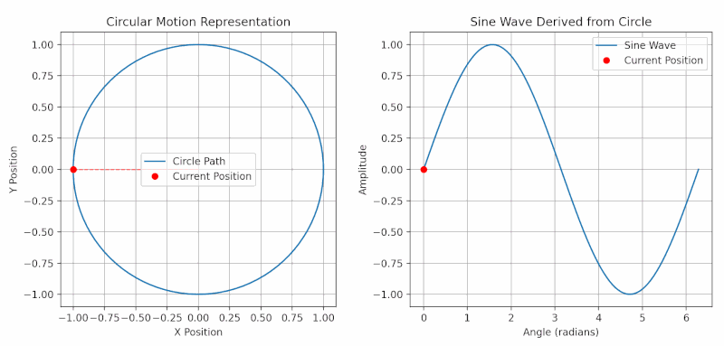

### Section 1.2: Reactance and Impedance

Radio signals are alternating currents that change direction millions of times per second, making radio circuits behave very differently from DC circuits. As a new General class operator, you'll encounter these concepts frequently—when tuning antennas, dealing with feed line effects, and understanding why your equipment performs differently across various bands.

In this section, we'll explore how capacitors and inductors create frequency-dependent effects that form the foundation of radio circuit design.

#### Why AC Circuits Are Different: The Phase Concept

Before diving into reactance, let's understand phase—a concept central to AC circuit behavior.

Imagine a spinning wheel. As the wheel turns, a point on its edge moves in a circle, completing a full rotation. Each rotation is a "cycle."

* **Phase** tells us where a point is in its rotation, measured in degrees (a full circle is 360°).
* In AC circuits, voltage and current follow sine wave patterns.
* If voltage and current rise and fall together, they are "in phase."
* When current peaks at a different time than voltage, they are "out of phase."

This phase relationship becomes crucial when we examine how components behave in AC circuits.

#### Reactance: Opposition Beyond Resistance

> **Key Information:** *Reactance is opposition to the flow of alternating current caused by capacitance or inductance.* 

Unlike resistance, which simply converts electrical energy to heat, reactance temporarily stores energy and then returns it to the circuit. This energy storage creates a phase shift between voltage and current.

Reactance is measured in ohms (Ω) just like resistance and is represented by the letter **X**.  There are two types, each with unique behaviors:

##### Inductive Reactance

> **Key Information:** *Inductive reactance is opposition to the flow of alternating current in an inductor.* 

Inductors resist changes in current by generating a magnetic field. This creates a phase shift where current lags 90° behind voltage.

An inductor's reactance depends on frequency:

> **Key Information:** *As the frequency of applied AC increases, inductive reactance increases.* 

Think of an inductor as increasingly "stubborn" about changing current flow as frequency rises. This makes inductors useful as RF chokes that block high frequencies while passing DC and low frequencies.

The formula for inductive reactance is:

$$X_L = 2\pi fL$$

Where:
- $X_L$ is inductive reactance in ohms (Ω)
- $f$ is frequency in hertz (Hz)
- $L$ is inductance in henrys (H)

**Practical Application:** When you see an RF choke in an antenna feed line or a ferrite bead on a computer cable, you're seeing inductive reactance at work—blocking RF signals while allowing desired currents to pass.

##### Capacitive Reactance

> **Key Information:** *Capacitive reactance is opposition to the flow of alternating current in a capacitor.* 

Capacitors store electrical charge, creating a phase shift where current leads voltage by 90°.

A capacitor's reactance also depends on frequency, but in the opposite way:

> **Key Information:** *As the frequency of applied AC increases, capacitive reactance decreases.* 

Capacitors become more "willing" to pass current as frequency rises. This makes them excellent as bypass capacitors that provide an easy path for RF signals while blocking DC.

The formula for capacitive reactance is:

$$X_C = \frac{1}{2\pi fC}$$

Where:
- $X_C$ is capacitive reactance in ohms (Ω)
- $f$ is frequency in hertz (Hz)
- $C$ is capacitance in farads (F)

**Practical Application:** Bypass capacitors used in radio equipment allow AC signals to "bypass" certain components while blocking DC—a direct application of capacitive reactance.

#### Impedance: The Complete Picture

Real-world radio circuits always contain both resistance and reactance. Their combined effect is called impedance:

> **Key Information:** *Impedance is the ratio of voltage to current in an AC circuit.* 

Impedance (Z) represents the total opposition to current flow and is measured in ohms (Ω).  Unlike resistance alone, impedance includes both magnitude and phase relationships:

$$Z = R + jX$$

Where:
- $R$ is resistance (the in-phase component)
- $X$ is reactance (the 90° out-of-phase component)
- $j$ is the mathematical way to represent the 90° phase shift

When measuring impedance with an antenna analyzer, you typically see the magnitude:

$$|Z| = \sqrt{R^2 + X^2}$$

**Why Impedance Matters:** Impedance is crucial because it determines how efficiently power transfers between components. Maximum power transfer occurs when impedances match—a principle central to antenna systems, feed lines, and amplifier design.

#### Admittance: The Inverse Perspective

When analyzing parallel circuits, engineers often find it easier to work with the inverse of impedance:

> **Key Information:** *Admittance is the inverse of impedance.* 

Just as conductance is the inverse of resistance, admittance (Y) is the inverse of impedance:

$$Y = \frac{1}{Z}$$

Admittance is measured in siemens (S) and is particularly useful when analyzing parallel circuits.

#### Introducing Resonance: A Special Case

The opposing behaviors of inductors and capacitors create a fascinating scenario when they're combined in a circuit:

> **Key Information:** *At resonance, inductive reactance and capacitive reactance are equal and cancel each other.*  

Since inductive reactance increases with frequency while capacitive reactance decreases, there's always exactly one frequency where they're equal—the resonant frequency.

At this special frequency, dramatic circuit behaviors occur that we'll explore in detail in the next section. Resonance is the foundation for:
- Filters that select desired frequencies
- Oscillators that generate signals
- Antenna systems that efficiently radiate power
- Impedance matching networks

#### Why These Concepts Matter for General Class Operators

Understanding reactance and impedance helps explain many practical aspects of amateur radio operation:

1. **Band-Dependent Antenna Performance**: Your antenna's impedance varies with frequency due to reactive effects, explaining why SWR changes across bands.

2. **Feed Line Behavior**: Transmission lines transform impedance depending on their length and frequency, affecting your antenna system's performance.

3. **Tuners and Matching Networks**: Antenna tuners use variable reactive components to transform impedance, providing the match your transmitter needs.

4. **Receiver Selectivity**: Your radio's ability to select desired signals relies on reactive circuits tuned to specific frequencies.

While you won't need to calculate reactance values for everyday operation, these concepts explain why your equipment behaves as it does across different frequencies.

In the next section, we'll explore how resonant circuits harness these principles to create filters and tuned circuits—the building blocks of radio frequency selection.