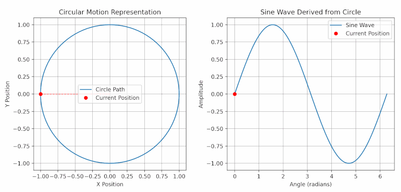
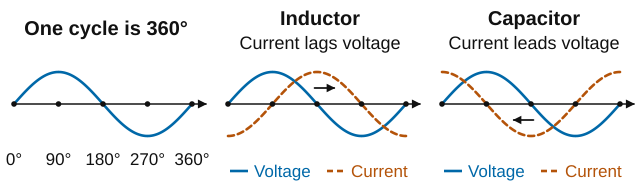

### Section 1.2: Reactance and Impedance

When you learned about capacitors and inductors, you probably focused on their basic properties: capacitors store energy in an electric field, inductors store energy in a magnetic field. After the initial charging or current buildup under steady DC, these components settle into predictable behaviors. But here's where AC circuits get a little more interesting—these same components behave differently at different frequencies of alternating current.

In our previous section, we learned how components combine using straightforward math. With a steady DC source and a fixed resistive load, the current stays constant. But as soon as we introduce *alternating* current, everything changes! Capacitors and inductors suddenly develop frequency-dependent opposition called reactance. Combined with the familiar resistance we discussed before, we now have impedance—the complete, frequency-dependent opposition to current flow in AC circuits.

#### Why AC Circuits Are Different: The Phase Concept

Before diving into reactance, let's understand phase—a concept central to AC circuit behavior.

Imagine a spinning wheel. As the wheel turns, a point on its edge moves in a circle, completing a full rotation. Each rotation is a "cycle."



{caption="Figure 2: As a point moves at constant speed around a circle, its vertical position traces a sine wave over time."}




{caption="Figure 2: One cycle is 360 degrees. A quarter-cycle difference between voltage and current is 90 degrees."}


* **Phase** tells us where a point is in its rotation, measured in degrees (a full circle is 360°).
* For this discussion, we use sine-wave AC and ideal components. Real signals can have other shapes.
* If voltage and current rise and fall together, they are "in phase."
* When current peaks at a different time than voltage, they are "out of phase."

This phase relationship becomes crucial when we examine how components behave in AC circuits.

#### Reactance: Opposition Beyond Resistance

Unlike resistance, which simply converts electrical energy to heat, reactance temporarily stores energy and then returns it to the circuit. This energy storage creates a phase shift between voltage and current.

> **Key Information:** 
> - Reactance is opposition to the flow of alternating current caused by capacitance or inductance. 
> - The letter used to represent reactance is X 
> - Reactance is measured in ohms (Ω) 

Reactance is measured in ohms just like resistance and is represented by the letter X. There are two types, each with unique behaviors:

##### Inductive Reactance

> **Key Information:** 
> - Inductive reactance is opposition to the flow of alternating current in an inductor. 
> - As the frequency of applied AC increases, inductive reactance increases. 

An inductor’s changing magnetic field produces a voltage that opposes changes in current. In an ideal inductor, current lags 90° behind voltage.

An inductor's reactance depends on frequency. Think of an inductor as increasingly "stubborn" about changing current flow as frequency rises. This makes inductors useful as RF chokes that block high frequencies while passing DC and low frequencies.

The formula for inductive reactance is:

$$X_L = 2\pi fL$$

Where:
- $X_L$ is inductive reactance in ohms (Ω)
- $f$ is frequency in hertz (Hz)
- $L$ is inductance in henrys (H)

For example, a 10 μH inductor at 7 MHz has reactance of about 440 Ω, but at 14 MHz it doubles to about 880 Ω—higher frequency means more opposition.

**Practical Application:** When you see an RF choke in an antenna feed line or a ferrite bead on a computer cable, you're seeing impedance at work—opposing unwanted RF currents while allowing desired currents to pass. Ferrites can provide both reactance and loss; Section 2.1 explains how those help suppress interference.

##### Capacitive Reactance

> **Key Information:**
> - Capacitive reactance is opposition to the flow of alternating current in a capacitor. 
> - As the frequency of applied AC increases, capacitive reactance decreases. 

Capacitors resist changes in voltage by storing energy in an electric field. In an ideal capacitor, current leads voltage by 90°.

A capacitor's reactance also depends on frequency, but in the opposite way from inductors. Capacitors become more "willing" to pass current as frequency rises. This makes them excellent as bypass capacitors that provide an easy path for RF signals while blocking DC.

The formula for capacitive reactance is:

$$X_C = \frac{1}{2\pi fC}$$

Where:
- $X_C$ is capacitive reactance in ohms (Ω)
- $f$ is frequency in hertz (Hz)
- $C$ is capacitance in farads (F)

For example, a 100 pF capacitor at 7 MHz has reactance of about 227 Ω, but at 14 MHz it halves to about 114 Ω—higher frequency means less opposition.

**Practical Application:** Bypass capacitors used in radio equipment allow AC signals to "bypass" certain components while blocking DC—a direct application of capacitive reactance.

#### Impedance: The Complete Picture

Now that we understand both types of reactance, let's see how they combine with resistance to create impedance—the complete picture of AC opposition.

Real-world radio circuits generally contain both resistance and reactance. Their combined effect is called impedance.

Remember Ohm's law from your Technician studies? For DC circuits, resistance equals voltage divided by current: $R = \frac{E}{I}$. This fundamental relationship doesn't change for AC circuits—we just need to account for the phase shifts caused by reactance.

In AC circuits, we still have the same basic relationship between voltage and current, but now we replace "R" with "Z" to represent the total opposition:

> **Key Information:** Impedance is the ratio of voltage to current in an AC circuit. 

So while Ohm's law for DC circuits states $R = \frac{E}{I}$, the AC version uses impedance: $Z = \frac{E}{I}$. Impedance (Z) represents the total opposition to current flow and is still measured in ohms (Ω), just like resistance. The key difference is that impedance includes both magnitude and phase relationships:

$$Z = R + jX$$

Where:
- $R$ is resistance (the in-phase component)
- $X$ is reactance (the 90° out-of-phase component)
- $j$ is the mathematical way to represent the 90° phase shift

An antenna analyzer may show resistance and reactance separately, or the impedance magnitude:

$$|Z| = \sqrt{R^2 + X^2}$$

For example, 30Ω resistance and 40Ω reactance give a magnitude of $\sqrt{30^2+40^2}=50\ \Omega$, not 70Ω. You do not need complex-number calculations for the General questions here; the point is that resistance and reactance do not add like ordinary numbers.

**Why Impedance Matters:** Impedance is crucial because it determines how efficiently power transfers between components. Matching accounts for both resistance and reactance—a principle central to antenna systems, feed lines, and amplifier design. Section 1.4 explains the matching conditions and the usual 50-ohm equipment requirement.

#### Admittance: The Inverse Perspective

While impedance is the primary way we describe AC opposition, engineers often find it mathematically convenient to work with its inverse, especially when analyzing parallel circuits:

> **Key Information:** Admittance is the inverse of impedance. 

Just as conductance is the inverse of resistance, admittance (Y) is the inverse of impedance:

$$Y = \frac{1}{Z}$$

Admittance is measured in siemens (S) and is particularly useful when analyzing parallel circuits. When components are in parallel, their admittances simply add together, making calculations much simpler than working with impedances directly.

#### Introducing Resonance: A Special Case

The opposing behaviors of inductors and capacitors create a fascinating scenario when they're combined in a circuit:

> **Key Information:** 
> - In a series LC circuit at resonance, impedance is very low 
> - At resonance, inductive reactance and capacitive reactance are equal and cancel each other 

Since inductive reactance increases with frequency while capacitive reactance decreases, a simple ideal LC circuit has one frequency where they're equal—the resonant frequency.

At this special frequency, dramatic circuit behaviors occur that we'll explore in detail in the next section. Resonance is the foundation for filters that select desired frequencies, oscillators that generate signals, antenna systems that efficiently radiate power, and impedance matching networks.

#### Making Sense of Your Equipment

You now know why your SWR changes with frequency even though your antenna doesn't move—reactance is changing. You understand why ferrite cores reduce interference (impedance that can include reactance and loss) and why bypass capacitors clean up power supplies (low capacitive reactance to noise).

Most importantly, you're ready to understand resonance—that special frequency where inductive and capacitive reactances cancel completely. That's where the real magic happens, and it's next.
