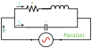

### Section 1.3: Resonance and Filters

Once you've got your General license, you'll discover the HF bands are much more crowded than VHF/UHF frequencies. To successfully navigate this crowded spectrum, you'll need to understand how your radio separates desired signals from unwanted ones. This is where resonance and filters come into play.

#### Why Resonance Matters in Amateur Radio

We introduced the concept of resonance in Section 1.2—that special frequency where inductive reactance equals capacitive reactance ($X_L = X_C$). But why do we care about this electrical phenomenon? Because resonance is the foundation of frequency selection in radio circuits.

> **Key Information:** At resonance in an LC circuit, inductive reactance and capacitive reactance are equal and cancel each other.

When an LC circuit reaches resonance, it responds dramatically to signals at its resonant frequency while ignoring others. This selectivity is precisely what we need to:

- Tune into specific stations
- Reject interference
- Generate stable oscillator frequencies
- Define our transmitted signal bandwidth

The resonant frequency of an LC circuit is calculated using:

$$f_r = \frac{1}{2\pi\sqrt{LC}}$$

Where:
- $f_r$ is the resonant frequency in Hz
- $L$ is inductance in henries
- $C$ is capacitance in farads

Let's see how resonance works in practical circuit configurations.

#### Series and Parallel Resonance: Two Critical Circuit Behaviors

There are two fundamental ways to connect inductors and capacitors in resonant circuits, and they behave quite differently:

1. 
   {.float-right .img-med}
   **Series Resonant Circuit**: When L and C are in series, their reactances cancel at resonance, leaving only the resistance to limit current flow. This creates minimum impedance at the resonant frequency, allowing maximum current flow.
   
   *Application*: Series resonant circuits are excellent for creating band-pass filters that select a specific frequency range.

2. 
   {.float-right .img-med}
   **Parallel Resonant Circuit (Tank Circuit)**: When L and C are in parallel, the opposite occurs—impedance is maximum at resonance. The currents through the inductor and capacitor cancel each other out, creating a high-impedance path at the resonant frequency.
   
   Why "tank"? Because energy sloshes back and forth between the inductor's magnetic field and the capacitor's electric field—like water sloshing in a tank—creating an oscillating current without additional input.

> **Key Information:** The frequency of an LC oscillator is determined by the inductance and capacitance in the tank circuit. 

**Practical Note:** While modern transceivers use digital frequency synthesis rather than tank circuits for frequency generation, understanding these resonant circuits remains relevant for antenna tuners, filters, and many homebrew projects.

#### Filters: Controlling the Flow of Signals

Filters are circuits designed to pass some frequencies while rejecting others. As a General class operator, you'll encounter several types:

1. **Low-Pass Filters**: Pass frequencies below a cutoff point
   - *Application*: Reduce harmonics from your transmitter output
   - *Example*: TVI filters that prevent television interference

2. **High-Pass Filters**: Pass frequencies above a cutoff point
   - *Application*: Eliminate low-frequency noise
   - *Example*: Telephone filters that block RF interference

3. **Band-Pass Filters**: Pass a specific range of frequencies
   - *Application*: Select your operating band
   - *Example*: Receiver front-end filters

4. **Band-Stop (Notch) Filters**: Block specific frequencies
   - *Application*: Eliminate interference from a nearby station
   - *Example*: Notch filters in modern transceivers

#### Key Filter Specifications You Should Know

Whether you're evaluating equipment or building your own circuits, understanding these specifications will help you make informed decisions:

##### Cutoff Frequency

> **Key Information:** The cutoff frequency of a low-pass filter is the frequency above which its output power is less than half the input power. 

This "half-power" point corresponds to a 3 dB reduction in power. When you see filter specifications mentioning "-3 dB points," they're referring to these cutoff frequencies.

##### Filter Bandwidth

> **Key Information:** The bandwidth of a band-pass filter is measured between its upper and lower half-power (-3 dB) points. 

Different operating modes require different bandwidths:
- CW: 250-500 Hz
- SSB: 2.4-2.8 kHz
- AM: 6 kHz
- FM: 10-15 kHz

**Operating Tip:** Using a wider filter than necessary reduces your signal-to-noise ratio, while using one that's too narrow can distort the received signal. Modern transceivers allow you to select appropriate filter bandwidths for different modes.

##### Insertion Loss

> **Key Information:** Insertion loss specifies a filter's attenuation inside its passband. 

Ideally, a filter would pass desired frequencies with zero attenuation, but real-world components always introduce some loss. Lower insertion loss values indicate better filter performance.

For example, a filter with 1 dB insertion loss passes about 80% of the input power within its passband. High-quality filters typically have insertion losses below 3 dB.

##### Ultimate Rejection

> **Key Information:** Ultimate rejection specifies a filter's maximum ability to reject signals outside its passband. 

This tells you how well the filter blocks unwanted signals. A higher value (measured in dB) means better filtering of interference.

A filter with 60 dB ultimate rejection reduces unwanted signals to one-millionth of their original power. Contest-grade bandpass filters might have ultimate rejection values of 50 dB or more.

#### Impedance Matching with Filters

Many filter circuits serve double duty—they not only select frequencies but also match impedances between different parts of your station:

> **Key Information:** Transformers, Pi-networks, and lengths of transmission line can all be used for impedance matching at radio frequencies. 

Common examples include:

- **Pi-networks**: Named for their resemblance to the Greek letter π in schematic form (capacitor-inductor-capacitor), these are often found in antenna tuners and amplifier output circuits.

- **L-networks**: Simpler than Pi-networks, using just two components (one series and one parallel), these are common in antenna matching applications.

- **Quarter-wave transformers**: Special sections of transmission line that transform impedance based on their characteristic impedance.

#### Filter Technologies in Your Radio

Modern amateur radio equipment employs various filter technologies:

1. **LC Filters**: Traditional combinations of inductors and capacitors
   - *Advantages*: Simple, passive, high power handling
   - *Limitations*: Larger size, fixed characteristics

2. **Crystal Filters**: Use quartz crystals for precise, narrow filtering
   - *Advantages*: Excellent selectivity, high stability
   - *Limitations*: Fixed frequency, relatively expensive

3. **Mechanical Filters**: Use mechanical resonant elements
   - *Advantages*: Exceptional shape factor, good for SSB/CW
   - *Limitations*: Found mostly in older equipment

4. **Digital Signal Processing (DSP) Filters**: Implement filtering mathematically
   - *Advantages*: Adjustable characteristics, can be updated
   - *Limitations*: Require digital processing power

**Looking Forward:** As you grow in amateur radio, you may encounter specialized filter applications like roofing filters that protect receiver front ends, or crystal ladder filters in homebrew projects. The principles covered here will help you understand how they all work.

#### Practical Applications in Your General Class Operations

How will you use this knowledge of resonance and filters in your everyday operating?

1. **Selecting Filter Bandwidths**: Choose appropriate filter settings in your transceiver for different modes and band conditions.

2. **Reducing Interference**: Add external band-pass or notch filters when facing stubborn interference problems.

3. **Building Projects**: Design simple resonant circuits for antenna tuners or QRP (low power) equipment.

4. **Troubleshooting**: Recognize when filter-related issues might be affecting your station's performance.

5. **Equipment Selection**: Make informed choices when evaluating transceivers based on their filter specifications.

While digital technology handles most filtering automatically in modern equipment, understanding these principles helps you make the most of your radio's capabilities.

In the next section, we'll explore transformers and advanced impedance matching techniques that ensure efficient power transfer throughout your station.