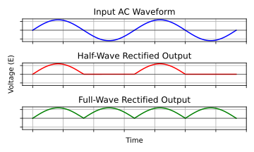

#### Rectification: Converting AC to DC

The first step in converting AC to DC is rectification—changing alternating current that flows back and forth into direct current that flows in one direction. There are two basic approaches to rectification: half-wave and full-wave.

> **Key Information:**
> * *A half-wave rectifier converts 180 degrees of the AC cycle to DC.* 
> * *A full-wave rectifier converts 360 degrees of the AC cycle to DC.* 

As you can see in the waveform comparison:
- The input AC signal alternates between positive and negative
- Half-wave rectification preserves only the positive portions, creating gaps in the output
- Full-wave rectification flips the negative portions to create a continuous series of positive pulses

#### Half-Wave Rectification

> **Key Information:** *A half-wave rectifier is characterized by using only one diode.* 

The half-wave rectifier is the simplest design:
- A single diode allows current to flow only during the positive half-cycle
- The negative half-cycle is completely blocked
- The output pulses occur at the same frequency as the input AC

Despite its inefficiency (using only half the available power), half-wave rectification is sometimes used in:
- Simple battery chargers
- Power indicators
- Applications where cost and simplicity outweigh efficiency concerns
- Circuits where only a small amount of DC power is needed

#### Full-Wave Rectification

Full-wave rectifiers utilize the entire AC cycle, making them more efficient and easier to filter.

> **Key Information:** *An unfiltered full-wave rectifier connected to a resistive load produces a series of DC pulses at twice the frequency of the AC input.* 

The main advantage of full-wave rectification is its efficiency:
- It utilizes both positive and negative portions of the AC cycle, effectively doubling the energy captured compared to half-wave rectification
- By converting both halves of the cycle, it inherently produces pulses at twice the input frequency (120 Hz from a 60 Hz input)
- This continuous flow with no complete gaps makes filtering easier and requires less capacitance to smooth the output

The exam covers two common full-wave rectifier designs: center-tapped transformer and bridge rectifier.

##### **Center-Tapped Transformer Design**

> **Key Information:** *A full-wave rectifier circuit using a center-tapped transformer uses two diodes.* 

This design uses:
- A transformer with a center tap on its secondary winding
- Two diodes that alternately conduct during opposite half-cycles
- The center tap serves as the common (often ground) connection

During operation:
- When the top of the secondary is positive, the top diode conducts
- When the bottom of the secondary is positive, the bottom diode conducts
- Both scenarios create current flow in the same direction through the load

##### **Bridge Rectifier Design**

The bridge rectifier uses four diodes arranged to:
- Direct current through the load in the same direction regardless of input polarity
- Eliminate the need for a center-tapped transformer
- Provide full-wave rectification with a standard transformer

To illustrate the current path we'll use compass points – N, E, S, W (going clockwise starting at the top of the diagram on the right). We'll use the "positive to negative" convention of tracing current flow.

- When N is positive, current flows from `N` -> `D2` -> `DC+` -> `Load` -> `DC-` -> `D4` -> `S`
- When N is negative, current flows from `S` -> `D3` -> `DC+` -> `Load` -> `DC-` -> `D1` -> `N`

#### Center-tapped vs. Bridge Rectifier Designs

Each design has advantages and disadvantages:

Center-tapped transformer design:
- Uses fewer components (only two diodes)
- Only one diode voltage drop in the current path
- Requires a special center-tapped transformer
- Less efficient use of the transformer (each half of the secondary winding conducts only 50% of the time)

Bridge rectifier design:
- Works with any transformer (no center tap required)
- More efficient use of transformer windings
- Requires four diodes instead of two
- Two diode voltage drops in series (higher loss)

#### Practical Considerations

In practical circuits, the diode forward voltage drop affects the output. Each silicon diode typically drops about `0.7V` when conducting. This means:
- In half-wave rectifiers: output is reduced by about 0.7V
- In center-tapped designs: output is reduced by about 0.7V
- In bridge rectifiers: output is reduced by about 1.4V (two diodes in series)

For high-power applications, this voltage drop represents wasted power and heat generation in the diodes.

Most amateur radio power supplies use full-wave rectification because of these advantages, with bridge rectifiers being the most common in modern designs due to their flexibility and the low cost of diodes.
