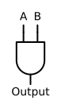
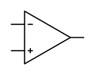
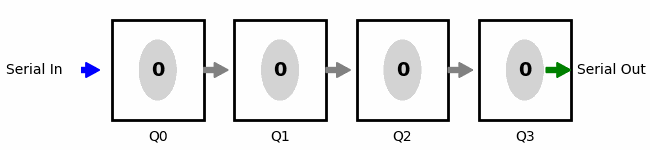

### Section 2.4: Digital Circuit Fundamentals

Modern amateur radio equipment relies heavily on digital technology to process signals, control functions, and enhance performance. As a General class operator exploring HF bands and digital modes, understanding these digital building blocks helps explain how your equipment processes signals and why certain features work the way they do. Since our goal is to help you understand the basics of digital circuits for your exam, we'll focus on the key concepts you need to know rather than diving into the complexities of digital design.

#### The Digital Difference: Binary States

Unlike analog circuits that work with continuously varying voltages and currents, digital circuits operate with just two states: on or off (usually represented as 1 or 0). This binary approach creates circuits that are:
- More resistant to noise and interference
- Capable of precise, repeatable operations
- Able to perform complex logical functions

This fundamental difference explains why digital signal processing can often extract weak signals from noise more effectively than analog circuits alone—a capability you'll appreciate on the crowded HF bands.

#### Logic Gates: Digital Decision Makers

The fundamental building blocks of digital circuits are logic gates—components that perform basic decision-making functions based on their inputs:

> **Key Information:** *A two-input AND gate outputs a high signal (1) only when both inputs are high.* 

 A | B | Output
:-:|:-:|:------:
 0 | 0 | 0
 0 | 1 | 0
 1 | 0 | 0
 1 | 1 | 1
{.w-50 caption="Table 1: AND gate truth table"}

Think of an AND gate as similar to a series circuit with two switches—both must be closed for current to flow. In digital terms:
- If Input A = 1 AND Input B = 1, then Output = 1
- For any other combination, Output = 0

There are many other types of gates which provide similar but different functions which make up the building blocks of digital logic. These include OR, NOT, NOR, NAND, and XOR gates, just to name a few of the basics; if you are interested in digital circuits they are worth reading up on, but since you only need the basics for the license exam we'll leave it here for the purpose of this book.

#### Integrated Circuits: Technology in a Package

Most digital functions in modern equipment are implemented using integrated circuits (ICs)—silicon chips containing thousands or millions of transistors in a single package.

##### MMICs: RF Processing in a Tiny Package

> **Key Information:** *MMIC stands for Monolithic Microwave Integrated Circuit.* 

These specialized ICs are designed specifically for radio frequency and microwave applications, integrating various RF functions into a single chip:
- Amplifiers
- Mixers
- Oscillators
- Filters

MMICs have revolutionized RF design by enabling complex RF processing in extremely small packages. They're a key reason why modern handhelds and mobile radios can offer sophisticated features in compact sizes. As you explore microwave bands and satellite communications with your General privileges, you'll benefit from equipment using these efficient components.

##### CMOS vs. TTL: Digital Logic Families

Digital ICs come in different "families" with distinct characteristics:

> **Key Information:** *An advantage of CMOS integrated circuits compared to TTL integrated circuits is low power consumption.* 

**CMOS (Complementary Metal-Oxide-Semiconductor)** offers:
- Very low power consumption (especially when not switching)
- Wide range of operating voltages (typically 3V to 15V)
- High noise immunity
- Recognizes 70% of supply voltage or higher as logical "1" 
- Recognizes 30% of supply voltage or lower as logical "0"

**TTL (Transistor-Transistor Logic)** provides:
- Faster switching speeds (in traditional versions)
- Higher current drive capability
- More standardized voltage levels (fixed 5V supply)
- Recognizes 2.0V to 5.0V as logical "1"
- Recognizes 0V to 0.8V as logical "0"

Modern amateur radio equipment predominantly uses CMOS technology due to its energy efficiency—particularly important for portable and battery-powered devices. This technology choice directly impacts your radio's battery life and heat generation.

#### Operational Amplifiers: The Analog-Digital Bridge

While we're focusing on digital circuits, it's important to understand how analog and digital worlds interface:

> **Key Information:** *An integrated circuit operational amplifier is an analog device.* 

{.float-right .img-sm caption="Figure 1: Operational Amplifier symbol"}

Operational amplifiers (op-amps) are versatile analog ICs that:
- Amplify and condition signals
- Create active filters
- Buffer between circuit stages

Op-amps often form the critical interface between analog signals (from antennas or microphones) and the digital processing systems within modern transceivers. They prepare signals for analog-to-digital conversion and restore processed digital signals to analog form for transmission or audio output.

Passing the exam requires that you know that op-amps are analog devices, but the practical applications of op-amps in digital systems are beyond the scope of this book and the exam.

#### Digital Storage and Processing Elements

Digital circuits include specialized components for managing digital information:

##### Shift Registers: Digital Data Movement

> **Key Information:** *A shift register is a clocked array of circuits that passes data in steps along the array.* 

{.img-centered caption="Figure 2: Shift register example animation"}

A shift register functions like a bucket brigade for digital data—each pulse of a clock signal moves the data one position down the line. This sequential movement is important for:
- Converting between serial and parallel data forms
- Creating precise timing delays
- Generating specific bit patterns

Shift registers are widely used in the digital signal processing capabilities of modern transceivers and in the encoding/decoding circuits for digital communications modes.

##### Binary Counters: Tracking Digital States

> **Key Information:** *A 3-bit binary counter has 8 states.* 

A binary counter is a digital circuit that advances through a sequence of binary states with each clock pulse. For a 3-bit counter:

| Decimal | Binary |
|:-------:|:------:|
| 0       | 000    |
| 1       | 001    |
| 2       | 010    |
| 3       | 011    |
| 4       | 100    |
| 5       | 101    |
| 6       | 110    |
| 7       | 111    |
{.w-50}

That's $2^3 = 8$ different states.

Binary counters are fundamental to:
- Frequency synthesis in modern transceivers
- Digital frequency displays
- Timing and control functions

The number of bits in a counter determines how many states it can represent: an n-bit counter can represent $2^n$ different states. This exponential relationship is why adding just a few bits dramatically increases a digital system's capabilities.

#### The Digital Foundation for Advanced Radio Features

While we've focused on the fundamental components, these digital building blocks combine to create the sophisticated capabilities in modern equipment:

- **Digital Signal Processing (DSP)** uses these elements at high speeds to filter signals and reduce noise
- **Software Defined Radio (SDR)** leverages digital processing to implement radio functions in software rather than hardware
- **Digital Mode Operation** relies on these components to encode and decode signals

When you use features like noise reduction, notch filters, or digital mode interfaces, you're benefiting from these digital fundamentals working together.

#### Looking Ahead

The digital concepts we've explored form the foundation for many advanced amateur radio techniques. In later sections, we'll see how these digital capabilities translate into practical applications for General class operation, including:
- Operating digital modes on HF bands
- Understanding and using DSP features in modern transceivers
- Setting up interfaces between computers and radios

Now that we've examined the components that make up both analog and digital circuits, let's look at how we can test and measure their performance. In the next section, we'll explore test equipment and troubleshooting techniques that will help you maintain your station and verify that these circuits are working correctly.
