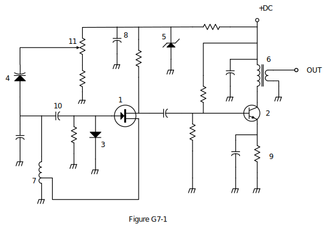

### Section 2.5: Test Equipment and Schematic Reading

Now that you're venturing into the world of General class privileges, you'll likely find yourself getting more hands-on with your equipment. Whether you're setting up a new HF station, troubleshooting an antenna system, or perhaps even building some of your own gear, two essential skills will serve you well: reading schematic diagrams and using test equipment.

These skills provide a window into what's actually happening inside your radio and throughout your station. When something isn't working right or you want to optimize performance, these tools and skills let you see beyond the front panel controls and really understand what's going on.

#### Reading Schematic Symbols

Schematics are the universal language of electronics—a standardized way to describe circuits using symbols instead of pictures. They function as detailed maps showing how current flows through a device. Learning to read these maps gives you the ability to understand your equipment at a deeper level and communicate effectively with other hams when discussing circuits or troubleshooting issues.

For the General class exam, you need to recognize several important schematic symbols. Let's look at Figure G7-1, which shows some of the most common symbols used in radio circuits:

{.img-full .img-centered caption="Figure G7: Electronic schematic symbols from the official question pool"}

We don't need to know all of the numbered components for the exam, but let's focus on the most important ones. They are:

* Symbol 1: Field Effect Transistor (FET)
* Symbol 2: NPN Junction Transistor  
* Symbol 5: Zener Diode
* Symbol 6: Solid Core Transformer
* Symbol 7: Tapped Inductor

You don't need to know these for the exam, but the others are:

* Symbol 3: Diode
* Symbol 4: Varactor Diode
* Symbol 8: Electrolytic Capacitor
* Symbol 9: Resistor

##### Transistors and Semiconductors

When you look at a modern transceiver schematic, you'll see dozens (or even hundreds) of semiconductor devices. Let's identify the most important symbols from Figure G7-1.

Symbol 1 in Figure G7-1 represents a field effect transistor (FET).  FETs control current flow through an electric field rather than a current, and appear frequently in RF circuits because they offer high input impedance and excellent performance at radio frequencies. In your transceiver, you'll find FETs handling everything from weak signal amplification to signal mixing and frequency generation.

Symbol 2 in Figure G7-1 represents an NPN junction transistor.  The arrow pointing outward from the base identifies this bipolar transistor as NPN (rather than PNP, where the arrow would point inward). These transistors handle everything from audio amplification to switching functions throughout your radio equipment.

Symbol 5 in Figure G7-1 represents a Zener diode.  Unlike standard diodes that conduct in only one direction, Zener diodes have a specific reverse breakdown voltage where they begin to conduct. This property makes them excellent for voltage regulation in power supplies and reference circuits.

##### Magnetic Components

The solid core transformer (Symbol 6 in Figure G7-1)  shows two coils with parallel lines between them, representing a magnetic core material. As we saw in Section 1.4, transformers are crucial for impedance matching, voltage conversion, and isolation between circuits. This symbol specifically indicates a solid core (usually ferrite or iron) rather than an air core transformer.

The tapped inductor (Symbol 7 in Figure G7-1)  is an inductor with an additional connection point somewhere along its length. This "tap" allows access to just a portion of the total inductance, which is useful for creating precise impedance matching networks or resonant circuits without needing separate components.

##### Practical Applications of Schematic Reading

While knowing these symbols is important for the exam, the real value comes in applying this knowledge. Schematic reading helps General class operators:

1. Troubleshoot equipment problems by following signal paths and identifying likely failure points
2. Perform equipment modifications safely and effectively
3. Build kits and homebrew projects from published designs
4. Select appropriate replacement parts when repairing equipment

The more comfortable you become with reading schematics, the more self-sufficient you'll be if you need to do any troubleshooting or modifications to your station.

#### Essential Test Equipment

As a General class operator, having access to good test equipment dramatically expands what you can accomplish with your station. The right test equipment transforms invisible electrical problems into visible, measurable issues you can solve. Let's explore the tools that help you see what's happening in your circuits.

##### The Oscilloscope

The oscilloscope contains horizontal and vertical channel amplifiers that work together to display signals on screen.  Think of it as an electronic camera that captures electrical signals in real time. The vertical amplifier controls the height (voltage) display, while the horizontal amplifier controls the time base (how quickly the trace moves across the screen).

An oscilloscope offers a significant advantage over a digital voltmeter because complex waveforms can be measured.  While a voltmeter gives you a single number, an oscilloscope shows you the entire shape of a signal—revealing details about how it changes over time. This capability allows you to:

- See distortion that might cause interference
- Measure signal timing and frequency
- Observe modulation quality
- Detect unwanted oscillations or noise

For CW operation, the oscilloscope is particularly valuable. The best instrument to use for checking the keying waveform of a CW transmitter is an oscilloscope.  By examining the shape of the keying waveform, you can identify problems that affect your signal quality. Too sharp a transition creates key clicks that interfere with nearby stations; too slow a transition makes your code sound mushy and difficult to copy.

When checking your transmitter's signal envelope, the attenuated RF output of the transmitter is connected to the vertical input of an oscilloscope.  This setup requires caution—your transmitter might produce 100 watts, but the oscilloscope can only handle a few volts. Always use an appropriate attenuator to reduce the signal to a safe level.

##### Digital and Analog Multimeters

While the oscilloscope might be the most versatile instrument, the multimeter is likely to be your most frequently used tool. Both digital and analog multimeters have their unique advantages.

An advantage of a digital multimeter compared to an analog multimeter is higher precision.  Digital multimeters typically offer:
- Precise numerical readings
- Greater accuracy (often ±0.5% or better)
- Multiple measurement functions
- Higher input impedance
- Easy-to-read displays

Despite the advantages of digital instruments, analog meters still have their place in the ham shack. An analog multimeter is preferred to a digital multimeter when adjusting circuits for maximum or minimum values.  The moving needle of an analog meter provides immediate visual feedback about which way values are changing and how quickly. This continuous display makes it much easier to find peaks or nulls than watching changing digits on a digital display.

When measuring high-impedance circuits, meter selection becomes especially important. Voltmeters have high input impedance to decrease the loading on circuits being measured.  If your meter draws significant current from the circuit you're measuring, it changes the circuit's behavior—giving you inaccurate readings or possibly even damaging sensitive components. This is why modern DMMs typically have 10 megohm or higher input impedance.

##### Transmitter Testing

For SSB transmitters, linearity is crucial to prevent splatter and interference. To conduct a two-tone test, two non-harmonically related audio signals are used.  This test involves feeding two pure audio tones (typically 700 Hz and 1900 Hz) into your transmitter instead of voice. The resulting pattern on an oscilloscope reveals any distortion that might cause interference.

A two-tone test analyzes transmitter linearity.  Looking at the resulting patterns tells you a lot about your transmitter's performance:
- Flattened peaks indicate compression or clipping
- Asymmetry suggests bias problems
- Jagged patterns reveal unwanted distortion products

Non-linear operation creates spurious emissions that can cause interference to other stations, make your signal sound distorted, and waste power in unwanted frequencies.

##### RF Measurement Tools

For antenna system measurements, specialized tools provide critical insights. Standing wave ratio (SWR) can be determined with a directional wattmeter.  This instrument contains sensors that distinguish between forward power (going to your antenna) and reflected power (coming back from the antenna). By comparing these values, you can calculate SWR—a critical indicator of how well your antenna system is matched to your transmitter.

Modern antenna analyzers take these measurements to the next level. When using an antenna analyzer for SWR measurements, the antenna and feed line must be connected.  These sophisticated instruments not only measure SWR but also display complex impedance (resistance and reactance), helping you identify resonant frequencies and optimize antenna performance.

However, antenna analyzers can be affected by external signals. Strong signals from nearby transmitters can interfere with an antenna analyzer by generating received power that interferes with SWR readings.  This happens because the analyzer can't distinguish between its own test signal and external RF from nearby transmitters. For accurate measurements, try to conduct antenna tests when local RF activity is minimal.

Beyond antenna measurements, an antenna analyzer can be used to measure the impedance of coaxial cable.  This capability helps you:
- Find faults in coaxial cables
- Measure cable loss
- Determine the electrical length of a cable
- Create matching sections for antenna systems

#### Building Your Test Bench

As you upgrade to General class, consider assembling a basic test bench to support your new operating privileges. You don't need to invest thousands of dollars—start with the essentials and add equipment as your interests and projects demand.

##### Essential Equipment
- **Digital multimeter** for basic voltage, current, and resistance measurements
- **SWR meter or antenna analyzer** for antenna system measurements
- **Dummy load** for testing transmitters without radiating a signal

##### Next-Level Additions
- **Oscilloscope** (new or used—even older analog models are useful)
- **RF power meter** for accurate transmitter output measurements
- **Frequency counter** for calibration and frequency measurements
- **Signal generator** for receiver testing and alignment

##### Safety First
When setting up test equipment:
- Ensure proper grounding of all instruments
- Use appropriate fusing and circuit protection
- Follow proper procedures when measuring high voltages
- Protect equipment from RF exposure
- Turn off transmitters when connecting or disconnecting test equipment

#### Practical Applications

Here are some everyday scenarios where your test equipment proves invaluable:

##### Troubleshooting a Power Supply
1. Use a multimeter to check AC input voltage
2. Measure DC output voltage under load
3. Look for ripple with an oscilloscope
4. Test regulation by varying the load

##### Optimizing an Antenna System
1. Use an antenna analyzer to sweep across your bands of interest
2. Find the frequency of lowest SWR
3. Make adjustments to center the resonance where you want it
4. Verify improvement with before/after measurements

##### Testing Transmitter Performance
1. Measure power output into a dummy load
2. Check modulation quality with a two-tone test
3. Verify that keying waveforms have appropriate shape
4. Monitor for spurious emissions or harmonics

The ability to read schematics and use test equipment opens up new dimensions in your amateur radio experience. These skills help you understand how your equipment works, troubleshoot problems effectively, optimize performance, and even build and modify your own gear.

In the next chapter, we'll explore how radio waves propagate through space—knowledge that, combined with your growing technical understanding, will help you make the most of those exciting new HF privileges!