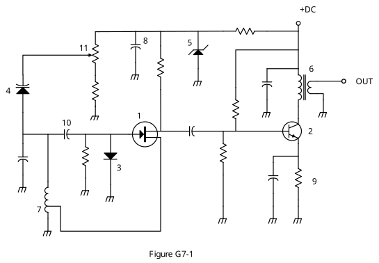

### Section 2.5: Schematic Reading and Measurement Principles

You have met the components that amplify signals, turn AC into DC, and process digital information. Inside a radio, those components work together. A schematic shows how they are connected; measurements let you compare what the circuit actually does with what you expect it to do. Learning to connect those two views is more useful than recognizing a collection of parts in isolation.

#### Reading the Connections

A schematic describes electrical connections, not the physical arrangement of parts on a circuit board. Two components drawn far apart may sit beside each other in the equipment. Lines represent conductors, and junction dots identify connected branches. A crossing without a junction dot generally means the wires are not connected; check the drawing's conventions when in doubt.

The symbols tell you what those connections join. A resistor limits current, a capacitor stores charge, and a transistor can control a larger current with a smaller input signal. Recognizing the symbols lets you follow the ideas from earlier sections into an actual circuit diagram.

{.img-full .img-centered caption="Figure G7-1: Electronic schematic symbols from the official question pool"}

#### Recognizing the Components

Only symbols 1, 2, 5, 6, and 7 are referenced by questions which could appear on the exam; the others help you understand the complete diagram.

The two transistor symbols in Figure G7-1 represent different ways of controlling current:

> **Key Information:**
> - Symbol 1 represents a field effect transistor (FET). 
> - Symbol 2 represents an NPN junction transistor. 

Recall from Section 2.2 that a FET's gate voltage controls conduction through its channel. In a bipolar transistor, base current controls the larger collector current. On the NPN symbol, the arrow is on the **emitter** lead and points outward; on a PNP symbol, it points inward. That small difference identifies the transistor type.

The three diode symbols show how small changes to a symbol distinguish different functions:

- **Symbol 3 is an ordinary diode.** It conducts readily when forward biased and normally blocks current in the reverse direction. The bar identifies its cathode.
- **Symbol 4 is a varactor diode**, also called a varicap. The capacitor-like addition to the diode symbol points to its purpose: when reverse biased, its capacitance changes with the applied voltage. This lets a voltage adjust a tuned circuit instead of mechanically turning a variable capacitor.
- **Symbol 5 is a Zener diode.** Its cathode bar has bent ends. Unlike an ordinary diode, it is designed to operate in reverse breakdown at a specified voltage, making it useful for establishing a voltage reference.

> **Key Information:** Symbol 5 represents a Zener diode. 

The two coil symbols connect back to the inductors and transformers from Chapter 1:

> **Key Information:**
> - Symbol 6 represents a solid core transformer. 
> - Symbol 7 represents a tapped inductor. 

The transformer has two windings, with lines between them indicating its magnetic core. The tapped inductor has an extra connection partway along one winding. That connection gives access to a portion of the winding rather than requiring a separate inductor. Look for these distinguishing features, not only the general coil shape.

The remaining numbered components are familiar capacitors and resistors, used in different places in the circuit:

- **Symbols 8 and 10 are capacitors.** Each shows two separated plates, one drawn curved. At 8, the capacitor connects the supply line to circuit ground, providing a bypass path for AC variations on the supply. At 10, the capacitor couples a changing signal between circuit stages while blocking DC. The connections show these different jobs; the basic component is the same. This drawing does not explicitly mark either capacitor's polarity.
- **Symbol 9 is a fixed resistor.** Its zigzag represents resistance. Here it connects the NPN transistor's emitter circuit to ground; elsewhere in the drawing, the same symbol appears without a number.
- **Symbol 11 is a potentiometer.** It adds a movable contact, shown by an arrow, to a resistor. Moving that contact selects a different fraction of the voltage across the resistor. In this circuit, the contact connects to the varactor, providing an adjustable control voltage.

The repeated ground marks identify the circuit's common reference connection, so those points need not be joined by lines across the page. The labels **+DC** and **OUT** identify the DC supply connection and signal output. Together, the symbols and connections describe the circuit; the numbered labels help you identify particular components within it.

#### From a Diagram to a Measurement

Once you can identify the parts and follow their connections, a measurement has a purpose. Suppose a low-voltage power supply contains a rectifier and a filter capacitor, like those in Section 2.3. The diagram tells you where the rectified voltage reaches the capacitor. You would expect the capacitor to smooth the pulses, leaving a relatively steady DC output.

A voltmeter can tell you whether that output is near the expected DC voltage. But the number alone may not tell you how much the output varies between charging pulses. For that, you need to see voltage changing with time: a *waveform*.

#### Seeing a Waveform

In its usual display mode, an oscilloscope plots voltage vertically and time horizontally. A steady DC voltage appears as a horizontal line; a changing voltage moves above and below its previous level as the trace progresses across the screen.

> **Key Information:** An oscilloscope contains horizontal and vertical channel amplifiers. 

In a traditional analog oscilloscope, the vertical amplifier moves the trace up and down in response to the measured signal. A separate time-base circuit generates a sweep signal, which the horizontal amplifier uses to move the trace across the screen. Digital oscilloscopes sample the input and construct the display electronically, but the familiar voltage-versus-time view remains.

The scales matter. At 1 volt per vertical division, a change of two divisions represents 2 volts. At 1 millisecond per horizontal division, a pattern that repeats every four divisions has a period of 4 milliseconds. The display gives you both the size of a change and how quickly it happens.

> **Key Information:** An advantage of an oscilloscope over a digital voltmeter is that complex waveforms can be measured. 

Return to the power supply example. Two supplies could show similar DC readings on a meter, yet one could have much larger ripple riding on its output. A scope can reveal those repeated rises and falls. Later, the same ability to see shape and timing will help you evaluate transmitted signals. Section 7.6 covers those practical tests; here the important distinction is between a numerical reading and a picture of the changing signal.

#### Measuring Without Changing the Circuit Too Much

There is a complication with every measurement: the instrument becomes part of the circuit. Connect a voltmeter across a resistor and you add another path for current, in parallel with that resistor. If the meter draws enough current, it changes the voltage you intended to measure. This is called *loading*.

> **Key Information:** Voltmeters have high input impedance to decrease loading on the circuits being measured. 

Consider two 10-kilohm resistors in series across a 10-volt source. Before connecting a meter, each resistor has 5 volts across it. A meter with only 10 kilohms of input resistance placed across the lower resistor makes that parallel combination 5 kilohms. The divider is now 10 kilohms above and 5 kilohms below, so the measured voltage becomes $10 \times 5/(10+5)$, or about 3.3 volts. The meter has changed the circuit.

A much higher input resistance draws less current and leaves the reading much closer to the original 5 volts. High input impedance reduces the disturbance; it does not mean the instrument has no effect under all conditions. Oscilloscope probes also load circuits, particularly at high frequencies.

These examples explain what measurements mean, not how to work safely inside energized equipment. Instrument ratings, probe connections, and the circuit's hazards must be understood before making a physical measurement. For now, you can use a schematic to predict behavior and ask what kind of observation would test that prediction.

The components in this chapter provide ways to generate, amplify, and measure changing voltages. Those changes become radio signals when we use them to carry information. Chapter 3 connects the circuit behavior to modulation, bandwidth, and the signals you hear on the air.
