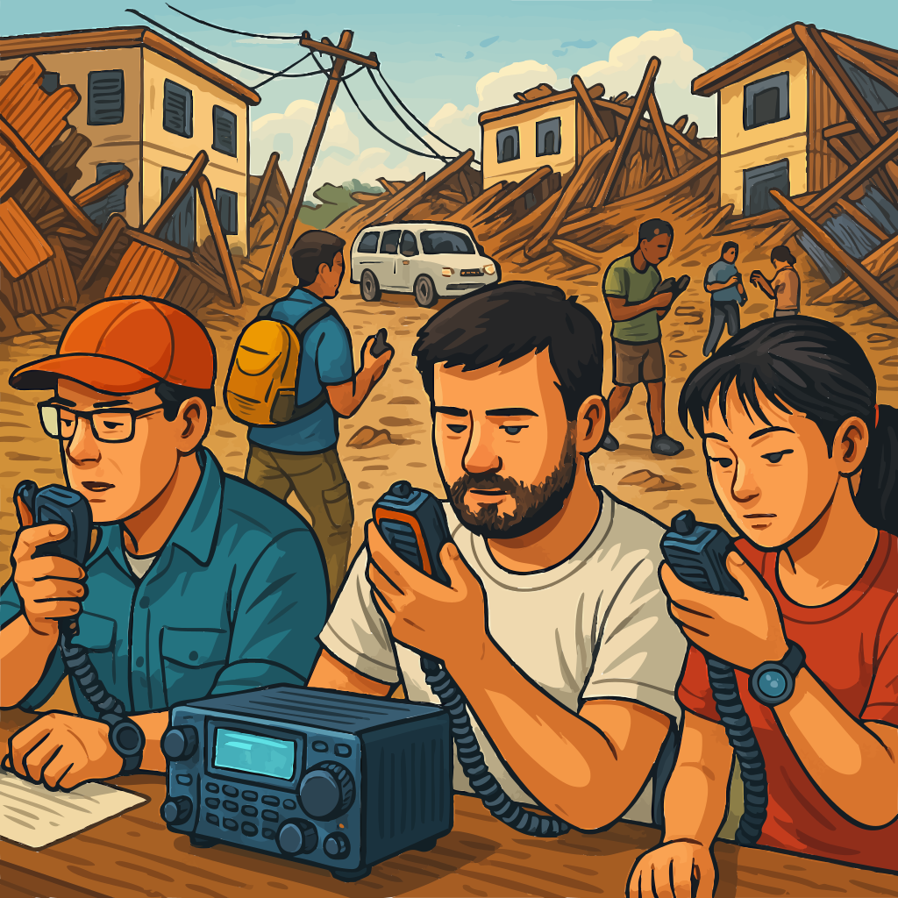
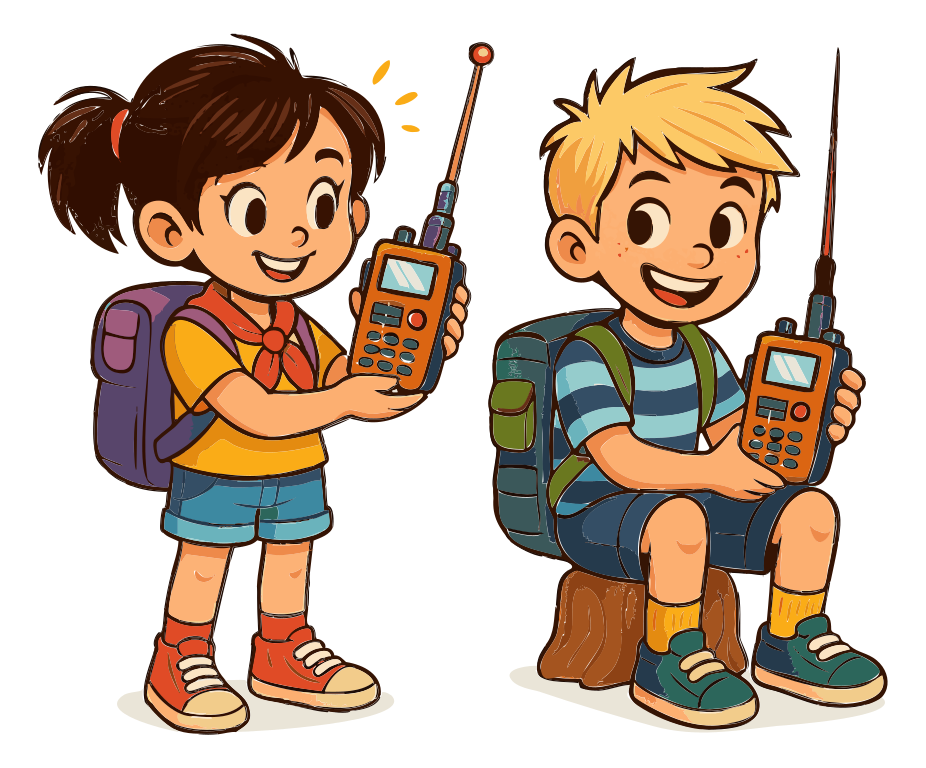

# Acerca de la Radioafición

La radioafición, a menudo llamada "radio ham", es más que un simple pasatiempo—es una comunidad de entusiastas que se conectan con otros, experimentan con electrónica y proporcionan comunicación vital durante emergencias. A diferencia de internet, las torres de telefonía celular o la red eléctrica, la radioafición puede operar de manera independiente, manteniéndote conectado sin importar dónde estés o qué esté sucediendo a tu alrededor. Ya sea que estés charlando con un vecino, experimentando con una nueva antena o ayudando en una crisis, la radioafición abre un mundo de posibilidades.

> Es posible que veas "HAM" escrito todo en mayúsculas, y eso es comprensible—ha habido confusión sobre el origen del término. Algunos piensan que es un acrónimo, y aunque se ha utilizado de esa manera, "ham" en realidad viene del inglés donde se usaba originalmente para referirse a operadores inexpertos o "de aficionados". En inglés, la palabra "ham" (jamón) se usaba en el siglo XIX como un término algo despectivo para describir a alguien con poca habilidad o destreza ("ham-handed" o "ham actor"). Los operadores profesionales usaban esta palabra para burlarse de los aficionados, pero estos adoptaron el término con orgullo. Con el tiempo, evolucionó hasta convertirse en el término amistoso que usamos hoy. Así que, aunque "HAM" en mayúsculas podría molestar a algunos veteranos, no te preocupes—no te daremos demasiados problemas. ¡Solo debes saber que "ham" funciona perfectamente bien, todo en minúsculas!

## Un Mundo de Posibilidades

{.img-xlarge .img-centered}

Imagina mantenerte en contacto cuando todo lo demás falla—sin servicio celular, sin internet, ni siquiera electricidad. Con la radioafición, no solo estás usando la red de alguien más; estás creando la tuya propia. Ya sea que estés en lo profundo de las montañas o en medio de un apagón en la ciudad, tu radio te mantiene conectado.

Los radioaficionados son conocidos por hacer que las cosas funcionen, incluso en las condiciones más difíciles. En una caminata remota donde tu teléfono no tiene señal, una radio simple y portátil aún puede ponerte en contacto con otros. En emergencias, cuando otros sistemas de comunicación fallan, la radioafición se convierte en un salvavidas, conectando personas y comunidades.

Como operador de clase Technician, tendrás acceso a frecuencias VHF y UHF, perfectas para comunicación local y regional. Con repetidores, puedes extender tu alcance aún más, haciendo de la radioafición una herramienta para la aventura y la exploración, sin importar dónde te encuentres.

## Más Que Solo un Pasatiempo

{.float-right .img-pgcap}

Claro, la radioafición es divertida, pero también es una herramienta vital en emergencias. Cuando ocurren desastres y las torres de telefonía celular caen, los radioaficionados a menudo intervienen para mantener abiertas las líneas de comunicación.

Por ejemplo, durante el huracán María en 2017, los radioaficionados en Puerto Rico proporcionaron apoyo crítico de comunicación cuando gran parte de la infraestructura de la isla fue destruida. Transmitieron mensajes de emergencia, ayudaron a coordinar esfuerzos de socorro e incluso asistieron en la reunificación de familias que habían perdido contacto durante el desastre.

Pero no se trata solo de emergencias. La radioafición es una comunidad de experimentadores y exploradores. Encontrarás radioaficionados experimentando con nueva tecnología, construyendo su propio equipo y llevando al límite lo que es posible. Ya sea que te interese el desafío técnico, la emoción de la comunicación independiente o la oportunidad de ayudar en una crisis, la radioafición tiene algo para ti.

## Una Comunidad de Innovadores

La radioafición tiene una larga historia de innovación. Muchas de las tecnologías que damos por sentadas hoy fueron desarrolladas o refinadas por entusiastas de la radioafición. Los radioaficionados siempre han estado a la vanguardia de lo que es posible con la tecnología inalámbrica.

En 2014, un grupo de radioaficionados hizo titulares al reutilizar un antiguo satélite de la NASA para uso amateur. El satélite ISEE-3, lanzado en 1978 y olvidado hace mucho tiempo, fue revivido por estos innovadores radioaficionados, mostrando el ingenio que define a la comunidad de radioafición.

## Un Pasatiempo para Todos

{.float-left .img-pgcap}

Ya sea que te interese el lado técnico de las cosas, disfrutes haciendo contactos de larga distancia o simplemente quieras estar preparado en caso de una emergencia, la radioafición tiene algo que ofrecer. Es un pasatiempo que abarca generaciones, reuniendo a personas de todas las edades que comparten un amor por la comunicación por radio.

A medida que explores la radioafición, encontrarás una comunidad lista para ayudarte a aprender, crecer y conectar. Ya sea a través de reuniones de clubes locales o concursos globales, hay infinitas oportunidades para hacer nuevos amigos y descubrir nuevos aspectos del pasatiempo.

## El propósito de la Radioafición {#purpose-intro}

La Comisión Federal de Comunicaciones (FCC) regula y hace cumplir las reglas para el Servicio de Radioaficionados en los Estados Unidos y fue establecida con propósitos específicos *que quizás necesites conocer para el examen*. Estos forman la base y el propósito de nuestro pasatiempo y servicio:

1. Avanzar en las destrezas tanto en los aspectos técnicos como de comunicación de la radio.
2. Ampliar el grupo de operadores capacitados, técnicos y expertos en electrónica.
3. Mejorar la buena voluntad internacional a través de comunicaciones globales.
4. Proporcionar un servicio de comunicación voluntario no comercial al público, especialmente en tiempos de emergencia.
5. Contribuir al avance del arte de la radio.

Estos propósitos destacan la naturaleza multifacética de la radioafición - no es solo un pasatiempo, sino un servicio con importantes roles técnicos, sociales y de seguridad pública. A medida que progreses en la radioafición, encontrarás oportunidades para cumplir con cada uno de estos propósitos, ya sea experimentando con nuevas tecnologías, haciendo amigos en todo el mundo o ayudando a tu comunidad durante emergencias.

---

Entender la pasión y el potencial de la radioafición es emocionante, pero ¿cómo empiezas realmente? El viaje comienza con el examen para la licencia de clase Technician—una puerta de entrada que podría parecer intimidante pero que en realidad es tu primera verdadera aventura en la radioafición. Vamos a desmitificar el proceso del examen y mostrarte que con el enfoque correcto, estarás en las ondas antes de lo que piensas.