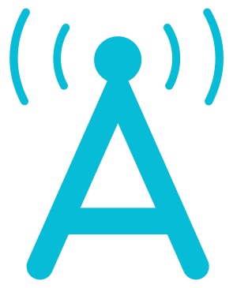

# Cómo Usar Este Manual HamBook

¡Bienvenido a tu guía para la licencia de radioaficionado de Clase Technician! Este Manual HamBook está diseñado para apoyarte donde sea que estés en tu camino de radioafición, ya sea que busques obtener tu licencia rápidamente o adquirir una comprensión más profunda de los conceptos técnicos. Aquí te explicamos cómo aprovechar al máximo este recurso:

## Estructura del Manual HamBook

Este Manual HamBook está dividido en dos partes principales:

1. **La Ciencia Detrás de la Radioafición**: Esta sección cubre los aspectos técnicos de la radio, incluyendo principios eléctricos, comportamiento de las ondas de radio y fundamentos de antenas.

2. **La Persona Detrás de la Radioafición**: Aquí nos enfocamos en los aspectos prácticos de ser un "ham", incluyendo seguridad, operación de estación, y las reglas y regulaciones que gobiernan la radioafición.

Cada capítulo desglosa los temas en segmentos digeribles, con conceptos clave resaltados para una fácil referencia. Ya sea que estés realizando un estudio profundo o buscando respuestas rápidas, encontrarás lo que necesitas.

## Diferentes Formas de Usar Este Libro

Cada persona aprende de manera diferente y tiene distintas metas. Aquí hay algunas formas en que puedes usar este Manual HamBook:

## Camino Rápido para Obtener la Licencia
- Revisa cada sección primero para obtener una visión general de los conceptos
- Concéntrate particularmente en todo lo que está en *cursiva* y cualquier **"Información Clave"**.
- Presta especial atención a los temas que captan tu interés o parecen importantes
- Revisa las preguntas de práctica al final de cada sección
- Lee explicaciones más profundas para los conceptos que encuentres desafiantes o interesantes
- Usa la aplicación HamStudy junto con el libro para seguir tu progreso y repasar las preguntas eficientemente
- Mantén el libro como referencia para explorar temas más a fondo después de obtener la licencia

## Preparación para el Examen Final
Una vez que hayas cubierto el material y estés cerca del día del examen, aquí hay una estrategia efectiva usando la aplicación HamStudy:

- Primero, usa el Modo de Estudio hasta que hayas visto el 100% de las preguntas al menos una vez
- Luego sigue este método probado para prepararte eficientemente para el examen:
  1. Toma un examen de práctica para identificar brechas de conocimiento
  2. Selecciona "Estudiar Áreas Más Débiles" (en la aplicación) o concéntrate en las categorías donde fallaste más preguntas (en el sitio web)
  3. Estudia esas áreas durante un tiempo determinado hasta que te sientas más confiado
  4. Toma otro examen de práctica y repite el proceso
- Probablemente estés listo para el examen cuando estés obteniendo consistentemente un 85% o mejor en las pruebas de práctica (recuerda, solo necesitas un 74% para aprobar)
- Consejo estratégico: Ya que cada pregunta del examen proviene de una sección diferente del banco de preguntas, teóricamente podrías omitir hasta 9 secciones por completo siempre que domines las otras 26

## Enfoque de Aprendizaje Profundo
- Lee cada capítulo a fondo antes de intentar las preguntas de práctica
- Toma notas y resalta conceptos clave, particularmente la Información Clave y cualquier cosa en *cursiva*
- Intenta relacionar nuevos conceptos con cosas que ya conoces
- Participa en clubes locales de radioafición para discutir lo que estás aprendiendo

## Guía de Referencia
- Mantén el libro a mano después de obtener la licencia
- Usa el índice detallado para encontrar rápidamente temas específicos
- Vuelve a consultar las secciones a medida que las encuentres en tus actividades de radioafición

## Mejora Tu Aprendizaje con HamStudy

{ .float-right .ma-1 .w-4r }

HamStudy.org y la aplicación móvil HamStudy funcionan perfectamente con este Manual HamBook, proporcionando práctica dinámica adaptada a lo que estás leyendo y a lo que más te cuesta.

1. **Recursos de Estudio**: HamStudy.org proporciona todos los materiales de estudio que necesitas para tu examen de licencia completamente gratis.

2. **Seguimiento de Progreso**: Ve qué áreas has dominado y cuáles podrían necesitar más atención.

3. **Modo de Estudio**: El estudio inteligente con tarjetas flash refuerza lo que estás aprendiendo.

4. **Botones de Estudio**: Al final de cada sección en este Manual HamBook, encontrarás un botón "Estudia esta sección con HamStudy" que enlaza a esas preguntas específicas de la sección en HamStudy.
   **Códigos QR para Estudiar**: A lo largo de este libro, encontrarás códigos QR al final de cada sección y capítulo. Escanear estos códigos abrirá una sesión de Estudio personalizada en HamStudy con las preguntas relevantes para lo que acabas de leer.

5. **Opción Móvil**: La aplicación móvil HamStudy ofrece características adicionales que incluyen:
   - **Seguimiento Mejorado**: Conocimientos adicionales y herramientas para optimizar tu estudio
   - **Estudio Alineado con el Libro**: Concéntrate en capítulos o secciones específicas basadas en la organización de este libro
   - **Estudio Offline**: Practica preguntas en cualquier lugar, incluso sin conexión a internet
   - **Compartir**: Comparte el progreso con un mentor o ayuda a otros en el aprendizaje

   

## Consejos de Estudio para el Éxito

- **Establece Metas Realistas**: Ya sea que estés apuntando a obtener la licencia rápidamente o adoptar un enfoque más lento y profundo, establece metas que funcionen para ti.

- **Usa Múltiples Métodos**: Combina la lectura, práctica con la aplicación y experiencia práctica en cualquier proporción que funcione mejor para tu estilo de aprendizaje.

- **Conéctate con Otros**: Los clubes locales de radioafición pueden proporcionar apoyo y perspectivas prácticas, independientemente de tu enfoque de estudio.

- **Exámenes de Práctica**: Usa la aplicación HamStudy para realizar exámenes de práctica cuando te sientas listo. Esto te ayuda a saber cuándo estás preparado para el examen.

Recuerda, no hay una sola "forma correcta" de convertirse en operador de radioafición. Algunas personas prefieren obtener su licencia primero y luego aprender a través de la experiencia práctica, mientras que otras disfrutan comprendiendo cada concepto antes de tomar el examen. ¡Ambos enfoques son válidos! Este Manual HamBook está diseñado para apoyarte independientemente del camino que elijas.

Ya sea que te estés preparando para tu examen o utilizando esto como una referencia posterior a la licencia, ¡nos alegra que estés aquí y esperamos que te unas a la comunidad de radioafición!