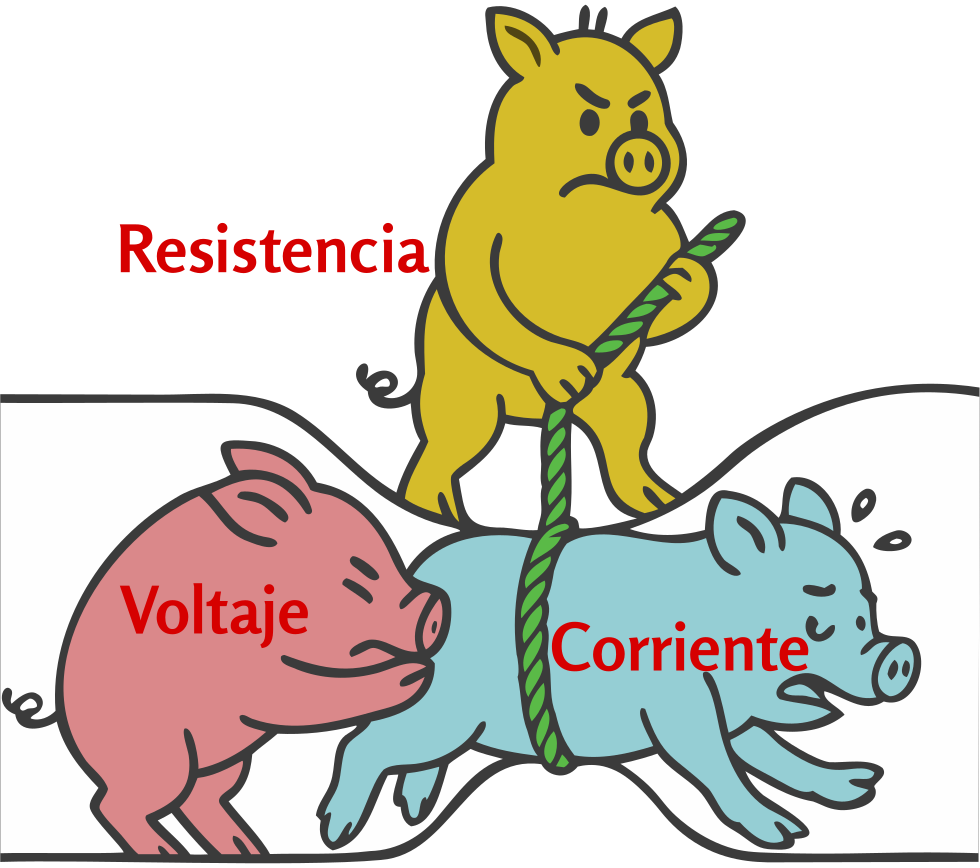
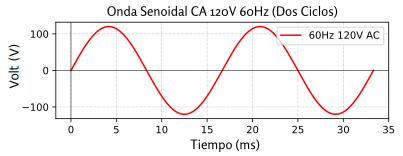

### Sección 1.2: Unidades y Cantidades Eléctricas

Para entender cómo funcionan nuestras radios, necesitamos familiarizarnos con algunas cantidades eléctricas básicas. Comencemos con las "tres grandes": voltaje, corriente y resistencia.

#### Voltaje, Corriente y Resistencia

{.img-pgcap .float-right}

Aunque a menudo comparamos la electricidad con el agua fluyendo a través de tuberías, esta analogía no es perfecta. Veamos lo que realmente está sucediendo:

**Voltaje** ($E$ o $V$) es como la "presión" eléctrica - *es la fuerza que causa el flujo de electrones en un circuito*, y lo medimos en **voltios (V)**. 
- El voltaje también se llama a veces **fuerza electromotriz (FEM)**, porque crea las condiciones que permiten que fluya la corriente.
- El voltaje siempre se mide *entre dos puntos*. Cuando decimos que una batería de coche es de 12V, nos referimos a que hay una **diferencia de 12 voltios** entre sus terminales positivo y negativo.

**Corriente** ($I$) es *el flujo de electrones en un circuito eléctrico*, medido en **amperios (A)**.   Aquí viene lo curioso:

Aunque los electrones individuales se mueven bastante lentamente a través de un conductor (¡aproximadamente media pulgada por minuto!), el movimiento de las cargas eléctricas es casi instantáneo - como un tubo largo lleno de canicas. Empuja una en un extremo, y una sale por el otro extremo casi inmediatamente.

En radioafición, podrías tratar con:
- **Miliamperios (mA)** en circuitos de baja potencia
- **Unos pocos amperios** alimentando un transceptor móvil
- **15-20 amperios** para un amplificador HF de alta potencia

**Resistencia** ($R$) es *cuánto un material se opone al flujo de corriente convirtiendo energía eléctrica en calor*, medido en **ohmios ($\Omega$)**. 
Piensa en la resistencia como una propiedad fundamental que afecta cómo la energía eléctrica se mueve a través de un circuito:
- Los *conductores* como el alambre de cobre tienen *muy baja resistencia*, permitiendo que la corriente fluya fácilmente
- Los *aislantes* como el caucho o el vidrio tienen *muy alta resistencia*, bloqueando el flujo de corriente
- Las *resistencias* son componentes con valores de resistencia específicos y controlados utilizados para:
  - Limitar la corriente en circuitos LED para prevenir quemaduras
  - Dividir el voltaje en circuitos de medición
  - Convertir energía eléctrica en calor en aplicaciones como cargas ficticias

Estas tres cantidades están fundamentalmente vinculadas como se explica en la **Ley de Ohm**, que cubriremos en la **Sección 1.3**.

#### Caída de Voltaje

Cuando la corriente fluye a través de un componente resistivo o cable, parte del voltaje se "consume" en el proceso. Esta disminución en el voltaje se llama **caída de voltaje**.

Es similar a la presión del agua disminuyendo a medida que el agua fluye a través de una tubería - cuanto más larga o estrecha sea la tubería, más presión se pierde. En términos eléctricos, cuando la corriente fluye a través de la resistencia, el voltaje disminuye a lo largo del camino.

Este concepto es importante en radioafición porque:
- Los cables de alimentación largos a tu radio pueden resultar en un voltaje más bajo en la radio que en la fuente de alimentación
- Una mayor demanda de corriente (como durante la transmisión) aumenta la caída de voltaje

Por eso la mayoría de las instalaciones de radioafición móviles utilizan cables de alimentación gruesos y cortos - para minimizar la caída de voltaje al operar equipos que consumen una corriente significativa. Esta es una aplicación directa de cómo la resistencia afecta la corriente y el voltaje en configuraciones de radioafición del mundo real.

#### Frecuencia {#12frequency}

Ahora que entendemos estos conceptos eléctricos básicos de CC, veamos la corriente alterna y la frecuencia.

En radioafición, a menudo tratamos con **corriente alterna (CA)**, que cambia suavemente de dirección en un patrón de onda sinusoidal, a diferencia de la CC que fluye constantemente en una dirección.

{.img-centered .img-full}

La CA ocurre naturalmente cuando un imán gira cerca de un cable. Cuando el polo norte del imán se acerca al cable, la corriente fluye en una dirección. Cuando el polo sur se acerca, la corriente fluye en la dirección opuesta. Esta rotación continua crea el patrón suave de onda sinusoidal mostrado en el diagrama. Este es el principio básico detrás de los generadores que producen la electricidad que alimenta nuestros hogares y las corrientes alternas en nuestros circuitos de radio.

El diagrama muestra dos **ciclos** completos de CA - cada uno comenzando en cero, subiendo a un pico positivo, cayendo a través de cero a un pico negativo, y luego volviendo a cero. *El número de estos ciclos completados por segundo se llama frecuencia, medida en Hertz (Hz)*.  

Algunos ejemplos:
- Energía doméstica: **60 Hz** (60 ciclos por segundo)
- Estaciones de radio AM: alrededor de **1000 kHz** (1.000.000 de ciclos por segundo)
- Radio FM y muchas bandas de radioaficionados: **rango de MHz** (millones de ciclos por segundo)

Entender la *frecuencia* es crucial en radioafición porque determina *qué bandas puedes usar* y *qué tan lejos pueden viajar tus señales*.

#### Potencia

La potencia es *la velocidad a la que la energía eléctrica es usada o generada en un circuito*.  Se mide en **vatios (W)**  y se calcula usando la **Ley de Potencia**, que cubriremos en la **Sección 1.3**.

En radioafición, la potencia es importante porque:

- **Más potencia = Mayor alcance de transmisión.** Una señal más fuerte llega más lejos.
- **Más potencia = Más calor.** Las radios de alta potencia necesitan refrigeración adecuada.
- **Más potencia = Mayores demandas de energía.** Tu fuente de alimentación debe manejar las necesidades de tu radio.

#### Decibelios

En lugar de hablar siempre en vatios, los radioaficionados a menudo usan **decibelios (dB)** para expresar cambios de potencia. El decibelio es una *unidad logarítmica* que facilita expresar y trabajar con proporciones muy grandes o muy pequeñas. En lugar de multiplicar niveles de potencia, podemos simplemente sumar o restar valores de dB, lo que es particularmente útil en sistemas de radio donde las señales pueden ser amplificadas y atenuadas múltiples veces.

Esto es lo que significan los decibelios en la práctica:

- **+3 dB** significa que la potencia *se duplica*. 
- **-3 dB** significa que la potencia *se reduce a la mitad*.
- **-6 dB** significa que la potencia *se reduce a la mitad dos veces (dividida por cuatro)*.
- **+10 dB** significa que la potencia *aumenta diez veces*. 
- **+20 dB** significa que la potencia aumenta cien veces.

Algunos ejemplos del mundo real:
- Un aumento de potencia de **5W a 10W** es una **ganancia de +3 dB**.
- Una disminución de **12W a 3W** es una **pérdida de -6 dB**. 
- ¿Ir de **20W a 200W**? Eso es un **aumento de +10 dB**.

La belleza de la escala de decibelios es que comprime grandes números en un rango más manejable, facilitando la comprensión y discusión de ganancias y pérdidas de señal a lo largo de un sistema de radio.

#### CA y CC

La electricidad viene en dos tipos:

- **Corriente Continua (CC)** fluye *en una dirección*, como desde una **batería** o fuente de alimentación. La mayoría de las radios funcionan con **12V CC**.
- **Corriente Alterna (CA)** *constantemente invierte la dirección, alternando entre direcciones positiva y negativa*, como la **energía doméstica**. 

La mayoría de los equipos de radioafición funcionan con **alimentación CC**, pero **las señales de radio mismas son CA**—alternan a **frecuencias de radio**. Las señales de radiofrecuencia (RF) son simplemente señales CA a frecuencias muy altas utilizadas para comunicación inalámbrica.

*La resistencia se opone a todos los tipos de flujo de corriente*, incluyendo corriente continua, corriente alterna y corriente RF. 

#### Impedancia

> **Información Clave:** *La impedancia es la oposición al flujo de corriente CA*  y, como la resistencia, se mide en *ohmios ($\Omega$)*. 

En un **circuito CC**, la resistencia simplemente se opone al flujo de electricidad. Pero en un **circuito CA**, la historia se vuelve más compleja.

*La capacitancia describe la capacidad de almacenar energía en un campo eléctrico*  y se mide en *faradios (F)*. 

*La inductancia describe la capacidad de almacenar energía en un campo magnético*  y se mide en *henrios (H)*. 

En circuitos eléctricos que incluyen capacitores y/o inductores, el efecto que estos componentes tienen en la corriente alterna variará con la frecuencia. Esta oposición al flujo de corriente dependiente de la frecuencia se llama **reactancia**.

- **La reactancia inductiva** aumenta a medida que aumenta la frecuencia
- **La reactancia capacitiva** disminuye a medida que aumenta la frecuencia

**La impedancia** combina tanto la resistencia como la reactancia, dándonos la oposición total al flujo de corriente CA en un circuito.

*Un circuito resonante consiste en un inductor y un capacitor conectados ya sea en serie (uno tras otro) o en paralelo (lado a lado)*.  A una frecuencia específica, las reactancias inductivas y capacitivas son iguales en magnitud pero opuestas en efecto, efectivamente cancelándose entre sí. Esto crea un balance eléctrico que permite que las señales a esa frecuencia pasen fácilmente (en serie) o sean bloqueadas (en paralelo). Esa frecuencia se llama **frecuencia resonante**, y este fenómeno se conoce como **resonancia**.

El equipo de radioafición está típicamente diseñado para trabajar con valores de impedancia específicos. Por ejemplo, la mayoría de los transceptores están diseñados para conectarse a un sistema de **50 ohmios**. Cuando las impedancias no están correctamente emparejadas:

- La transferencia de potencia se vuelve menos eficiente
- Parte de la energía puede ser reflejada hacia la fuente
- El equipo puede necesitar reducir la potencia de salida para protegerse

Estos principios se aplican a muchas partes de tu sistema de radio, incluyendo antenas, que exhiben propiedades de resistencia, capacitancia e inductancia.

#### Prefijos Métricos y Unidades Eléctricas

En radioafición, a menudo lidiamos con números muy grandes o muy pequeños. En lugar de escribir todos los ceros, usamos **prefijos métricos**:

| Prefijo | Símbolo | Multiplicador | Ejemplo |
|:------:|:------:|:----------:|:-------:|
| pico   | p      | $10^{-12}$ | 1 pF = 0,000000000001 F |
| nano   | n      | $10^{-9}$  | 1 nF = 0,000000001 F |
| micro  | μ      | $10^{-6}$  | 1 μF = 0,000001 F |
| mili   | m      | $10^{-3}$  | 1 mV = 0,001 V |
| (ninguno) | -   | $10^0$     | 1 A = 1 A |
| kilo   | k      | $10^3$     | 1 kHz = 1.000 Hz |
| mega   | M      | $10^6$     | 1 MHz = 1.000.000 Hz |
| giga   | G      | $10^9$     | 1 GHz = 1.000.000.000 Hz |

> **Información Clave:**
> * La abreviatura *kHz* significa "kilohercio".
> * La abreviatura *MHz* significa "megahercio".

Nota: Las unidades F (faradio) y H (henrio) se refieren a la capacitancia e inductancia como se discutió anteriormente, que exploraremos con más detalle en la Sección 2.1.

Aquí están algunas conversiones comunes que pueden aparecer en el examen:

         

| Original               | Equivalente             | ID de Pregunta |
|------------------------|------------------------|:-----------:|
| 1,5 amperios           | 1500 miliamperios       | T5B01       |
| 1500 kHz               | 1,5 MHz                | T5B02       |
| 1 kilovoltio           | 1000 voltios            | T5B03       |
| 1 microvoltio          | 0,000001 voltios        | T5B04       |
| 500 milivatios         | 0,5 vatios              | T5B05       |
| 3000 miliamperios      | 3 amperios              | T5B06       |
| 3,525 MHz              | 3525 kHz               | T5B07       |
| 1.000.000 picofaradios | 1 microfaradio          | T5B08       |
| 28400 kHz              | 28,400 MHz             | T5B12       |
| 2425 MHz               | 2,425 GHz              | T5B13       |
| 

¡Todas las conversiones en esta tabla vale la pena memorizarlas para el examen!

---

#### **Resumiendo Todo**

Entender estas cantidades eléctricas te ayudará a dar sentido a tu equipo de radio y aprobar el examen. A medida que continúes tu viaje en la radioafición, estas ideas surgirán una y otra vez, ¡así que mantén este conocimiento a mano!