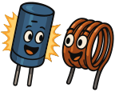

### Sección 2.1: Componentes Básicos

Cuando echas un vistazo dentro de cualquier equipo de radio, encontrarás una fascinante variedad de componentes electrónicos trabajando juntos en armonía. Comencemos nuestra exploración con componentes pasivos - los caballos de batalla de los circuitos electrónicos que no requieren una fuente de alimentación externa para funcionar.

#### Resistencias: Los Policías de Tráfico de la Electrónica

> **Información Clave:** Una resistencia se opone al flujo de corriente en cualquier circuito (incluido un circuito CC).

Las *resistencias* son componentes cilíndricos pequeños con bandas de colores que indican su valor de resistencia. Estos códigos de colores ayudan a los entusiastas de la electrónica a determinar la resistencia del componente.

Aplicaciones comunes en radioafición incluyen:
1. Dividir voltajes para proteger componentes delicados
2. Limitar la corriente a partes sensibles
3. Establecer puntos de operación en circuitos amplificadores

#### Capacitores e Inductores: Los Gemelos de Almacenamiento de Energía

{.img-pgcap .float-right}

Así como una batería almacena energía químicamente, los capacitores e inductores también almacenan energía—pero de formas completamente diferentes. Estos componentes son como hermanos: se complementan entre sí mientras tienen sus propias características únicas.

##### Capacitores: Almacenamiento de Energía en Campo Eléctrico

> **Información Clave:**
> - Un capacitor almacena energía en un *campo eléctrico*
> - Un capacitor consiste en *superficies conductoras (generalmente placas metálicas) separadas por un aislante*. Esta estructura física es fundamental para el funcionamiento de los capacitores y se evalúa frecuentemente.

Los *capacitores* vienen en varias formas y tamaños, desde pequeños discos cerámicos hasta grandes tipos cilíndricos. Su capacidad para almacenar carga se mide en faradios (F), aunque la mayoría de los circuitos de radio usan microfaradios (µF) o picofaradios (pF).

En radioafición, los capacitores se utilizan para:
1. Suavizar las fluctuaciones en fuentes de alimentación (convertidores de CA a CC)
2. Bloquear señales o ruido no deseados, incluyendo mantener la RF fuera de circuitos de audio
3. Ayudar a seleccionar o sintonizar frecuencias específicas en un circuito

##### Inductores: Almacenamiento de Energía en Campo Magnético

> **Información Clave:**
> - Los inductores almacenan energía en un campo magnético 
> - Típicamente están construidos como una *bobina de alambre* 
> - Se *usan con capacitores* para hacer un *circuito resonante* 

Mientras que los capacitores almacenan energía en un campo eléctrico, los *inductores* almacenan energía en un campo magnético que se forma alrededor de la bobina cuando la corriente fluye a través de ella. Esta relación complementaria los hace socios perfectos en circuitos de radio.

Los *inductores* juegan roles importantes en circuitos de radio, incluyendo:
1. Filtrado de señales
2. Adaptación de impedancia
3. Almacenamiento de energía

Juntos, capacitores e inductores forman la base de circuitos sintonizados que seleccionan frecuencias específicas—el corazón de la tecnología de radio.

#### Entendiendo las Configuraciones de Circuitos

> **Información Clave:** Las diferencias fundamentales entre circuitos en serie y paralelo son:
> - En *circuitos en serie*, la corriente es la misma a través de todos los componentes 
> - En *circuitos en paralelo*, el voltaje es el mismo a través de todos los componentes 

Estos dos tipos de circuitos se comportan de manera muy diferente:
- **Circuitos en Serie**: Los componentes están conectados de extremo a extremo en una sola trayectoria. Si un componente falla, todo el circuito deja de funcionar.
- **Circuitos en Paralelo**: Los componentes están conectados a través de los mismos dos puntos. Si una trayectoria falla, la corriente aún puede fluir a través de las otras trayectorias.

#### Potenciómetros: Las Resistencias Ajustables

> **Información Clave:** Un *potenciómetro se usa para controlar la resistencia*  y comúnmente se usa como *control de volumen*. 

Un *potenciómetro* es una resistencia variable. Al girar la perilla o deslizar el control, la resistencia cambia. En radioafición, comúnmente se utilizan para:
1. Control de volumen
2. Ajustar niveles de potencia de transmisión
3. Ajustar el control de silenciamiento (squelch)

#### Interruptores: Los Controladores de Circuitos

> **Información Clave:**
> * Para tu examen, necesitas saber sobre un *interruptor SPDT (Polo Simple, Doble Tiro)*. Este tipo de interruptor permite que *un solo circuito sea conmutado entre uno de otros dos circuitos*.
> * También necesitarás ser capaz de *identificar un interruptor SPST (Polo Simple, Tiro Simple) en un diagrama de circuito*. 

{.img-small .float-right .mb-1 .img-bw}

{.img-small .float-right .clear .img-bw}

Un interruptor SPST es un simple interruptor de encendido/apagado que controla una entrada. Un interruptor SPDT es similar, pero en lugar de simplemente encender o apagar la entrada, la conmuta entre dos salidas. Piensa en un interruptor SPDT como un cambio de vía de ferrocarril con una vía de entrada (el polo) que puede conectarse a cualquiera de las dos vías de salida (los tiros). Cuando accionas el interruptor, estás eligiendo a qué vía de salida se conectará la entrada.

Los interruptores se describen usando dos términos clave:
- **Polos**: El número de circuitos separados que un interruptor puede controlar
- **Tiros**: El número de posiciones a las que se puede conectar cada circuito

Por ejemplo, en un interruptor SPDT:
- Polo Simple: Controla un circuito
- Doble Tiro: Puede conectar ese circuito a cualquiera de dos posiciones

En radioafición, los interruptores son cruciales para:
1. Encender y apagar equipos
2. Seleccionar entre diferentes antenas
3. Cambiar bandas o modos en un transceptor
4. Activar o desactivar características específicas de una radio

#### Poniéndolo todo junto

Entender estos componentes pasivos - resistencias, capacitores, inductores, potenciómetros e interruptores - es crucial para comprender cómo funcionan los circuitos electrónicos. Son los bloques de construcción que permiten que tu equipo de radio funcione, controlando y moldeando señales eléctricas de formas precisas. A medida que continúes tu viaje en la radioafición, encontrarás estos componentes una y otra vez, cada vez obteniendo una apreciación más profunda de sus roles en hacer posible la comunicación por radio.