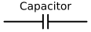
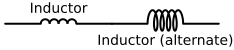
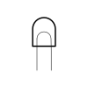

### Sección 2.4: Diagramas de Circuitos: Uniendo Todo

Para este momento, ya has conocido muchos componentes diferentes—resistencias, capacitores, transistores y más. Has visto sus símbolos esparcidos a lo largo de las secciones anteriores y, con suerte, ya te empiezan a resultar familiares. Ahora es el momento de reunir todo en un solo lugar y enfocarnos en cómo se usan estos símbolos en los diagramas de circuitos.

> **Información Clave:** Un *esquemático* es un diagrama de cableado eléctrico que usa símbolos de componentes estándar.  Lo más importante que debes recordar es que los esquemáticos muestran *las conexiones entre componentes* con precisión. 

Piensa en un esquemático como un mapa para la electrónica. En lugar de usar imágenes de las piezas reales, utiliza símbolos estándar para mostrar cómo se conectan los componentes. Una vez que sabes cómo leerlos, los diagramas de circuitos son tu clave para entender cualquier dispositivo electrónico, sin importar cuán complicado sea.

#### Componentes Esenciales y Sus Símbolos

Repasemos los componentes clave que encontrarás en los diagramas de circuitos. Presta especial atención a cómo controlan o afectan el flujo de corriente en un circuito.

##### Componentes Básicos

| **Componente** | **Descripción** | **Símbolo**  |
|---------------|------------------|---|
| **Resistencia** | Esa familiar línea en zigzag representa un componente que controla el flujo de corriente. Las verás en todas partes en los circuitos.  |  |
| **Resistencia Variable (Potenciómetro)** | Como una resistencia normal, pero con una flecha que muestra que puedes ajustar su valor.  |  |
| **Capacitor** | Esas líneas paralelas almacenan energía eléctrica. Verás versiones polarizadas (con una línea curva) y no polarizadas.  |  |
| **Inductor** | Una bobina de alambre que almacena energía en un campo magnético |  |
| **Transformador** | Dos bobinas una al lado de la otra muestran la transferencia de energía entre circuitos.  |  |
| **Inductor Variable** | Una bobina con una flecha que muestra que puedes ajustar su valor.  |  |
{.component-table}

##### Componentes Activos

| **Componente** | **Descripción** | **Símbolo** |
|---------------|-----------------|------------|
| **Transistor** | Estos caballos de batalla controlan el flujo de corriente y proporcionan amplificación. La flecha muestra la dirección de la corriente. |   |
| **Diodo** | Como se vio en la Sección 2.2, la flecha apunta hacia el negativo (cátodo) |  |
| **LED (Diodo Emisor de Luz)** | Como un diodo normal pero con flechas que muestran que emite luz. |   |
{.component-table}

##### Alimentación e Indicadores

| **Componente** | **Descripción** | **Símbolo** |
|---------------|-----------------|------------|
| **Batería** | Líneas largas y cortas muestran los terminales positivos y negativos. |   |
| **Lámpara** | Una bombilla o lámpara. |   |
| **Antena** | Una línea con líneas más pequeñas en ángulo representa una antena, donde las señales entran o salen del circuito.  |  |
{.component-table}

#### Lectura de Diagramas de Circuitos

Cuando mires un esquemático:
1. Comienza en la fuente de alimentación (generalmente una batería)
2. Sigue las conexiones entre componentes
3. Observa cómo están etiquetados los componentes (R1, C1, etc.)
4. Presta atención a los valores de los componentes cuando se muestran

Recuerda: Si bien los esquemáticos pueden parecer complicados al principio, son solo mapas que muestran cómo se conectan los componentes. ¡Con práctica, los leerás como un profesional!

#### Consejos Prácticos

- Busca patrones comunes en los circuitos
- Presta atención a las etiquetas de los componentes
- Sigue la trayectoria de la corriente desde la fuente de alimentación a través de los componentes
- Recuerda que los puntos de conexión se muestran con puntos donde se encuentran las líneas

Como operador de Clase Técnica, no necesitarás conocer este material en profundidad, pero hay algunas preguntas que podrías ver en el examen que requieren identificar un componente por su símbolo - ¡asegúrate de revisarlos cuidadosamente para saber qué buscar!
