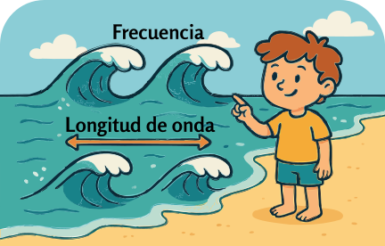
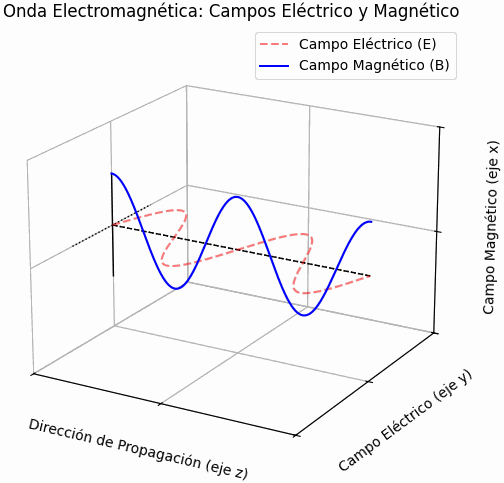

### Sección 3.1: Frecuencia y Longitud de Onda

{.img-pgcap .float-right}

Imagina que estás mirando olas en la playa. Algunas olas llegan rápidamente, una tras otra, mientras que otras vienen más lentamente con mayor distancia entre ellas. Esta diferencia está relacionada con la frecuencia—cuántas olas llegan en un tiempo determinado. Las ondas de radio funcionan de manera similar, pero en lugar de agua, son ondas electromagnéticas que viajan a través del espacio a la velocidad de la luz.

#### ¿Qué es RF?

> **Información Clave:** *RF* (Radiofrecuencia) se refiere a *señales de radio de todo tipo*.

Probablemente has escuchado el término **RF** en varias ocasiones, pero ¿qué significa realmente? **RF significa Radiofrecuencia** – básicamente, es una forma elegante de decir "señales de radio". RF abarca todo tipo de señales de radio, ya sea que se utilicen para voz, datos u otras formas de comunicación inalámbrica.  

Como discutimos en el Capítulo 1, **la energía de radiofrecuencia (RF) es una forma de corriente alterna (CA), pero a frecuencias mucho más altas que la electricidad doméstica**. En lugar de mover electrones de un lado a otro en un cable, como la CA en tu hogar, la RF viaja como ondas electromagnéticas a través del espacio, transportando señales a través de distancias cortas y largas.  

Ya sea que estés sintonizando tu estación de radio favorita, charlando en un repetidor o enviando datos a través de un enlace satelital, estás trabajando con RF. Es el pan de cada día de toda comunicación por radio, y es lo que hace posible todas estas cosas increíbles.  

#### La Naturaleza de las Ondas de Radio

> **Información Clave:** 
> - Una onda de radio tiene dos componentes: *campos eléctricos y magnéticos* 
> - Estos campos están *en ángulo recto* entre sí 
> - Las ondas de radio viajan a la *velocidad de la luz* en el espacio libre (aproximadamente *300.000.000 metros por segundo*)  

{.img-centered .img-large}

#### Polarización

> **Información Clave:** La *orientación del campo eléctrico* define la polarización de una onda de radio. 

Piensa en una onda de radio moviéndose a través del espacio como una cuerda que se ondula de arriba a abajo:
- Si el campo eléctrico se mueve de arriba a abajo, la onda está polarizada verticalmente
- Si se mueve de lado a lado, la onda está polarizada horizontalmente

Esto es crucial porque tu antena necesita coincidir con esta orientación para una mejor recepción.

#### Longitud de Onda y Frecuencia

> **Información Clave:** 
> - La longitud de onda se acorta a medida que aumenta la frecuencia 
> - Para encontrar la longitud de onda en metros, usa esta fórmula: *300 dividido por la frecuencia en megahercios* 
> - Las bandas de radioafición a menudo se identifican por su *longitud de onda aproximada en metros* 

Las ondas de radio vienen en todo tipo de tamaños. El tamaño de una onda de radio—su longitud de onda—está directamente relacionado con su frecuencia, y entender esta relación es clave para comprender las bandas de radioafición.

La longitud de onda es la distancia física que una onda de radio viaja mientras completa un ciclo completo. Cuando escuchas sobre la "banda de 2 metros" o la "banda de 70 centímetros", estás escuchando sobre la longitud de onda aproximada de las señales en esa banda.

El espectro de radio se divide en varios rangos de frecuencia que son importantes para los operadores de radioafición:

- **HF (Alta Frecuencia)**: 3-30 MHz, con longitudes de onda desde 100 metros hasta 10 metros
  - Incluye nuestras bandas de 80m, 40m, 20m, 15m y 10m
  - A menudo permite la comunicación de larga distancia debido a la propagación ionosférica

- **VHF (Muy Alta Frecuencia)**: 30-300 MHz, con longitudes de onda desde 10 metros hasta 1 metro
  - Incluye nuestras populares bandas de 6m y 2m
  - Principalmente utilizada para comunicación regional, con aperturas ocasionales de larga distancia

- **UHF (Ultra Alta Frecuencia)**: 300-3000 MHz, con longitudes de onda desde 1 metro hasta 10 centímetros
  - Incluye nuestras bandas de 70cm y 33cm
  - Típicamente utilizada para comunicación local y aplicaciones especializadas

Cuanto mayor sea la frecuencia, más corta será la longitud de onda. Esta relación inversa significa que a medida que aumenta la frecuencia, la longitud de onda disminuye proporcionalmente. Una señal a 144 MHz (banda de 2m) tiene el doble de frecuencia y la mitad de la longitud de onda que una señal a 72 MHz.

Así es como se calcula la longitud de onda (que a menudo nos referimos con la variable lambda, o λ):

$$\text{Longitud de onda (}\lambda\text{)} = \frac{300}{\text{Frecuencia en MHz (}f\text{)}}$$

{.img-small .float-right}

Al igual que cuando hablamos de la ley de Ohm, también podemos hacer un diagrama circular simple para esta relación, aunque necesitamos usar los símbolos por brevedad:

Para usar esta ayuda:
1. Cubre la variable que quieres encontrar
2. Las piezas restantes te muestran cómo calcularla

   - Cubre λ (longitud de onda): divide $\frac{300}{frecuencia}$

   - Cubre ƒ (frecuencia): divide $\frac{300}{longitud\ de\ onda}$

Por ejemplo, calculemos la longitud de onda para la banda de 2 metros (144 MHz):

$$
\begin{align*}
\text{Longitud de onda} &= \frac{300}{144}\\
&= 2.08 \text{ metros}
\end{align*}$$

¡Por eso la llamamos la banda de 2 metros!

#### Resonancia y Diseño de Antenas

Cuando la longitud de una antena coincide con la longitud de onda—o ciertas fracciones específicas de ella, como un cuarto de longitud de onda—resuena como un diapasón. Esta coincidencia física crea condiciones óptimas para que la antena absorba o emita energía electromagnética a esa frecuencia específica, lo que resulta en una transmisión y recepción de señal mucho más eficiente.

Por ejemplo, una antena dipolo de media onda para la banda de 2 metros tendría aproximadamente 1 metro de largo (la mitad de 2.08 metros). ¡Exploraremos esto más cuando discutamos las antenas!

#### ¡Mejor Comprensión, Mejores Resultados!

Entender estas relaciones te ayuda a:
1. Elegir la longitud correcta de antena para tu frecuencia
2. Hacer coincidir la polarización de la antena con las señales entrantes
3. Entender por qué diferentes bandas se comportan de manera diferente
4. Convertir fácilmente entre frecuencia y longitud de onda

Cada vez que sintonizas tu radio o ajustas tu antena, estás trabajando con estos principios fundamentales. Recuerda que las ondas de radio:
- Viajan a la velocidad de la luz
- Tienen campos eléctricos y magnéticos en ángulo recto
- Tienen longitudes de onda que se acortan a medida que aumenta la frecuencia
- Pueden estar polarizadas vertical u horizontalmente

¡Estos conceptos aparecerán una y otra vez en tus aventuras de radioafición!
