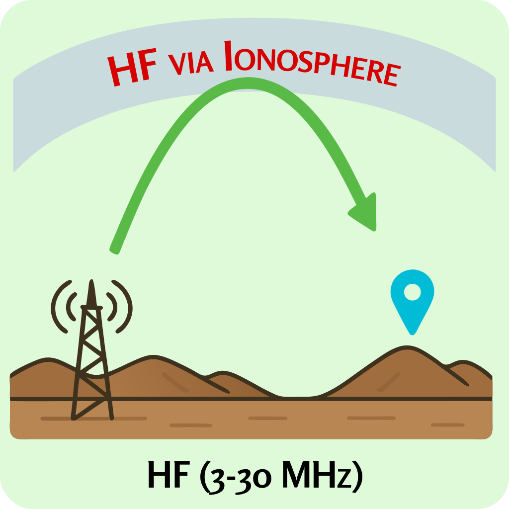
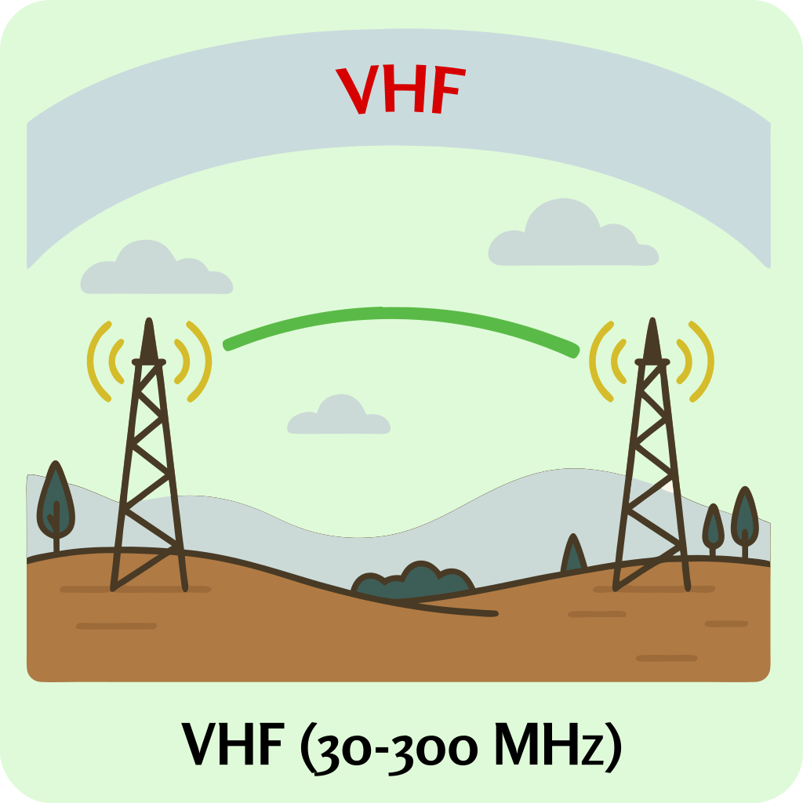

### Sección 3.3: Entendiendo las Bandas de Radioaficionados

Ahora que entendemos qué es el espectro electromagnético, concentrémonos específicamente en las porciones asignadas a los radioaficionados. Las frecuencias que nos han sido asignadas no son arbitrarias - están cuidadosamente distribuidas para proporcionar una variedad de características y capacidades de propagación.

#### El Plan de Bandas de Radioafición

Las frecuencias de radioafición están organizadas en "bandas" basadas en sus longitudes de onda. Por ejemplo, la "banda de 2 metros" se refiere a frecuencias en el rango de 144-148 MHz, donde la longitud de onda es aproximadamente de 2 metros. Estas designaciones de bandas proporcionan una manera rápida de hacer referencia a diferentes rangos de frecuencia y sus características generales.

Las bandas disponibles para los radioaficionados se asignan cuidadosamente mediante acuerdos internacionales para proporcionar una variedad de características de propagación. Esta asignación cuidadosa da a los aficionados acceso a frecuencias que pueden:
- Viajar alrededor del mundo (HF)
- Proporcionar comunicaciones regionales confiables (VHF)
- Soportar operaciones locales de mayor ancho de banda (UHF/microondas)

#### Bandas HF (3-30 MHz)

{.img-pgcap .float-right}

Como Técnico, tendrás acceso limitado a HF, principalmente en la banda de 10 metros (28 MHz), pero entender cómo se comportan estas frecuencias sigue siendo importante.

La característica más distintiva de las bandas HF es su capacidad para proporcionar comunicaciones de larga distancia sin infraestructura. Esto ocurre porque las ondas HF pueden ser refractadas por la ionosfera, permitiéndoles volver a la Tierra a cientos o miles de kilómetros del transmisor.

> **Información Clave:** Una *baliza* se define como *una estación de aficionado que transmite comunicaciones con el propósito de observar la propagación o actividades experimentales relacionadas*.

Las estaciones baliza son particularmente importantes en las bandas HF donde las condiciones cambian constantemente. Estas estaciones automatizadas transmiten regularmente en frecuencias conocidas, permitiendo a los aficionados de todo el mundo monitorear las condiciones de propagación. Al escuchar balizas distantes, puedes determinar si una banda está "abierta" para comunicaciones de larga distancia.

#### Bandas VHF (30-300 MHz)

{.img-pgcap .float-right}

El espectro VHF representa una zona de transición entre las bandas HF de alcance global y las bandas UHF estrictamente locales.

Bandas VHF como 6 metros (50-54 MHz) ocasionalmente experimentan propagación mejorada que puede proporcionar contactos sorprendentes de larga distancia, mientras que la popular banda de 2 metros (144-148 MHz) proporciona comunicaciones regionales confiables que son menos afectadas por las cambiantes condiciones ionosféricas.

Estas bandas son ideales para comunicaciones regionales consistentes dentro de un rango de aproximadamente 80-160 kilómetros dependiendo del terreno y la altura de la antena.

Para la mayoría de los nuevos operadores de clase Técnica, la banda de 2 metros probablemente se convertirá en tu banda de operación principal. Sus características confiables, abundancia de repetidores y amplia disponibilidad de equipos asequibles la convierten en el punto de entrada perfecto para nuevos radioaficionados. Aunque exploraremos los aspectos operativos de esta banda en el Capítulo 7, vale la pena señalar ahora que esta banda forma la columna vertebral de la actividad local de radioafición en la mayoría de las áreas.

#### Bandas UHF (300-3000 MHz)

{.img-pgcap .float-right}

Las bandas UHF representan un paradigma diferente en comunicaciones de radio. Aunque la incapacidad de usar propagación ionosférica podría parecer una limitación, en realidad proporciona varias ventajas:
- Áreas de cobertura más predecibles
- Menos interferencia de estaciones distantes
- Rendimiento más estable día a día
- Mayor disponibilidad de ancho de banda

Estas características hacen que bandas UHF como 70 centímetros (420-450 MHz) sean excelentes para redes locales, modos digitales y comunicaciones urbanas donde la fiabilidad es más importante que la distancia.

Junto con la banda de 2 metros, la banda de 70 centímetros (420-450 MHz) será una de tus bandas más utilizadas como nuevo Técnico. Muchos radios portátiles modernos cubren ambas bandas, y la banda de 70cm ofrece opciones adicionales de repetidores en áreas congestionadas donde las frecuencias de 2 metros podrían ser limitadas. Juntas, estas dos bandas (2m y 70cm) probablemente formarán la base de tu experiencia inicial en radioafición.

#### Consideraciones para la Selección de Bandas

La "mejor" banda depende enteramente de lo que estés tratando de lograr:

##### **Cuando la Distancia Importa**: 
- Las bandas HF pueden proporcionar alcance global cuando las condiciones son favorables
- Las bandas VHF inferiores (6 metros) ocasionalmente ofrecen sorprendentes aperturas de larga distancia
- Las bandas VHF superiores y UHF requieren infraestructura como repetidores para lograr distancia

##### **Cuando la Fiabilidad Importa**:
- UHF y VHF proporcionan un rendimiento más consistente día a día
- Menos afectadas por las condiciones solares y la hora del día
- Áreas de cobertura más predecibles

##### **Cuando el Tamaño del Equipo Importa**:
- Las frecuencias más altas permiten antenas más pequeñas
- Las antenas móviles y portátiles de UHF pueden ser muy compactas
- La operación en HF típicamente requiere sistemas de antena más grandes

Como nuevo Técnico, la gran mayoría de tus operaciones iniciales serán en bandas VHF y UHF, particularmente 2 metros y 70 centímetros. Estas bandas ofrecen equipos accesibles, abundantes repetidores y comunidades locales activas. Incluso a medida que los operadores avanzan a clases de licencia superiores, muchos continúan usando frecuencias VHF y UHF para sus comunicaciones diarias. Discutiremos los aspectos prácticos de operar en estas diferentes bandas en detalle en el Capítulo 7.

Recuerda que la radioafición ofrece una tremenda gama de frecuencias para explorar. Aunque algunas bandas pueden ser más adecuadas para ciertas aplicaciones, cada una ofrece oportunidades y desafíos únicos que hacen que nuestra afición sea tan diversa y atractiva.

En la siguiente sección, examinaremos exactamente cómo las señales de radio viajan a través de estas diferentes bandas, explorando los fascinantes fenómenos de propagación que hacen posibles las comunicaciones de radioafición en diversas distancias y condiciones.