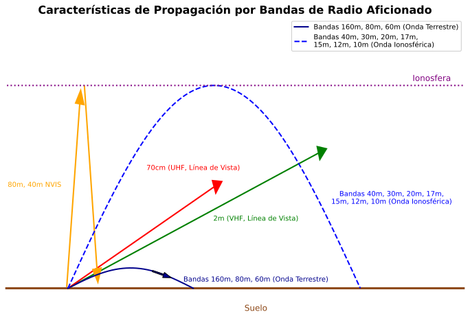

### Sección 3.4: Cómo Viajan las Señales

Ahora que entendemos las diferentes bandas de radioafición, exploremos cómo las señales realmente viajan a través de ellas. La forma en que las ondas de radio se propagan varía dramáticamente dependiendo de su frecuencia y las condiciones ambientales, creando posibilidades fascinantes para la comunicación.

Cuando transmites una señal, esta no viaja simplemente en línea recta como un rayo láser. Las ondas de radio pueden doblarse, rebotar, dispersarse y penetrar obstáculos de maneras que a veces parecen casi mágicas. Entender estos mecanismos de propagación es clave para el éxito en las comunicaciones de radioafición.

> **Información Clave:** Comportamiento Básico de las Ondas en las Bandas de Aficionados
> - La ionosfera puede refractar o doblar las ondas de radio HF y VHF 
> - El horizonte de radio está más lejano que el horizonte visual porque *la atmósfera refracta ligeramente las ondas de radio* 
> - La propagación ionosférica de larga distancia es mucho más común en HF que en VHF/UHF 
> - *Las señales UHF* rara vez se escuchan más allá de su horizonte de radio porque *generalmente no son propagadas por la ionosfera* 

#### Propagación por Onda Terrestre

**Más Allá del Examen**: La propagación por onda terrestre es como arrastrar una cuerda a través de un campo - la señal sigue la superficie de la Tierra. Aunque esto no se evalúa directamente, ayuda a explicar por qué algunas frecuencias viajan mejor sobre tierra que otras, particularmente en frecuencias más bajas.

#### Propagación en Línea de Vista (LOS)

La línea de vista es como poder ver a alguien a través de un campo - si puedes verlos, probablemente puedes comunicarte con ellos. Sin embargo, varios efectos importantes pueden ayudar o dificultar esta propagación básica:

> **Información Clave - Efectos Multitrayecto**: 
> - Las intensidades de señal VHF pueden variar mucho al moverse solo unos pocos pies porque *la propagación multitrayecto cancela o refuerza las señales* 
> - **Efecto de valla** (Picket fencing) es el *rápido desvanecimiento en señales móviles debido a la propagación multitrayecto* 

Cuando las señales de radio viajan del transmisor al receptor, a menudo toman múltiples caminos:
- Algunas señales van directamente
- Otras rebotan en edificios, montañas u otros objetos
- Estos diferentes caminos pueden combinarse en tu antena:
  - Cuando las señales llegan en fase, se fortalecen entre sí
  - Cuando llegan fuera de fase, pueden cancelarse mutuamente
  - Mover tu antena incluso ligeramente puede cambiar esta relación

Es por eso que podrías escuchar una señal móvil cortándose rápidamente al conducir - como mirar a través de una valla de estacas.

> **Información Clave - Sorteando Obstáculos**:
> - Cuando los edificios bloquean una señal de repetidor, a menudo puedes *comunicarte encontrando un camino que refleje las señales* hacia el repetidor 
> - La difracción de filo de cuchillo permite que las señales de radio viajen más allá de las obstrucciones 

El hecho de que no puedas ver tu objetivo no significa que no puedas alcanzarlo:
- **Reflexiones**: Como rebotar una pelota en una pared, tu señal puede rebotar en edificios u otras superficies para llegar a un repetidor
- **Difracción de filo de cuchillo**: Las ondas de radio pueden doblarse alrededor de bordes afilados de obstáculos (como montañas o edificios), similar a cómo el agua fluye alrededor de una roca en un arroyo

#### Propagación por Onda Espacial

> **Información Clave:**
> - *El desvanecimiento irregular de las señales es causado por la combinación aleatoria de señales que llegan por diferentes caminos* 
> - Mejor momento para la propagación de la región F en la banda de 10 metros: *desde el amanecer hasta poco después del atardecer durante alta actividad de manchas solares* 
> - Durante el pico del ciclo solar, *6 y 10 metros* pueden usar propagación de la región F 

Piensa en la propagación por onda espacial como rebotar una pelota en el techo para llegar a alguien al otro lado de la habitación. La ionosfera actúa como nuestro "techo" en el cielo, pero en lugar de una superficie dura, es una región de partículas cargadas que dobla (o refracta) las ondas de radio de vuelta hacia la Tierra. Como la ionosfera no es uniforme, las señales pueden tomar diferentes caminos, causando variaciones en la intensidad de la señal.

Por simplicidad, este efecto de flexión a menudo se llama "rebote" o "reflexión", aunque en realidad es una refracción gradual a través de capas de la ionosfera que eventualmente envía la señal hacia abajo.

- Diferentes capas de la ionosfera afectan diferentes frecuencias
- La hora del día y la actividad solar cambian qué tan bien refleja las señales
- Múltiples caminos de señal pueden causar desvanecimiento a medida que se combinan de diferentes maneras

**Efectos Aurorales**:
Las señales recibidas vía reflexión auroral están *distorsionadas y la intensidad de la señal varía considerablemente* . Esto se debe a que la aurora es como una cortina brillante y en movimiento que refleja las señales de manera impredecible.

#### Propagación por Esporádica E

> **Información Clave:** *La Esporádica E causa señales fuertes ocasionales en las bandas de 10, 6, y 2 metros* desde más allá del horizonte de radio .

Piensa en la Esporádica E como atrapar un rebote afortunado en una nube - ocurre ocasionalmente y puede darte contactos inesperados de larga distancia. Aunque no puedes predecir exactamente cuándo ocurrirá, es una característica regular de la propagación VHF.

#### Conductos Troposféricos

> **Información Clave:**
> - *Causados por inversiones de temperatura* en la atmósfera 
> - Permite *comunicaciones VHF y UHF a rangos de aproximadamente 480 kilómetros regularmente* 

Imagina un túnel en el cielo que puede llevar tu señal mucho más lejos de lo habitual. Las inversiones de temperatura crean estos "conductos" que pueden guiar señales VHF y UHF mucho más allá de su alcance normal, haciendo posibles contactos de larga distancia en bandas que usualmente funcionan solo para comunicación local.

#### Dispersión Meteórica

> **Información Clave:** La *banda de 6 metros es la más adecuada* para comunicaciones por dispersión meteórica .

Cuando los meteoritos se queman en la atmósfera, dejan estelas breves que pueden reflejar señales de radio. Es como jugar ping-pong con una estrella fugaz - las reflexiones son breves pero pueden permitir contactos a distancias sorprendentes. La banda de 6 metros funciona particularmente bien para este tipo de comunicación.

#### Efectos Ambientales

Diferentes factores ambientales afectan diferentes frecuencias de varias maneras.

> **Información Clave:** 
> - La precipitación puede disminuir el alcance en frecuencias de microondas 
> - La niebla y la lluvia tienen poco efecto en las señales en las bandas de 10 metros y 6 metros 
> - Las señales UHF y de microondas son absorbidas por la vegetación 
> - La propagación multitrayecto puede aumentar las tasas de error en transmisiones de datos 

Entender estos efectos te ayuda a:
- Elegir frecuencias apropiadas para diferentes condiciones climáticas
- Posicionar antenas para minimizar la absorción por árboles y edificios
- Tener en cuenta posibles errores de datos en comunicaciones digitales

#### Comunicaciones de Datos 

Cuando se utilizan modos digitales, la propagación multitrayecto puede ser particularmente problemática porque las señales que llegan por diferentes caminos pueden interferir entre sí, aumentando las tasas de error. Por eso los modos digitales a menudo incluyen mecanismos de detección y corrección de errores.

#### Revisión de Propagación

Todos estos métodos de propagación trabajan juntos para hacer posible la comunicación por radio. Entenderlos te ayuda a:
- Elegir la banda correcta para la distancia de comunicación deseada
- Saber cuándo las condiciones podrían ser mejores para contactos de larga distancia
- Solucionar problemas de comunicación
- Aprovechar diferentes modos de propagación

Recuerda: Aunque ciertos efectos específicos de propagación son importantes para el examen, entender cómo funcionan todos juntos te convertirá en un mejor operador. Trata de visualizar cómo funciona cada tipo de propagación a través de las diferentes bandas de radioafición que discutimos en la sección anterior. Este conocimiento te ayudará a elegir las bandas y horarios correctos para las comunicaciones que deseas establecer.

En la próxima sección, exploraremos cómo combinamos estos principios de ondas de radio con diferentes métodos de modulación para transmitir voz, datos y otra información a través de las ondas.