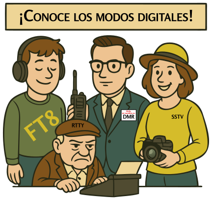

### Sección 3.6: Modos Digitales y Video

{.img-pgcap .float-right}

¡Bienvenido a la era digital de la radioafición! Si los modos de voz son como tener una conversación, los modos digitales son como enviar mensajes de texto o correos electrónicos a través de las ondas. ¿Y el video? ¡Podrías sorprenderte al saber que ha sido posible enviar imágenes e incluso televisión a través de la Radioafición durante décadas!

> **Información Clave:** Los modos de comunicación digital incluyen radio por paquetes, IEEE 802.11 y FT8, entre otros 

#### Radio por Paquetes

> **Información Clave:** La radio por paquetes incluye suma de comprobación para detección de errores, indicativo de la estación de destino y solicitud automática de repetición 

¡Imagina enviar un correo electrónico a través de ondas de radio. Eso es esencialmente lo que hace la radio por paquetes! Divide tu mensaje en pequeños "paquetes" de datos, los envía por el aire, y luego los reensambla en el extremo receptor. Cada paquete incluye una *suma de comprobación para detección de errores*, el *indicativo de la estación de destino*, y una *solicitud automática de repetición si se detectan errores*.

¡Es como enviar un rompecabezas a través del aire que se reensambla perfectamente al otro lado! La radio por paquetes fue muy importante en los años 1980 y 1990 antes de que internet se generalizara. Hoy, todavía se usa en algunas aplicaciones, especialmente en comunicaciones de emergencia.

#### APRS (Sistema Automático de Reporte de Posición)

> **Información Clave:**
> - APRS puede transmitir datos de posición GPS, datos meteorológicos y mensajes de texto 
> - APRS proporciona comunicaciones tácticas en tiempo real con mapeo de ubicación de estaciones 

*APRS* te permite transmitir *datos de posición GPS*, *información meteorológica*, y *mensajes de texto cortos* mientras proporciona *comunicaciones digitales tácticas en tiempo real junto con un mapa que muestra las ubicaciones de las estaciones*. ¡Es como Twitter combinado con Google Maps, pero para radio!

#### PSK31

> **Información Clave:** *PSK significa Modulación por Desplazamiento de Fase* 

*PSK* (*Modulación por Desplazamiento de Fase*) es ideal para conversaciones en tiempo real de teclado a teclado. PSK31 opera a una velocidad de símbolo de 31,25 baudios, aproximadamente coincidente con la velocidad de escritura típica. Es tan estrecho que los contactos pueden estar espaciados a solo 100 Hz de distancia, permitiendo que muchas señales encajen donde solo cabría una única transmisión de voz.

#### RTTY (Radioteletipo)

RTTY es el abuelo de los modos digitales, que data de la década de 1930. Es básicamente una máquina de escribir basada en radio. Sigue siendo popular en concursos y entre algunas agencias de noticias.

#### PACTOR

PACTOR es un modo digital versátil que puede cambiar automáticamente entre velocidades y métodos de codificación según las condiciones. Hay varias versiones, con PACTOR III ofreciendo un rendimiento robusto para cosas como correo electrónico por radio.

#### Radio Móvil Digital (DMR)  

> **Información Clave:**
> - DMR utiliza multiplexación por división de tiempo para poner dos señales de voz digitales en un solo canal de repetidor de 12,5 kHz 
> - Los códigos de color DMR deben coincidir con el repetidor para el acceso 
> - Los grupos de conversación DMR permiten a los usuarios compartir un canal sin escuchar a otros usuarios 
> - Únete a un grupo de conversación DMR programando tu radio con el ID o código del grupo 
> - Un "code plug" de DMR contiene información de acceso para repetidores y grupos de conversación 

DMR es un potente modo de voz digital que *utiliza multiplexación por división de tiempo para poner dos señales de voz digitales en un solo canal de repetidor de 12,5 kHz*. Esto efectivamente duplica los canales disponibles sin usar más espectro.

Lo que hace único a DMR:  
- **Grupos de Conversación**: Una forma para que grupos de usuarios compartan un canal sin escuchar a otros usuarios. Únete programando tu radio con el ID o código del grupo.
- **Códigos de Color**: Deben coincidir con el código de color del repetidor para el acceso.
- **Code Plugs**: Contienen información de acceso para repetidores y grupos de conversación.

Las redes DMR son ampliamente utilizadas tanto para comunicación local como mundial a través de sistemas vinculados a internet.

#### Sistema Fusion y C4FM

System Fusion es el sistema de voz digital de Yaesu que utiliza C4FM (Modulación de Frecuencia Continua de Cuatro Niveles). Su característica destacada es el cambio perfecto entre FM digital y analógico - un radio Fusion puede detectar automáticamente si una señal es digital o analógica y cambiar de modo en consecuencia. Esta compatibilidad hacia atrás significa que puedes comunicarte tanto con estaciones digitales como analógicas sin programación adicional.

Fusion funciona con WIRES-X, el sistema de enlace de internet de Yaesu, para la comunicación digital mundial.

#### D-STAR (Tecnologías Digitales Inteligentes para Radio Amateur)  

> **Información Clave:** Antes de transmitir en D-STAR, debes programar tu indicativo en el transceptor 

D-STAR es un sistema de voz y datos completamente digital desarrollado por la Liga de Radioaficionados de Japón. A diferencia de System Fusion, D-STAR es completamente digital sin compatibilidad analógica. Su característica clave es el enrutamiento por indicativo - puedes introducir el indicativo de otro radioaficionado, y el sistema encaminará tu señal a través de repetidores vinculados para encontrarlo.

*Antes de transmitir en D-STAR, debes programar tu indicativo en el transceptor*. Esto es necesario porque tu indicativo se incluye en cada transmisión, permitiendo el enrutamiento por indicativo y el enlace de repetidores.

#### Grupos de Estaciones Digitales y Selección

> **Información Clave:** Para seleccionar un grupo específico de estaciones en un transceptor de voz digital, introduce el código de identificación del grupo 

Los modos de voz digital te permiten organizar la comunicación en diferentes grupos o canales. Ya sea que estés usando grupos de conversación DMR, reflectores D-STAR o salas de System Fusion, necesitas saber cómo unirte a la conversación correcta. 

Para *seleccionar un grupo específico de estaciones en un transceptor de voz digital*, normalmente *introduces el código de identificación del grupo* en tu radio. Esto podría ser un ID de grupo de conversación DMR, un número de reflector D-STAR, o un identificador similar dependiendo del modo digital que estés usando. Configurar correctamente estos ajustes asegura que tus transmisiones lleguen a tu audiencia prevista en lugar de ser transmitidas a todos los que usan esa frecuencia.

#### Puntos de Acceso Digitales (Hot Spots)

> **Información Clave:** Los puntos de acceso digitales permiten la comunicación usando sistemas de voz o datos digitales a través de internet 

Un *punto de acceso digital* permite *la comunicación usando sistemas de voz o datos digitales a través de internet*. Es casi como tener tu propio repetidor personal, proporcionando una puerta de entrada al mundo de la radio digital, extendiendo tu alcance mucho más allá de tu área local para modos como DMR, D-STAR o System Fusion.

#### Interfaces Computadora-Radio

> **Información Clave:**
> - La interfaz computadora-radio necesita: Audio de recepción, audio de transmisión y control de transmisión 
> - Para FT8: Conecta la radio a la entrada y salida de audio de una computadora que ejecuta el software WSJT-X 
> - Para modos digitales: Conecta la "entrada de línea" de la computadora al altavoz del transceptor 

Para modos digitales, necesitas conectar tu radio a tu computadora. Esto requiere:
- *Audio de recepción* (de la radio a la computadora)
- *Audio de transmisión* (de la computadora a la radio)
- *Control de transmisión* (para controlar cuándo transmite la radio)

Para *FT8*, conecta a la *entrada y salida de audio de una computadora que ejecuta el software WSJT-X* y conecta la *"entrada de línea" de la computadora al altavoz del transceptor*.

#### WSJT-X y FT8

> **Información Clave:**
> - FT8 es un modo digital capaz de operar con baja relación señal-ruido 
> - El software WSJT-X soporta comunicación Tierra-Luna-Tierra, balizas de propagación de señales débiles y dispersión meteórica 

*FT8* es un *modo digital capaz de operar con baja relación señal-ruido* que es parte del conjunto de software WSJT-X. Este software admite varias actividades clave de radioafición:
- Comunicación Tierra-Luna-Tierra (rebote lunar)
- Balizas de propagación de señales débiles
- Dispersión meteórica
- Varios modos digitales incluyendo FT8

#### Modos de Video

> **Información Clave:** NTSC indica una señal analógica de TV a color de barrido rápido 

Los operadores de radioafición tienen varias opciones para enviar imágenes y video:

**Televisión de Barrido Rápido (FSTV)**:
*NTSC* se refiere a *una señal analógica de TV a color de barrido rápido*, similar a la que se usaba para la TV de transmisión pero adaptada para uso de aficionados. FSTV requiere un ancho de banda significativo, por lo que típicamente se usa en frecuencias UHF y de microondas.

**Televisión de Barrido Lento (SSTV)**:
Piensa en SSTV como enviar una postal por radio. Transmite imágenes fijas, tomando desde unos pocos segundos hasta un par de minutos por imagen. SSTV funciona en bandas HF, requiere equipo mínimo, ¡e incluso se usa para recibir imágenes desde la Estación Espacial Internacional!

#### Redes Mesh

> **Información Clave:** Una red mesh de radioaficionados es una red de datos basada en radioafición que utiliza equipos Wi-Fi comerciales con firmware modificado 

Una *red mesh de radioaficionados* es una *red de datos que utiliza equipos Wi-Fi comerciales con firmware modificado*. Crea una red robusta y descentralizada donde cada estación puede recibir y retransmitir datos.

#### ARQ (Solicitud Automática de Repetición)

> **Información Clave:** ARQ es un método de corrección de errores donde la estación receptora detecta errores y envía una solicitud de retransmisión 

*ARQ* es un *método de corrección de errores donde la estación receptora detecta errores y envía una solicitud de retransmisión*. Es como tener una función incorporada de "¿Podrías repetir eso?".

#### Comenzando con Modos Digitales

1. **Empieza Simple**:
   - Intenta recibir antes de transmitir
   - Usa interfaces de tarjeta de sonido incorporadas
   - Únete a redes digitales locales para practicar con radio por paquetes
   - Aprende a usar *grupos de conversación* y *códigos de color* en *DMR*

2. **Progresa Gradualmente**:
   - Prueba *APRS* para reportar posición y mensajería
   - Experimenta con modos de teclado a teclado como *PSK*
   - Configura *FT8* para contactos de señal débil
   - Explora modos de voz digital

3. **Expande Tus Capacidades**:
   - Construye un nodo de *red mesh*
   - Configura un *punto de acceso digital*
   - Prueba diferentes métodos de interfaz
   - Experimenta con modos de video

Recuerda: Los modos digitales están en constante evolución. Aunque necesitas conocer ciertos conceptos para el examen, la verdadera emoción viene de usar estos modos para comunicarte de formas nuevas e interesantes.
