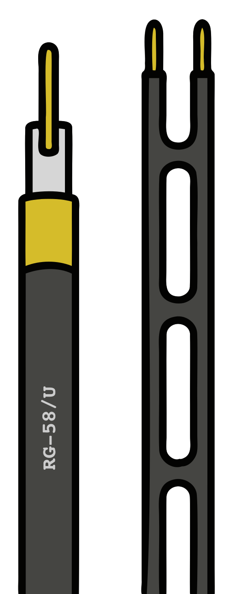

### Sección 4.3: Líneas de Alimentación  

#### Introducción a las Líneas de Alimentación  
¿Alguna vez te has preguntado cómo las ondas de radio llegan realmente desde tu transceptor hasta tu antena? Ahí es donde entran las *líneas de alimentación*. Piensa en ellas como las autopistas para tus señales de radio, llevando potencia desde tu radio hacia tu antena de la manera más eficiente posible. Algunas líneas de alimentación son autopistas rápidas y suaves. Otras son caminos rurales llenos de baches que desperdician tu señal antes de que llegue a donde necesita ir.

#### Cable Coaxial: El Estándar en Radioafición  

> **Información Clave:** La mayoría de las líneas de alimentación de radioafición son **cables coaxiales**, que consisten en un conductor central, aislamiento, una capa de blindaje y una cubierta protectora.

El cable coaxial, o simplemente *coaxial*, es la línea de alimentación preferida por los radioaficionados. Es fácil de usar, no requiere un manejo especial, y hace un gran trabajo llevando tu señal a donde necesita ir—al menos si eliges el tipo correcto. 

#### Impedancia: Por Qué es Importante  

> **Información Clave:** La mayoría de los equipos de radioafición y antenas usan **coaxial de 50 ohmios**, mientras que los sistemas de TV y cable usan **coaxial de 75 ohmios**, que no es ideal para radioafición.

Si alguna vez has mirado detrás de tu TV, es posible que hayas visto coaxial de **75 ohmios** para cable o satélite. ¿Puedes usarlo para radioafición? Técnicamente, sí. ¿Deberías? No realmente. El equipo de radioafición está diseñado para coaxial de **50 ohmios**, así que eso es lo que quieres usar para mantener tu instalación funcionando sin problemas. 

#### Tipos de Cable Coaxial  

> **Información Clave:** El coaxial más grueso generalmente significa *menos pérdida*. *RG-213* y *LMR-400* tienen menos pérdida a cualquier frecuencia dada y son excelentes para tramos largos, mientras que *RG-58* es mejor para cables cortos o instalaciones portátiles.

Hay muchos tipos diferentes de coaxial, y cada uno tiene sus ventajas y desventajas. Aquí hay algunos tipos comunes:  

- **RG-58** – Delgado y flexible. Excelente para tramos cortos o uso portátil, pero tiene *mayor pérdida* a distancia.  
- **RG-8X** – Un poco mejor que el RG-58, sigue siendo flexible pero con *menos pérdida de señal*.  
- **RG-8 / RG-213 / LMR-400** – Coaxial más grueso, de *baja pérdida* que es excelente para tramos más largos y frecuencias más altas. 
- **RG-59 / RG-6** – El material de TV de **75 ohmios**. *Técnicamente* funciona, pero no es una gran elección para radioafición.  
- **Hardline / Heliax** – Coaxial de uso pesado, de *pérdida súper baja*. Usado para repetidores y grandes instalaciones donde no puedes permitirte perder potencia en el camino. *Esto tiene la menor pérdida a *cualquier* frecuencia dada (incluyendo UHF y VHF)* de los tipos coaxiales que hemos mencionado aquí. 

#### Comprendiendo la Pérdida en Líneas de Alimentación  
> **Información Clave:** Cuanto mayor sea la frecuencia, más **pérdida** tendrás en el coaxial. Una **pérdida de 3 dB** significa que estás perdiendo **la mitad** de tu potencia antes de que llegue a la antena. La potencia perdida en las líneas de alimentación se convierte en calor.

Ningún coaxial es perfecto—algo de tu potencia siempre se pierde como calor antes de que llegue a la antena. Cuanto mayor sea la frecuencia, peor es la pérdida. Es por eso que las antenas parabólicas a menudo colocan el transmisor *justo en la antena* en lugar de usar un cable coaxial largo.  

#### Problemas Potenciales con las Líneas de Alimentación  
> **Información Clave:** El agua, el daño UV, los conectores sueltos y demasiados adaptadores pueden causar *pérdida de señal* y estropear tu línea de alimentación.

Incluso el mejor coaxial puede encontrar problemas. Aquí hay algunas cosas a las que debes prestar atención:  

- **Intrusión de agua** – El coaxial y el agua no se mezclan. Si entra humedad, el rendimiento se desploma. *¡Siempre impermeabiliza las conexiones exteriores!* 
- **Conexiones deficientes** – Los conectores sueltos o corroídos son como baches en la autopista de tu señal. *¡Mantenlos limpios y apretados!* 
- **ROE (SWR) alta** – Cubrimos la ROE anteriormente, pero recuerda—si es demasiado alta, estás perdiendo potencia en tu línea de alimentación en lugar de radiarla.  
- **Demasiados conectores** – Cada adaptador o conexión adicional significa *más pérdida*. ¡Mantenlo simple!  
- **Daño UV** – Los **rayos UV** del sol pueden degradar el coaxial con el tiempo. Si va a estar en el exterior, asegúrate de que sea **resistente a los UV** o protégelo con conductos o cinta. 

#### Líneas de Alimentación Alternativas: Línea de Escalera

> **Información Clave:** La línea de escalera tiene **muchas menos pérdidas** que el coaxial pero debe **mantenerse alejada del metal** o no funcionará correctamente.

{.img-xsmall .float-right}

La línea de escalera es como el auto deportivo de las líneas de alimentación—super eficiente, pero algo exigente. Tiene *mucha* menos pérdida que el coaxial, especialmente en HF, pero tiene una gran desventaja: **debes mantenerla alejada del metal** o comenzará a captar ruido y a comportarse de manera extraña. Es una opción fantástica si estás usando una antena balanceada y tienes espacio para enrutarla correctamente.

#### Tipos Especiales de Coaxial  
> **Información Clave:** El coaxial con núcleo de aire tiene **baja pérdida** pero requiere **técnicas especiales** para mantener fuera la humedad.

Algunos coaxiales de gama alta usan **aire** en lugar de aislamiento sólido entre el conductor central y el blindaje. Esto ayuda a reducir la pérdida, pero si **entra humedad, es el fin del juego**. Es por eso que este tipo de coaxial a menudo está **presurizado con aire seco o nitrógeno** para mantener el agua fuera. 

#### Elegir la Línea de Alimentación Correcta 

> **Información Clave:** Para *tramos más largos*, usa *coaxial de baja pérdida* como *RG-213* o *LMR-400* para mantener fuerte tu señal.

Considera estos factores al elegir coaxial:  
- **¿Qué tan largo es el tramo?** Tramos más largos = *más pérdida*. Usa coaxial más grueso, de baja pérdida.  
- **¿Qué frecuencia estás usando?** Las frecuencias más altas sufren *más pérdida*.  
- **¿Cuánta potencia estás utilizando?** Algunos coaxiales manejan mejor el calor y la potencia que otros.  
- **¿Estará en el exterior?** Si es así, usa coaxial **resistente a los UV, impermeable** o protégelo adecuadamente.  

---

Tu línea de alimentación es tan importante como tu antena. Podrías tener la mejor antena del mundo, pero si tu coaxial es terrible, la mayor parte de tu potencia se desperdicia antes de que llegue allí.  

Así que cuando estés configurando tu estación, **¡no escatimes en tu línea de alimentación!** Elige el coaxial adecuado, protégelo de los elementos y mantén esos conectores apretados. ¡Tu señal (y todos los que intentan escucharte) te lo agradecerán!
