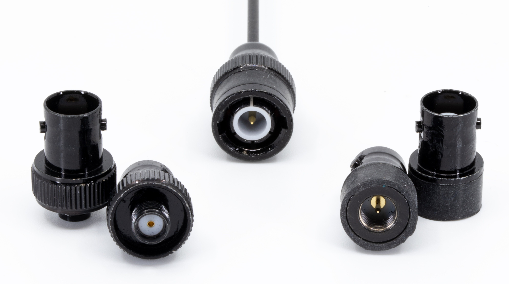
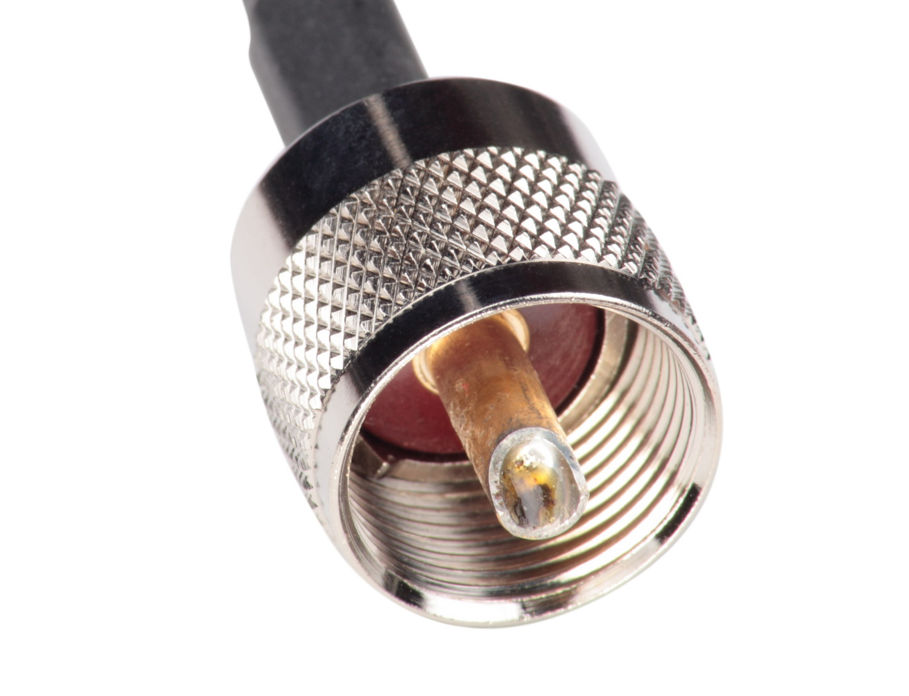
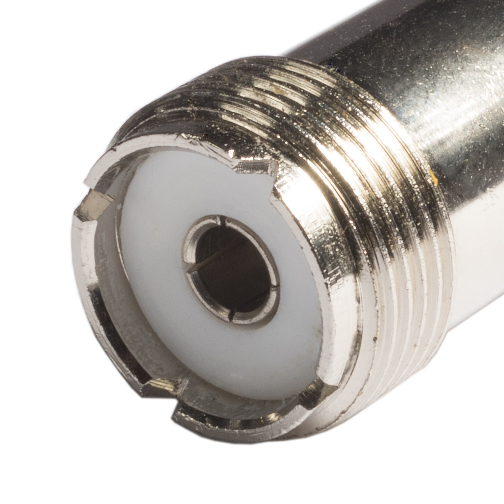
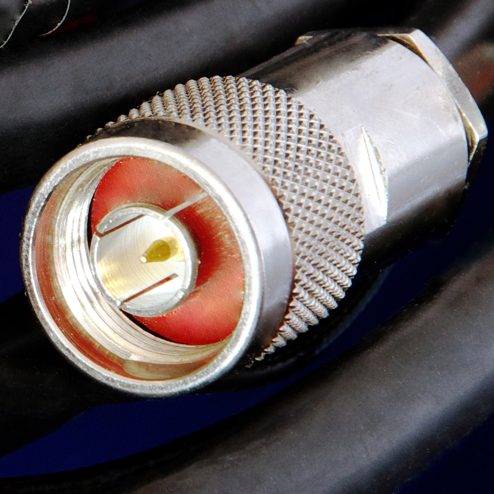

### Sección 4.4: Conectores  

¿Alguna vez has intentado conectar el cargador de tu teléfono a un puerto USB-C, sólo para darte cuenta de que es micro-USB? Ese es el mundo de los conectores en pocas palabras. En radioafición, conseguir la conexión correcta es crucial—es el apretón de manos entre tu radio y la antena.  

Veamos los conectores que es más probable que encuentres como nuevo Técnico, especialmente si estás trabajando con radios portátiles.  

#### SMA (SubMiniatura versión A)  

Este pequeño conector es como el smartphone de los conectores de radio—pequeño, elegante y se encuentra en todas partes hoy en día. La mayoría de los radios portátiles modernos los utilizan, pero aquí es donde puede complicarse un poco:  

- Las marcas principales como **Icom, Yaesu y Kenwood** generalmente ponen un conector **SMA-F (hembra)** en el radio, por lo que necesitas una antena **SMA-M (macho)**.  
- Sin embargo, muchas marcas más nuevas, especialmente **Baofeng y otras marcas chinas**, hacen lo contrario. Utilizan un conector **SMA-M** en el radio, por lo que necesitarás una antena **SMA-F**.  

**Entendiendo el Género de los Conectores SMA:**  
Un **conector SMA-M (macho)** tiene **roscas internas** y un **pin central**. Esto a menudo causa confusión porque las **roscas externas** de un **conector SMA-F (hembra)** pueden hacer que *parezca* macho a primera vista. Sin embargo, el detalle clave es que **el conductor central determina el género**:  

| Centro con **pin** = **macho** | Centro con **receptáculo** = **hembra** |
|:---------:|:-----:|
|  |  |
{.connector-table}

¿Confundido? No te preocupes, le agarrarás el truco. Solo recuerda: cualquier conector que esté en tu radio, necesitas el *opuesto* en tu antena.  

#### BNC (Bayoneta Neill–Concelman)  

{.img-large .float-right} 

Piensa en el BNC como el artista del cambio rápido de los conectores. En lugar de atornillarse como el SMA, tiene un mecanismo de **giro y bloqueo** que hace que conectar y desconectar antenas sea muy fácil. Los verás en algunos radios portátiles, muchos equipos de prueba e incluso algunos accesorios de HF.

**Desde principios de 2021, ha habido un cambio significativo en la comunidad de radios portátiles** hacia el uso de conectores BNC. Si bien la mayoría de los equipos portátiles todavía vienen con conectores SMA, un número creciente de operadores—especialmente aquellos que intercambian antenas regularmente—ahora están **agregando adaptadores BNC a sus radios**. Esta tendencia se ha acelerado rápidamente, con los adaptadores BNC convirtiéndose en equipo estándar para muchos radioaficionados.

**¿Por qué tantos radioaficionados están haciendo este cambio?**
- **Cambios rápidos de antena**—giro y bloqueo en lugar de múltiples rotaciones con roscas SMA
- **Reducción del desgaste en los conectores del radio**—el adaptador absorbe la tensión en lugar del conector incorporado del radio
- **Flexibilidad para diferentes situaciones**—cambia entre antenas de goma, látigo y móviles en segundos
- **Menos riesgo de rosca cruzada**—un problema común con los conectores SMA

Sin embargo, los adaptadores no son para todos. **Agregan volumen** y **una pequeña cantidad de pérdida de señal**. Si no cambias de antenas con frecuencia, quedarte con lo que se adapta directamente a tu radio está perfectamente bien.

#### PL-259/SO-239 (Conector UHF)  

> **Información Clave:** Los conectores PL-259 se **utilizan comúnmente en frecuencias HF y VHF** pero **no son ideales para trabajo en UHF real**. 

A pesar de su nombre, el "conector UHF" es un poco erróneo. Se usa ampliamente para radios de **HF y VHF**, pero no es la mejor opción para UHF. El nombre se origina de una época en la que el espectro UHF se definía como un rango diferente (más bajo) de frecuencias, pero el nombre del conector se quedó.

Encontrarás estos conectores en muchos **equipos móviles y de estaciones base**. Son **robustos**, **fáciles de soldar** y pueden manejar **altos niveles de potencia**.  

* El **PL-259** es el **PL**ug (enchufe) macho.
* El **SO-239** es el **SO**cket (receptáculo) hembra.

| PL-259 (UHF Macho) | SO-239 (UHF Hembra) |
|:---------:|:-----:|
|  |  |
{.connector-table}

Estos conectores funcionan bien hasta aproximadamente **150 MHz**, pero si estás trabajando por encima de eso, podrías querer usar conectores **Tipo N** en su lugar.  

#### Tipo N  

> **Información Clave:** Los conectores Tipo N son la **mejor opción para frecuencias superiores a 400 MHz** debido a su **baja pérdida y excelente blindaje**.  

{.img-med .float-right}

Conoce al campeón de peso pesado de los conectores RF. **Los conectores Tipo N** son como los tanques blindados del mundo de la radio—**fuertes, impermeables y construidos para altas frecuencias**.  

Están diseñados para **bandas UHF y microondas**, lo que significa que funcionan excelentemente para **repetidores, comunicaciones por satélite y configuraciones serias de VHF/UHF**. Aunque son más grandes que los conectores SMA o BNC, lo compensan con **baja pérdida de señal y excelente blindaje**.  

Si estás trabajando en **frecuencias superiores a 400 MHz**, **Tipo N** es tu mejor opción para un **rendimiento máximo**.  

#### Consejos Profesionales para Usar Conectores  

1. **Mantén los conectores limpios y secos** – Son puntos de conexión cruciales para tu señal, así que trátalos bien.    
2. **Aprieta, pero no demasiado** – Ajustado a mano generalmente está bien para equipos portátiles.
3. **Se gentil con los conectores SMA** – Son resistentes, pero no indestructibles.  
4. **Quédate con un tipo de conector en tu estación** – Te ahorrará dolores de cabeza con adaptadores en el futuro.  

Recuerda, aunque los adaptadores pueden ser salvavidas, **no son ideales para configuraciones permanentes**. Cada conexión es un punto potencial de **pérdida de señal o fallo**. Cuando sea posible, **usa antenas y equipos que coincidan directamente con el conector de tu radio**.

---

Entender los conectores no es la parte más emocionante de la radioafición, pero es una de las más **prácticas**. Si no conoces la diferencia entre SMA-M y SMA-F, podrías comprar una antena que no se ajuste a tu equipo portátil. Si no reconoces un PL-259, podrías acabar con el coaxial equivocado para tu estación móvil o base.  

Obtener los conectores correctos significa **menos problemas, menos adaptadores y mejor rendimiento**. Ya sea que estés conectando una nueva antena, cambiando de radio o construyendo tu estación, conocer tus conectores te ahorrará tiempo, dinero y frustración.  

Así que antes de hacer clic en "Comprar Ahora" para esa nueva antena o coaxial, tómate un segundo para verificar el conector. ¡Un poco de conocimiento aquí puede ahorrarte muchos dolores de cabeza más adelante!
