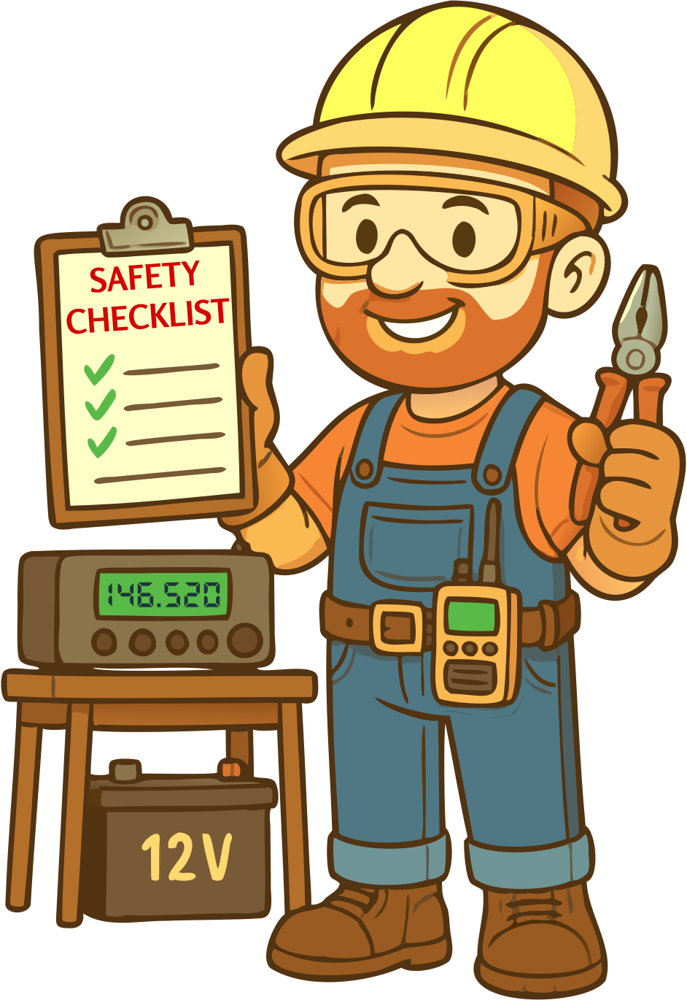

## Capítulo 5: Seguridad

Bienvenido a uno de los capítulos más importantes en tu camino para convertirte en un operador responsable de radioafición: **seguridad**. Hacer contactos a través del mundo es emocionante, pero es igual de vital asegurar que tus aventuras de radio no te pongan en riesgo—ni a nadie más.

{.img-small .float-right}

En este capítulo, exploraremos temas clave de seguridad que todo radioaficionado debe entender. Comenzaremos con **seguridad eléctrica**, incluyendo cómo manejar la corriente alterna responsablemente y reconocer peligros potenciales en tu estación. Aprenderás la importancia de una conexión a tierra adecuada y cómo protegerte de descargas eléctricas.

A continuación, nos sumergiremos en la **seguridad RF**, donde discutiremos los riesgos potenciales de la exposición a radiofrecuencia y cómo minimizarlos. Obtendrás conocimientos sobre niveles de potencia seguros y ubicación inteligente de antenas para protegerte a ti mismo, a tu hogar y a tus vecinos.

También cubriremos **seguridad de baterías**, que es especialmente importante para aquellos interesados en operaciones portátiles o de emergencia. Y repasaremos las mejores prácticas para la **instalación de antenas**, incluyendo cómo evitar el peligro muy real de las líneas eléctricas cercanas.

Recuerda, la seguridad no se trata solo de seguir listas de verificación—se trata de desarrollar una mentalidad que pone el bienestar primero en cada parte del pasatiempo. Al final de este capítulo, tendrás el conocimiento y la conciencia para crear un entorno seguro para tus actividades de radio, asegurando que tu experiencia de radioafición no sea solo divertida sino también segura.

Así que, ¡pongámonos nuestras gafas de seguridad y cascos (metafóricamente hablando) y comencemos—porque nadie quiere una sorpresa impactante!