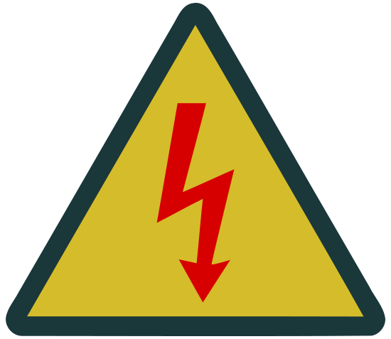

### Sección 5.2: Voltajes Peligrosos

> **Nota:** Aunque esta sección no contiene material directamente vinculado a preguntas específicas del examen, la información de seguridad presentada aquí es conocimiento esencial para cualquier operador de radioafición que trabaje con equipos eléctricos.

#### ¿Qué Son los Voltajes Peligrosos?

{.img-pgcap .float-right}

En el mundo de la radioafición, generalmente consideramos que cualquier cosa por encima de 30 voltios es potencialmente peligrosa. Eso puede parecer bajo, pero recuerda, no se necesita mucho para darte una desagradable descarga o algo peor.

#### ¿Dónde Podrías Encontrar Voltajes Peligrosos?

Te podría sorprender dónde pueden aparecer voltajes peligrosos:

- **Cables de Prueba**: Cuando estás *midiendo* voltajes peligrosos, no olvides que las sondas que utilizas para medir también están sujetas a esos voltajes peligrosos. Es algo fácil de pasar por alto durante las pruebas.

- **Fuentes de Alimentación**: ¿Esa fuente de alimentación de 13.8V para tu radio? En su interior, está convirtiendo 120V CA a CC. Un movimiento equivocado y podrías llevarte una descarga.

- **Sistemas de Antena**: ¿Has oído hablar de antenas "calientes"? Algunas antenas pueden desarrollar altos voltajes en sus puntos de alimentación, especialmente durante la transmisión.

- **Equipos Antiguos**: Si tienes la suerte de jugar con equipos antiguos, sé especialmente cauteloso. ¡Los equipos antiguos con tubos pueden tener voltajes de cientos o incluso miles de voltios!

- **Condensadores**: Estos pequeños tanques de almacenamiento pueden mantener una carga mucho después de que el equipo esté desenchufado. Son como portadores de rencor eléctricos.

> Esto vale la pena enfatizar; cuando hay condensadores involucrados, ¡el hecho de que esté desenchufado y la alimentación esté apagada no significa que sea seguro! Muchas personas se han lastimado al abrir equipos y tocar lo incorrecto antes de que los condensadores estuvieran completamente descargados.

#### Manteniéndose Seguro Alrededor de Voltajes Peligrosos

Entonces, ¿cómo nos mantenemos seguros?

- **Asume que Todo está "Activo"**: Siempre asume que el equipo está energizado hasta que se demuestre lo contrario. Usa un voltímetro para verificar antes de tocar.

- **Regla de Una Mano**: Usa una sola mano cuando trabajes cerca de altos voltajes. Suena extraño, pero evita que la corriente fluya a través de tu pecho si recibes una descarga.

- **Descarga los Condensadores Correctamente**: Los condensadores pueden mantener una carga peligrosa. Aprende formas seguras de descargarlos antes de hurgar—normalmente a través de una resistencia de valor apropiado, nunca cortocircuitándolos directamente.

- **Usa Herramientas Correctamente Aisladas**: Cuando trabajes con voltajes potencialmente peligrosos, usa herramientas con mangos aislados clasificados para el voltaje con el que estás trabajando. Busca herramientas marcadas con clasificaciones de voltaje (a menudo 1000V) y asegúrate de que el aislamiento no esté agrietado o dañado.

- **Mantén Tu Área de Trabajo Seca**: El agua y la electricidad no se mezclan. Asegúrate de que tu área de trabajo esté seca y que no estés parado sobre un suelo húmedo o concreto (que puede ser conductor).

- **Busca Etiquetas de Advertencia**: Presta atención a cualquier etiqueta de advertencia en equipos que indique voltajes peligrosos. Si estás construyendo o modificando equipo, considera añadir tus propias etiquetas de advertencia donde sea apropiado.

- **Nunca Trabajes Solo**: Cuando trabajes en equipos de alto voltaje, siempre ten un compañero cerca que sepa RCP, por si acaso.

- **Si No Estás Seguro, No Lo Toques**: No hay vergüenza en pedir ayuda o dejárselo a los expertos.

#### Primeros Auxilios para Descargas Eléctricas

Si alguien recibe una descarga eléctrica:

1. No lo toques si todavía está en contacto con la fuente eléctrica
2. Corta la energía si es posible antes de proporcionar asistencia
3. Llama a ayuda médica de emergencia inmediatamente
4. Proporciona RCP si la persona no responde y no respira normalmente
5. Trata cualquier quemadura después de abordar las condiciones que amenazan la vida

Recuerda, el objetivo es hacer contactos, no convertirte en uno con tu equipo. A la electricidad no le importa cuán experimentado eres o cuán cuidadoso crees que estás siendo. Tomará cualquier camino hacia tierra, incluso a través de ti si le das la oportunidad.

Mantente seguro, mantente aislado, y que todas tus conexiones sigan siendo sociales y no eléctricas.