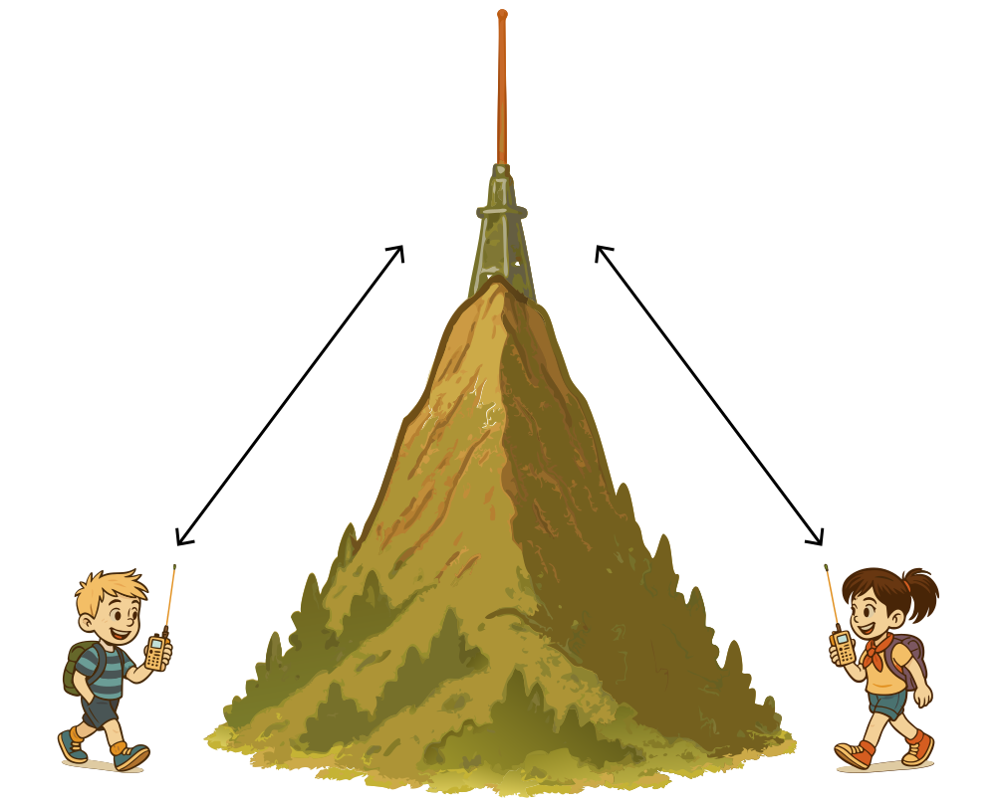

### Sección 6.5: Operación con Repetidores

Muy bien, hablemos sobre los repetidores - las maravillas extensoras de alcance del mundo de la radioafición. Estos dispositivos útiles toman tu señal y la gritan desde los tejados (o cimas de montañas) por ti.

#### ¿Qué es un Repetidor?

> **Información Clave:** Una estación repetidora retransmite simultáneamente la señal de otra estación de radioaficionado en un canal diferente (frecuencia). 

{.img-med .float-right}

Imagina una estación de retransmisión de radio ubicada en lo alto de una colina o un edificio alto. Escucha en una frecuencia y retransmite simultáneamente lo que oye en otra. Esto extiende tu alcance mucho más allá de lo que tu pequeño equipo portátil o móvil podría hacer por sí solo.

Ahora, solo una señal puede existir útilmente en una determinada frecuencia a la vez, por lo que el repetidor no puede hablar en la misma frecuencia en la que tú estás hablando. En cambio, cuando transmites a un repetidor, en realidad estás enviando en una frecuencia (la entrada) y escuchando en otra (la salida). No te preocupes, tu radio manejará esto automáticamente si lo has configurado correctamente.

#### Desplazamientos de Repetidores

> **Información Clave:** El *desplazamiento del repetidor* es la diferencia entre las *frecuencias de transmisión y recepción* del repetidor. Los desplazamientos comunes son *más o menos 600 kHz en 2 metros* y *más o menos 5 MHz en 70 cm*.   

Al usar repetidores, necesitas saber sobre los desplazamientos. Un *desplazamiento es la diferencia entre las frecuencias de transmisión y recepción de un repetidor*. Tu radio necesita estar configurado con el desplazamiento correcto para comunicarse a través de un repetidor de manera efectiva.

Aquí hay una tabla útil de desplazamientos comunes de repetidores para varias bandas de radioaficionados:

| Banda | Rango de Frecuencia | Desplazamiento Común |
|:----:|:---------------:|:-------------:|
| 6m   | 50-54 MHz       | -500 kHz o -1 MHz |
| 2m   | 144-148 MHz     | *±600 kHz* |
| 1.25m| 222-225 MHz     | -1.6 MHz |
| 70cm | 420-450 MHz     | *±5 MHz* |
| 33cm | 902-928 MHz     | -12 MHz o -25 MHz |
| 23cm | 1240-1300 MHz   | -12 MHz o -20 MHz |

Recuerda, estos son los desplazamientos más comunes, pero puede haber excepciones:

- En 2 metros, los repetidores por encima de 147 MHz típicamente usan un desplazamiento positivo, mientras que los que están por debajo usan un desplazamiento negativo.
- Algunas áreas pueden usar desplazamientos no estándar debido a la coordinación de frecuencias local.
- Ciertos repetidores, especialmente aquellos en bandas menos comunes, podrían usar frecuencias divididas que no siguen estos desplazamientos estándar.

La mayoría de las radios modernas pueden establecer automáticamente el desplazamiento correcto basado en la frecuencia que ingreses, pero siempre es bueno verificar. En caso de duda, consulta un directorio local de repetidores o pregunta a otro radioaficionado en tu área.

Consejo Profesional: Puedes usar la función "inversa" de un transceptor VHF/UHF para *escuchar en la frecuencia de entrada de un repetidor*. Esto te ayuda a determinar si puedes escuchar una estación directamente sin pasar por el repetidor—útil para verificar la calidad de la señal o solucionar problemas.

#### Accediendo a Repetidores

> **Información Clave:** La mayoría de los repetidores usan *tonos CTCSS o códigos DCS* para acceso. Las dificultades para acceder a un repetidor podrían ser causadas por *desplazamiento incorrecto, tono CTCSS erróneo o código DCS equivocado*. CTCSS (Sistema de Silenciador Codificado por Tono Continuo) es un *tono subaudible* transmitido junto con el audio de voz normal para *abrir el silenciador de un receptor*.  

La mayoría de los repetidores requieren ya sea un tono CTCSS (Sistema de Silenciador Codificado por Tono Continuo), a menudo llamado tono PL (Línea Privada), o un código DCS (Silenciador Codificado Digital) para acceder a ellos. *CTCSS es un tono subaudible transmitido junto con el audio de voz normal para abrir el silenciador de un receptor*. DCS, por otro lado, es un flujo continuo de datos digitales de baja velocidad.

Ambos sirven el mismo propósito: ayudan a prevenir interferencias y activaciones no intencionadas del repetidor. Tu radio debe estar configurado para transmitir el tono CTCSS o código DCS correcto para que el repetidor reconozca tu señal. Consulta tu directorio local de repetidores o la información del club para averiguar qué sistema usa un repetidor en particular.

> **Información Clave:** DTMF (Multifrecuencia de Doble Tono) usa *pares de tonos de audio* para enviar comandos a repetidores y acceder a sistemas como IRLP, pero es diferente de CTCSS/DCS que son requeridos para el acceso básico al repetidor.

También encontrarás DTMF (Multifrecuencia de Doble Tono) en la operación con repetidores. *DTMF usa pares de tonos de audio* y es la misma tecnología utilizada en los teléfonos de tonos. A diferencia de CTCSS o DCS, DTMF no se usa para el acceso básico al repetidor sino para controlar funciones del repetidor, activar enlaces a otros sistemas o acceder a sistemas conectados a internet como IRLP (que discutiremos más adelante en esta sección).

Si estás teniendo problemas para acceder a un repetidor cuya salida puedes escuchar, podría haber varias razones:
- *Estás usando el desplazamiento incorrecto*
- *Estás usando el tono CTCSS incorrecto*
- *Estás usando el código DCS incorrecto*
- Estás demasiado lejos o en una ubicación desfavorable para que tu señal alcance el repetidor

Siempre verifica doblemente todos estos ajustes cuando programes un nuevo repetidor en tu radio.

#### Cómo Funcionan las Conversaciones por Repetidor

> **Información Clave:** Cuando llames a otra estación en un repetidor, *di el indicativo de la estación, luego identifícate con tu indicativo*. 

Así es como fluye una conversación típica por repetidor:
1. Transmites en la frecuencia de entrada (tu radio agrega el desplazamiento y tono correctos).
2. El repetidor recoge tu señal y la retransmite en la frecuencia de salida.
3. Otros radioaficionados en el área te escuchan en la frecuencia de salida del repetidor.
4. Cuando responden, transmiten en la frecuencia de entrada, y el repetidor retransmite su señal en la frecuencia de salida, completando el ciclo de comunicación.

Llamar a alguien en un repetidor es simple: solo *di el indicativo de la estación con la que quieres hablar, luego identifícate con tu indicativo*. Por ejemplo: "W1ABC, aquí K2XYZ." Esto es más una convención que una regla, pero es una forma apropiada de llamar la atención de alguien en un repetidor.

#### Etiqueta del Repetidor

La etiqueta del repetidor es importante ya que estos son recursos compartidos:
- Escucha antes de transmitir para evitar interrumpir conversaciones en curso.
- Mantén las transmisiones razonablemente cortas y deja pausas para que otros se unan.
- Identifícate usando tu indicativo según lo requieren las reglas de la FCC.
- Si quieres unirte a una conversación en curso, espera una pausa y di tu indicativo.

Como con cualquier equipo, el propietario del repetidor establece las reglas para su uso (sujetas a las regulaciones de la FCC). Ten en cuenta que cada repetidor puede ser un poco diferente en las convenciones que la gente sigue.

#### Llamando en un Repetidor

> **Información Clave:** Para indicar que estás escuchando en un repetidor y buscando un contacto, *usa tu indicativo seguido de la palabra "monitoreando"*. 

En general, realmente no llamamos "CQ" en un repetidor – no hay ninguna razón por la que no podríamos hacerlo, pero generalmente es mal visto con diversos niveles de intensidad por diferentes miembros de la comunidad. En cambio, para indicar que estás escuchando en un repetidor y buscando un contacto, *usa tu indicativo seguido de la palabra "monitoreando"*. Por ejemplo: "K2XYZ monitoreando."

Aquí hay algunas otras frases comunes:
- *"Aquí KD7BBC, móvil y monitoreando"* – indicando tanto que te estás moviendo como que estás en la frecuencia, presumiblemente feliz de hablar con alguien si quieren.
- *"K1BEN a la escucha"* – versión más corta de lo mismo
- *"Aquí AC7DM. ¿Alguien disponible para charlar mientras conduzco?"* – más casual, pero aún bien
- *"Aquí NV7V, ¿podría obtener un reporte de señal?"* – indica que no estás buscando un QSO, solo confirmar qué tan bien estás entrando al repetidor.

Los detalles específicos no importan, siempre que sea fácil de entender y no sea engañoso.

#### Comunicación por Repetidor vs. Comunicación Directa

Cuando te comunicas a través de un repetidor, estás operando en modo dúplex como discutimos anteriormente - estás usando dos frecuencias diferentes (la entrada y salida del repetidor). Esto es diferente de la comunicación directa estación a estación (llamada operación simplex).

> **Información Clave:** Al usar un repetidor, estás transmitiendo y recibiendo en diferentes frecuencias. Esto contrasta con la operación simplex donde las estaciones transmiten y reciben en la misma frecuencia.

A veces, se designan frecuencias específicamente para comunicación directa estación a estación sin usar repetidores. Esto ayuda a mantener los repetidores disponibles para aquellos que realmente necesitan sus capacidades de extensión de alcance. Cubriremos la operación simplex y estas frecuencias designadas más a fondo más adelante en el libro.

#### Sistemas de Repetidores Enlazados

> **Información Clave:** Una red de repetidores enlazados es una en la que *las señales recibidas por un repetidor son transmitidas por todos los repetidores en la red*. 

Imagina una red de estaciones de radio instaladas en diferentes cimas de colinas a través de una región. En una configuración tradicional, cada repetidor serviría solo a su área local. Pero en una *red de repetidores enlazados, las señales recibidas por un repetidor son transmitidas por todos los repetidores en la red*.

Es como tener un mensaje de texto grupal - cuando una persona envía un mensaje, todos en el grupo lo reciben independientemente de su ubicación. De manera similar, cuando transmites a un repetidor en una red enlazada, tu transmisión se retransmite a través de toda la red de repetidores conectados, extendiendo enormemente tu rango de comunicación.

Los repetidores enlazados son particularmente valiosos para:
- Comunicaciones de emergencia a través de áreas amplias
- Redes de clubes que abarcan múltiples ciudades o condados
- Eventos especiales donde se necesita coordinación a través de una región grande
- Permitir a los operadores móviles mantenerse conectados mientras viajan largas distancias

#### Repetidores Enlazados a Internet y Sistemas VoIP

> **Información Clave:** Voz sobre Protocolo de Internet (VoIP) es un *método de entregar comunicaciones de voz a través de internet usando técnicas digitales*. 

Algunos repetidores no están enlazados solo a través de conexiones de radio tradicionales—usan internet para conectarse con otros repetidores a través de grandes distancias. Esto se hace usando Voz Sobre Protocolo de Internet (VoIP), que es un *método de entregar comunicaciones de voz a través de internet usando técnicas digitales*.

Una estación de radioaficionado que conecta otras estaciones de radioaficionado a internet se llama *una puerta de enlace*.  Estas estaciones de puerta de enlace son los puentes entre el mundo de la radio e internet, permitiendo comunicación global.

Dos sistemas VoIP populares en radioafición son IRLP y EchoLink:

**IRLP (Proyecto de Enlace de Radio por Internet)**

El Proyecto de Enlace de Radio por Internet (IRLP) es *una técnica para conectar sistemas de radioafición, como repetidores, a través de internet usando Voz Sobre Protocolo de Internet (VoIP)*. 

Para usar IRLP, *el acceso por aire a nodos IRLP se logra usando señales DTMF*  (esos mismos pares de tonos que mencionamos anteriormente). Ingresarás códigos usando el teclado de tu radio para conectarte a varios nodos IRLP alrededor del mundo.

**EchoLink**

EchoLink lleva la conectividad de internet un paso más allá al permitir que una *estación de radioaficionado transmita a través de un repetidor sin usar una radio para iniciar la transmisión*.  Puedes usar software en tu computadora o teléfono inteligente para conectarte directamente al sistema.

*Antes de usar el sistema EchoLink, debes registrar tu indicativo y proporcionar prueba de licencia*.  Este proceso de verificación asegura que solo radioaficionados con licencia puedan acceder al sistema.

#### ¿Por Qué Usar Repetidores?

Los repetidores son excelentes para comunicaciones locales, preparación para emergencias y para comenzar en la radioafición. Son una gran manera de conocer a otros radioaficionados y aprender sobre la comunidad de radio local. ¡Con sistemas vinculados a internet, incluso puedes hablar con radioaficionados de todo el mundo!

Así que encuentra un repetidor local, prográmalo en tu radio y pruébalo. Recuerda, cuando presionas ese micrófono, te estás conectando con otros entusiastas de la radio que comparten tu pasión por la comunicación. ¡Disfruta explorando el mundo expandido que los repetidores abren para ti! La mejor manera de aprender es hacerlo.
