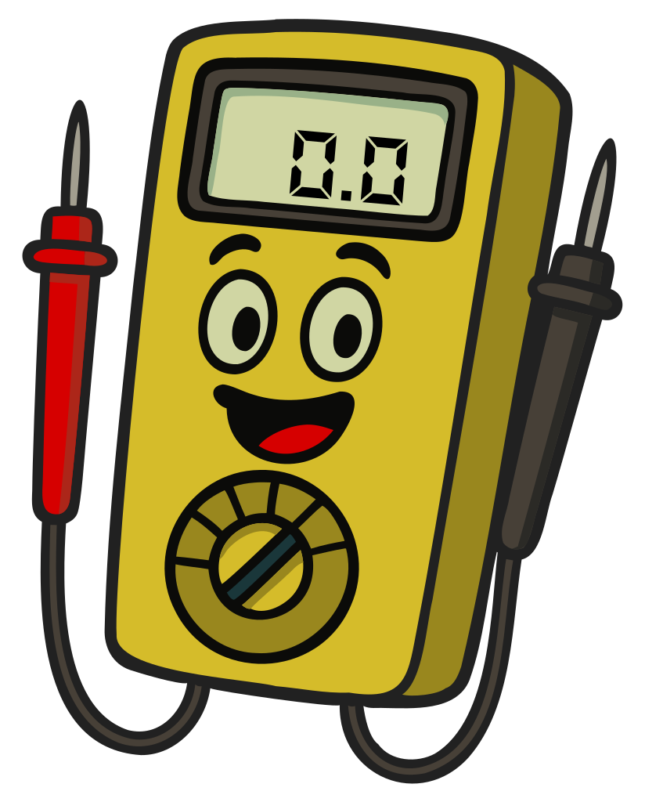

### Sección 6.6: Reparación y Pruebas Básicas

#### Introducción al Equipo de Prueba

Familiaricémonos con algunas habilidades esenciales para mantener tu estación de radioafición funcionando sin problemas: usar equipos de prueba y soldar de forma básica.

#### El Multímetro: La Navaja Suiza de tu Estación

{.img-small .float-right}

> **Información Clave:**
> * Un multímetro puede medir *voltaje, corriente y resistencia*.
> * Un *amperímetro* se usa para medir corriente eléctrica. 
> * Un medidor muestra una *cantidad eléctrica como un valor numérico*. 

Tu confiable multímetro es quizás la herramienta de diagnóstico más versátil y esencial en la estación de radioafición. Típicamente combina al menos tres instrumentos cruciales de medición: un *voltímetro (para medir voltaje)* , un *amperímetro (para medir corriente)* , y un *ohmímetro (para medir resistencia)*. Cuando solucionas problemas de equipos, tu primer paso a menudo debe ser comprobar las fuentes de alimentación y conexiones con tu multímetro.

##### Usando un Multímetro de Forma Segura

> **Información Clave:** 
> * Un *voltímetro se conecta en paralelo*  con un componente para medir voltaje.
> * Un *amperímetro se conecta en serie*  con un componente para medir corriente.
> * *Asegúrate de que el circuito no esté energizado cuando midas resistencia*  para evitar dañar el medidor.
> * Intentar medir voltaje cuando se usa la configuración de resistencia*  puede dañar tu multímetro.

Cuando midas voltaje, configura tu multímetro en el rango apropiado (DC o AC) y conéctalo en paralelo con el componente - sonda roja al punto positivo y negra al negativo o tierra.

Para mediciones de corriente, debes interrumpir el circuito y conectar el medidor en serie para que la corriente fluya a través del medidor.

⚠️ **ADVERTENCIA**: Nunca intentes medir corriente conectando las sondas en paralelo con un circuito - esto puede causar un cortocircuito y dañar tu medidor o crear un peligro para la seguridad.

#### Trabajando con Condensadores

> **Información Clave:** 
> * Una lectura de resistencia creciente en un ohmímetro indica que estás midiendo un *condensador descargado que se está cargando*. 
> * Las fuentes de alimentación pueden almacenar cargas peligrosas en *condensadores de filtro incluso después de ser apagadas*. 

Al medir un condensador con un ohmímetro, podrías notar que la lectura comienza baja y luego aumenta. Este es un comportamiento normal para un condensador descargado. A medida que el ohmímetro aplica un pequeño voltaje para realizar su medición, carga el condensador, causando que la resistencia aparente aumente con el tiempo.

⚠️ **ADVERTENCIA**: Siempre descarga los condensadores de forma segura antes de trabajar en equipos, especialmente en fuentes de alimentación que pueden almacenar cargas peligrosas incluso después de ser apagadas.

#### Midiendo Altos Voltajes

> **Información Clave:** Al medir altos voltajes, *asegúrate de que el voltímetro y los cables estén clasificados para los voltajes a medir*. 

La seguridad es primordial al medir altos voltajes. Siempre *asegúrate de que tu voltímetro y sus cables estén clasificados para el voltaje que estás midiendo*. Usar un voltímetro clasificado para 50 voltios para medir 1000 voltios podría dañar tu medidor o causar lesiones graves.

Recuerda que algunos equipos de radioafición, especialmente los basados en tubos, pueden tener voltajes peligrosamente altos incluso cuando están desenchufados. Esos condensadores de filtro pueden mantener una carga por mucho tiempo, así que siempre descarga los condensadores de alto voltaje antes de trabajar en equipos.

#### Otros Equipos de Prueba Esenciales

> **Información Clave:** Una carga ficticia *previene la transmisión de señales al aire cuando se realizan pruebas*  y consiste en *una resistencia no inductiva montada en un disipador de calor*. 

1. **Medidor de ROE**: Mide la Relación de Onda Estacionaria, indicándote qué tan bien está adaptada tu antena a tu transmisor. Una ROE alta puede indicar problemas en la antena y podría dañar tu transmisor.

2. **Vatímetro**: Mide la potencia de salida de tu transmisor, ayudándote a mantenerte dentro de los límites legales y asegurar un funcionamiento adecuado.

3. **Carga Ficticia**: Invaluable para probar transmisores sin emitir una señal. Es esencialmente una antena falsa que convierte la salida de tu radio en calor, permitiéndote ajustar y solucionar problemas sin causar interferencia.

4. **Osciloscopio**: Para pruebas más avanzadas, un osciloscopio puede visualizar señales eléctricas, ayudando a diagnosticar problemas con la modulación o la calidad de la señal.

#### El Arte de Soldar

> **Información Clave:** 
> * No se debe usar soldadura con núcleo de ácido para aplicaciones de radio y electrónica.  
> * Una unión de soldadura fría aparece rugosa o grumosa. 

Soldar es una habilidad que puede ahorrarte dinero y mantener tu equipo en óptimas condiciones. Aquí hay algunos conceptos básicos sobre soldadura:

1. Usa un soldador con control de temperatura ajustable (600-700°F/315-370°C para la mayoría de la electrónica).

2. Siempre "estaña" la punta de tu soldador aplicando una pequeña cantidad de soldadura antes de hacer una conexión.

3. Calienta la unión, no la soldadura. Toca con tu soldador los componentes que estás uniendo, luego aplica soldadura a la unión calentada.

4. *Usa soldadura con núcleo de resina para electrónica. Nunca uses soldadura con núcleo de ácido*, que puede corroer tus componentes.

5. Trabaja en un área bien ventilada y siempre usa gafas de seguridad.

6. Una buena unión de soldadura debe ser lisa y brillante, con forma cóncava. Si ves una unión que parece *opaca, rugosa o grumosa*, es probable que sea una unión de soldadura "fría" que se formó cuando las partes no se calentaron lo suficiente. Las uniones frías pueden causar conexiones intermitentes y deben rehacerse.

#### Recordatorio Final de Seguridad

Recuerda, ¡la seguridad es lo primero! Siempre desenchufa el equipo antes de trabajar en él, y ten en cuenta que los condensadores pueden mantener una carga incluso cuando la alimentación está apagada. Con estas habilidades en tu caja de herramientas, estarás bien equipado para manejar reparaciones básicas y mantener tu estación en óptimas condiciones de funcionamiento. ¡Felices pruebas y soldaduras!