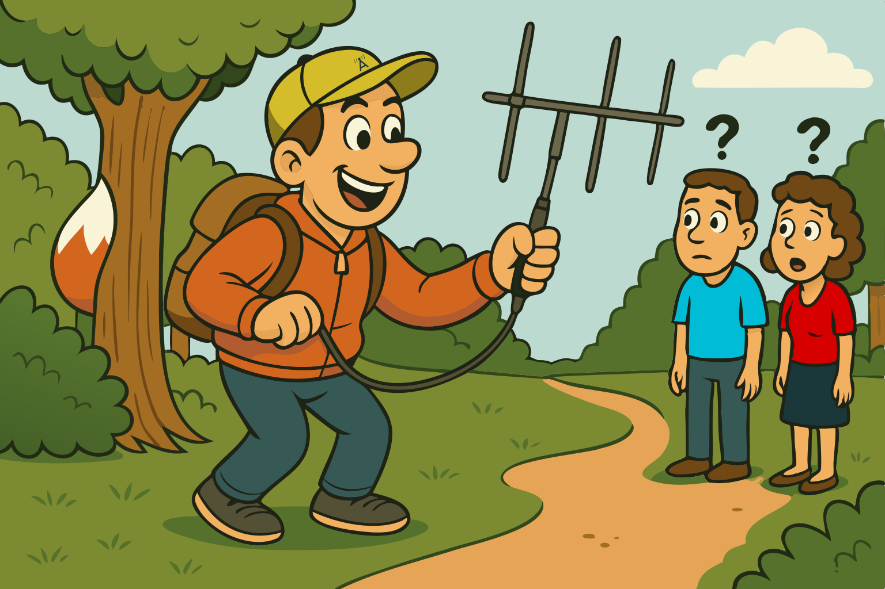

### Sección 7.5: Diversión con la Radioafición

¡Muy bien, aventureros de la radio, abróchense los cinturones! Estamos a punto de explorar algunas de las cosas más interesantes, peculiares y francamente impresionantes que puedes hacer con tu licencia de radioaficionado. Comencemos con algunas actividades que podrían aparecer en el examen.

> **Información Clave:** La radiogoniometría se utiliza para localizar fuentes de interferencia por ruido o interferencias intencionadas.  Implica el uso de antenas direccionales y receptores para determinar la ubicación de una señal de radio.

#### Caza del Zorro y Radiogoniometría

{.img-xlarge .img-centered}

¿Alguna vez te has imaginado como un detective de radio? ¡Entonces te encantará la caza del zorro! En radioafición, un "zorro" es un transmisor oculto, y tu trabajo es encontrarlo utilizando tus habilidades de radio y algo de equipo ingenioso. Es como un juego de escondite de alta tecnología. Así es cómo funciona:

1. Alguien configura un transmisor de baja potencia (el "zorro") en un lugar secreto.
2. *Los cazadores utilizan antenas direccionales para rastrear la señal.*
3. ¡La primera persona o equipo que encuentre el transmisor gana!

La caza del zorro te ayuda a desarrollar habilidades valiosas como comprender la propagación de ondas de radio, practicar comunicaciones de emergencia y obtener experiencia práctica con antenas direccionales. Para comenzar, solo necesitas un radio portátil, *una antena direccional (como una Yagi)* , y un atenuador. Muchos clubes organizan cacerías de zorros regularmente, lo que lo convierte en una excelente manera de conocer a otros radioaficionados y divertirse con la radio al aire libre.

Si bien a menudo se hace como una actividad divertida, también es una habilidad genuinamente útil, especialmente cuando se trata de rastrear fuentes de interferencia o interferencias intencionadas.

> 🔥 Algunos radioaficionados locales escucharon quejas de vecinos de que las puertas de garaje en el vecindario habían dejado de funcionar misteriosamente. Con curiosidad, decidieron investigar con un analizador de espectro y descubrieron una fuerte señal justo en la frecuencia utilizada por los abridores de puertas de garaje. Naturalmente, tomaron su equipo de radiogoniometría para investigar.
>
> La señal los llevó directamente al garaje de uno de los cazadores. Una configuración de repetidor en el interior había desarrollado una conexión suelta, que permitía que las señales del repetidor y una estación de transmisión cercana se mezclaran y produjeran interferencias no deseadas.
>
> El operador responsable —que puede o no haber sido un colaborador principal de este mismo libro— se sorprendió ligeramente y se sintió en silencio mortificado. Pero ese es el valor de la radiogoniometría: funciona, incluso cuando tú eres el problema.

#### Concursos

¿Alguna vez has sentido la emoción de una carrera? Bueno, la radioafición tiene su propia versión de competición de alta velocidad: ¡los concursos! *Es una actividad operativa que implica contactar con tantas estaciones como sea posible durante un período específico.*  Aquí está la información:

1. ¿Qué es un concurso? Es un evento donde los radioaficionados compiten para hacer la mayor cantidad de contactos, a menudo con objetivos específicos como trabajar diferentes países, estados o cuadrículas. Algunos duran unas pocas horas, otros un fin de semana completo. ¡Es como una fiesta de radio global!

2. ¿Cómo funciona? Intercambiarás información breve con cada estación que contactes, generalmente un reporte de señal y algunos otros datos como tu ubicación o un número de serie. *Al contactar con otra estación en un concurso, el buen procedimiento es enviar solo la información mínima necesaria para la identificación adecuada y el intercambio del concurso.*  No es el momento para una charla prolongada.

3. ¿Por qué participar en concursos? Es una excelente manera de mejorar tus habilidades operativas, probar el rendimiento de tu estación y tal vez conseguir algunas ubicaciones raras para premios. Además, ¡la descarga de adrenalina es real!

4. ¡Sal al aire! Muchos concursos tienen secciones para principiantes o estaciones de baja potencia. Es una manera perfecta de sumergirte en las aguas de los concursos.

> **Información Clave:** Los concursos son una actividad operativa popular donde los operadores intentan contactar con tantas estaciones como sea posible durante un período de tiempo específico. El buen procedimiento en un concurso es enviar solo la información mínima requerida.

#### Localizadores de cuadrícula

Ahora, hablemos de una herramienta genial utilizada en muchos concursos: los localizadores de cuadrícula. *Un localizador de cuadrícula es un designador de letras y números asignado a una ubicación geográfica*  en la Tierra. Por ejemplo, 'FM18' cubre el área de Washington D.C. En los concursos, podrías intercambiar cuadrículas en lugar de estados o países. ¡Es como un juego global de hundir la flota! Los localizadores de cuadrícula no son solo para concursos; son útiles para operaciones satelitales, trabajo en VHF/UHF, e incluso charlas generales cuando quieres compartir tu ubicación.

Aquí hay algunos ejemplos:

| Punto de Referencia | Dirección | Ciudad, Estado, Código Postal | Localizador de Cuadrícula |
|----------|---------|------------------|:------------:|
| Estatua de la Libertad | Liberty Island | Nueva York, NY 10004 | FN20xq |
| Puente Golden Gate | Golden Gate Bridge | San Francisco, CA 94129 | CM87st |
| Casa Blanca | 1600 Pennsylvania Avenue NW | Washington, D.C. 20500 | FM18lv |
| Space Needle | 400 Broad St | Seattle, WA 98109 | CN87to |
| Graceland | 3764 Elvis Presley Blvd | Memphis, TN 38116 | EM45xb |

Estos ejemplos muestran cómo los localizadores de cuadrícula pueden señalar ubicaciones en todo Estados Unidos. Observa cómo los dos primeros caracteres (como FM, CM, etc.) dan una idea aproximada de la región, mientras que los caracteres siguientes reducen la ubicación específica. Este sistema permite a los radioaficionados comunicar rápidamente su ubicación aproximada sin necesidad de intercambiar coordenadas detalladas.

---

#### Más Allá del Examen: Más Aventuras en Radioafición

Ahora que hemos cubierto las actividades operativas que necesitas conocer para el examen, exploremos otros aspectos emocionantes de la radioafición. Si bien estos temas no estarán en tu examen de Técnico, representan la increíble diversidad de este pasatiempo y ¡podrían inspirar tu próxima aventura radial!

#### Redes Mesh de Radioafición

Imagina crear tu propio mini-internet utilizando ondas de radio. De eso se trata la creación de redes mesh. Los radioaficionados están estableciendo redes de nodos que pueden pasar datos entre ellos, creando un sistema de comunicación robusto y descentralizado. ¡Es una red inalámbrica de área amplia que no se cae cuando falla tu ISP!

#### APRS (Sistema Automático de Reporte de Paquetes) {#aprs-section75}

Hablamos un poco sobre esto en la Sección 3.6 – ¡piensa en APRS como las redes sociales para tu radio! Te permite transmitir tu posición, datos meteorológicos y mensajes cortos a través de la radioafición. Imagina un mapa en tiempo real que muestra dónde están operando los radioaficionados, completo con actualizaciones de estado e información local. Es especialmente útil durante eventos de servicio público o emergencias, permitiendo a los coordinadores ver dónde están sus operadores de un vistazo.

#### SOTA (Cumbres En El Aire) y POTA (Parques En El Aire)

¿Qué tal combinar la radio con la naturaleza? Estas actividades te desafían a hacer contactos desde cimas de montañas o parques estatales/nacionales. Es una mezcla perfecta de senderismo y radio. ¡Nada supera la emoción de hacer un contacto desde un pico remoto usando una radio y antena que tú mismo transportaste hasta allí!

#### Radio Definida por Software (SDR)

Para los radioaficionados expertos en tecnología, SDR convierte tu computadora en un potente receptor de radio (y a veces transmisor). Con SDR, puedes decodificar señales digitales, rastrear aviones, escuchar satélites e incluso recibir imágenes de satélites meteorológicos. ¡Es como tener una super-radio que puede hacer casi cualquier cosa!

#### Comunicaciones EME (Tierra-Luna-Tierra)

¿Te encanta el espacio? Prueba EME, también conocido como rebote lunar. Sí, literalmente puedes rebotar señales de radio en la luna para comunicarte con otros radioaficionados. Es desafiante y requiere un equipo serio, pero ¿qué tan genial es usar la luna como un reflector de radio gigante?

#### Proyectos DIY

Para los constructores y aficionados al bricolaje, hay todo un mundo de proyectos DIY. Desde la construcción de tus propias antenas hasta la creación de transceptores QRP (baja potencia), las posibilidades son infinitas. Es como LEGO para adultos, ¡pero con la satisfacción de hacer contactos con equipos que tú mismo construiste!

#### Modos Digitales

Aunque no son exactamente nuevos, modos como FT8 están revolucionando la forma en que hacemos contactos. Usando estos modos, puedes comunicarte alrededor del mundo con muy poca potencia y antenas comprometidas. ¡Es como tener un superpoder que te permite susurrar a través de continentes!

#### ¡Mucho más!

Recuerda, estos son solo algunos ejemplos de las cosas increíbles que puedes hacer con radioafición. El pasatiempo está en constante evolución, con radioaficionados encontrando formas nuevas e innovadoras de utilizar la tecnología de radio. Ya sea que estés interesado en experimentación de alta tecnología o en conversaciones tradicionales, siempre hay algo nuevo para probar.

Así que no tengas miedo de explorar, experimentar y empujar los límites de lo que es posible con tu licencia. ¿Quién sabe? Podrías ser pionero en la próxima gran cosa en radioafición. ¡Ahora sal y haz que ocurra algo de magia radial!