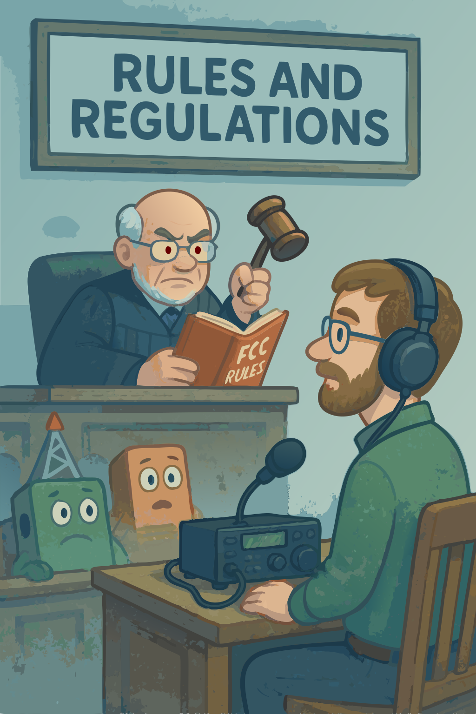

## Capítulo 8: Normas y Reglamentos

¡Bienvenido a tu manual de reglas de Radioaficionado! Aunque puede que no suene tan emocionante como hacer contactos DX o experimentar con antenas, entender las normas y reglamentos es crucial para ser un operador responsable y legal – ¡sin mencionar evitar molestar a radioaficionados más experimentados!

{.img-pgcap .float-right}

En este capítulo, navegaremos por el mundo de las regulaciones de la FCC que gobiernan la radioafición en los Estados Unidos. Comenzaremos explicando la estructura de las licencias de radioaficionado, incluyendo las diferentes categorías de licencia y los privilegios que ofrecen.

Aprenderás sobre las asignaciones de frecuencias - qué partes del espectro radioeléctrico están disponibles para uso de radioaficionados y qué se te permite hacer en cada banda. Cubriremos conceptos importantes como asignaciones primarias y secundarias, y cómo compartir bandas con otros servicios.

Nos adentraremos en los detalles de la identificación de estaciones, enseñándote cuándo y cómo identificar correctamente tu estación. Aprenderás sobre transmisiones autorizadas y prohibidas, asegurándote de mantenerte dentro de la ley mientras estás al aire.

También cubriremos temas importantes como los protocolos de comunicaciones de emergencia, las reglas de tráfico de terceros y las regulaciones internacionales que afectan a la radioafición.

Recuerda, estas reglas no son solo burocracia - están diseñadas para asegurar un uso justo y eficiente del espectro radioeléctrico, promover la buena voluntad internacional y mantener la integridad de la radioafición como servicio.

Al final de este capítulo, tendrás una comprensión clara de tus derechos y responsabilidades como operador de radioaficionado. Estarás preparado para operar legal y éticamente, manteniendo las orgullosas tradiciones del servicio de radioaficionados.

> Cuando se trata de operar una estación de Radioaficionado, las normas de la FCC *siempre* aplican – cuando hay excepciones, como en una emergencia, ¡esa excepción está escrita en las reglas para que sigan aplicando!

Con esto en mente, ¡vamos a discutir las reglas y asegurar que tu aventura en la radioafición se mantenga en la frecuencia correcta!
