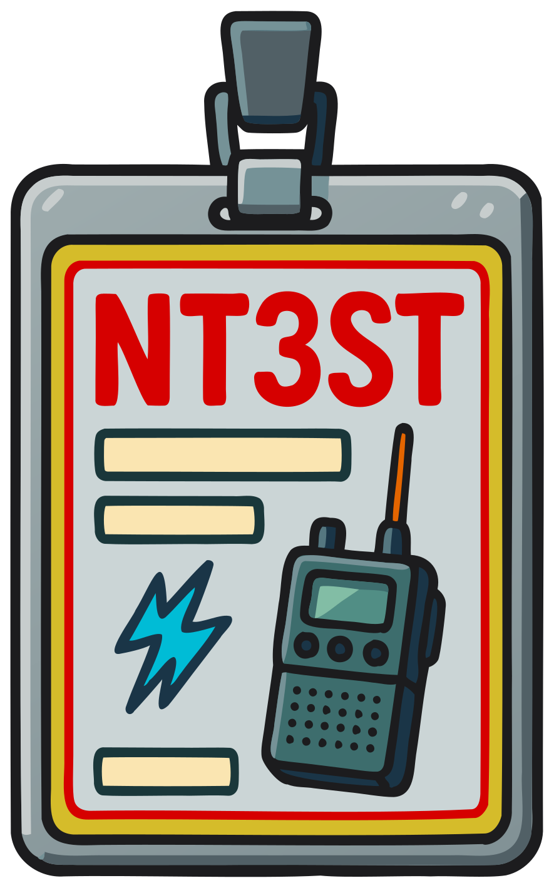

### Sección 8.5: Identificación de Estación

{.img-xsmall .float-right}

Muy bien, compañeros radioaficionados, hablemos sobre una de las reglas más fundamentales en la radioafición: la identificación de estación. ¡Es como firmar tu nombre, pero a través de las ondas!

#### Cuándo Identificarse

> **Información Clave:** Estás obligado a transmitir tu indicativo asignado al menos cada 10 minutos durante y al final de una comunicación. 

La FCC requiere que identifiques tu estación en dos situaciones clave:
1. Al menos cada 10 minutos durante un contacto
2. Al final de cada comunicación

Recuerda: "Diez y Final" - identifícate al menos cada diez minutos y al final.

> **Información Clave:** Cuando hagas transmisiones de prueba al aire, debes identificar la estación transmisora. 

Incluso para transmisiones de prueba cortas, debes identificar tu estación con tu indicativo. ¡No hay excepción de "solo probando" a las reglas de identificación!

#### Cómo Identificarse

> **Información Clave:** El inglés es el idioma requerido para la identificación cuando se opera fonía en el Servicio de Radioaficionados. 
>
> *El método de identificación del indicativo para una transmisión de fonía es usar una emisión de CW o fonía.* 

Tu identificación de estación debe incluir tu indicativo asignado por la FCC. Aquí hay algunos puntos clave:

1. **Idioma**: *Debes identificarte en inglés.* Sin embargo, también puedes añadir identificaciones en otros idiomas si lo deseas.

2. **Identificación de Voz**: *Puedes identificarte usando emisión de CW o fonía cuando operas en fonía.* Por ejemplo: "This is KA1ABC" o "KA1ABC clear."

3. **CW y Modos Digitales**: Transmite tu indicativo usando el modo en el que estás operando.

4. **Fonética**: Aunque no es obligatorio, la FCC *fomenta el uso de un alfabeto fonético* para la identificación de estación cuando se opera en modos de fonía.  Esta práctica ayuda a asegurar una comunicación clara y precisa de los indicativos, especialmente en condiciones desafiantes. Por ejemplo: "Kilo Alpha Uno Alpha Bravo Charlie." en lugar de "KA1ABC". Es mejor usar un alfabeto estándar en lugar de inventar uno para evitar confusiones.

5. **Indicadores Autoasignados**: 

> **Información Clave:** Todas estas opciones son aceptables cuando se usa una transmisión de fonía: KL7CC stroke W3, KL7CC slant W3, o KL7CC slash W3. 

¿Quieres añadir un poco de estilo a tu indicativo? ¡Puedes usar indicadores autoasignados! Estos son como pegatinas de parachoques de radio que dicen a otros algo especial sobre tu operación. Añádelos antes o después de tu indicativo (o ambos), separados por una barra (/), la palabra "stroke," "slant," o "slash". Por ejemplo, "KA1ABC/MOB" podría usarse para que la gente sepa que estás en movimiento. "W1AW/70" podría indicar que estás celebrando un 70º aniversario. Solo recuerda, tu indicador no puede chocar con ningún indicador especificado por la FCC o prefijos de países.

#### Situaciones Especiales

1. **Estaciones de Club**: Usa el indicativo del club, no el tuyo personal.
2. **Estaciones de Eventos Especiales**: Usa el indicativo del evento especial si se ha emitido uno.
3. **Operación Remota**: Pueden aplicarse reglas adicionales de identificación. Verifica las regulaciones actuales de la FCC.

#### Uso de Indicativos Tácticos

> **Información Clave:** Cuando se usan indicativos tácticos como "Cuartel General de Carrera," debes identificarte con tu indicativo asignado por la FCC al final de cada comunicación y cada diez minutos durante una comunicación. 

Por mucho que todos amemos nuestros indicativos (si no lo haces, ¡lo harás!) hay momentos en los que no es super conveniente llevar un seguimiento de ellos cuando se trabaja con un grupo. Imagina que estás ayudando con un gran evento – quizás un desfile en una ciudad de tamaño medio. Digamos que necesitamos a alguien en cada una de estas estaciones:

* Cuartel general del desfile – alguien para coordinar con los oficiales a cargo del desfile y transmitir información según sea necesario
* Calle 1ª
* Calle 2ª
* ...
* Área de preparación – el comienzo del desfile donde las carrozas se preparan para iniciar el desfile
* Control de Red – la persona que coordina a todos los operadores para que no hablen todos al mismo tiempo

Ahora, imagina que por alguna razón el desfile va a durar mucho tiempo y tienes gente cambiando en turnos; cuando necesitas saber qué está pasando en la Calle 3ª realmente no te importa quién es el operador allí, solo necesitas hablar con alguien en esa ubicación.

Afortunadamente, la Parte 97 no requiere que identifiques a la persona a la que estás llamando por su indicativo real. ¡Solo requiere que te identifiques *tú mismo* – y ahí está el propósito de un indicativo táctico!

**¿Qué son los indicativos tácticos?**
Los indicativos tácticos son nombres cortos y descriptivos usados para identificar la función o ubicación de una estación durante un evento. Podrías tener entonces una conversación como esta:

* "Calle 1ª, aquí Control de Red"
* "Control de Red de Calle 1ª, ¡adelante!"
* "¿Puedes ver la carroza del desfile con el sándwich gigante de bologna?"
* "Afirmativo control de red, están pasando por mi ubicación ahora"
* "Gracias. Enviaré a alguien a devolver su nevera de pastrami – se cayó una cuadra atrás y no se dieron cuenta"
* "Entendido. Calle 1ª, KF1AZT fuera"
* "Control de red, NT3ST fuera"

Observa algunas cosas en este ejemplo inventado:

* Es fácil para todos seguir quién está hablando y qué está pasando – incluso si no saben dónde está KF1AZT. Si hubieran usado indicativos en su lugar, habría sido mucho más difícil seguir eso.
* Las reglas no requieren que te identifiques en cada transmisión, solo una vez cada 10 minutos y al final – así que necesitas despedirte con tu indicativo pero puedes responder con el indicativo táctico.
* Los detalles específicos de cuándo y cómo te identificas con tu indicativo real no importan siempre y cuando sigas esas dos reglas.

Recuerda, los indicativos tácticos son la cereza en el helado de tu comunicación, no un reemplazo para tu indicativo oficial de la FCC. ¡Úsalos sabiamente, y serás el superhéroe de comunicación que tu evento necesita!

#### Excepciones a los Requisitos de Identificación

> **Información Clave:** Cuando se transmiten señales para controlar aeromodelos, las estaciones de radioaficionados no están obligadas a identificarse al aire. 

Aunque la identificación de estación es generalmente requerida, hay algunas situaciones específicas donde una estación de radioaficionado puede transmitir sin identificarse al aire:

1. **Transmisiones para controlar aeromodelos**: Cuando se usa control de radio para telecomando no estás obligado a identificarte en las formas regulares.
   > **telecomando**: Una transmisión unidireccional para iniciar, modificar o terminar funciones de un dispositivo a distancia.

2. **Transmisiones desde una estación espacial**: Las estaciones espaciales operando bajo control automático pueden tener requisitos de identificación diferentes. Hay requisitos especiales de licencia para poner en funcionamiento una estación espacial. ¡Principalmente solo necesitas saber que está en la lista de excepciones!

Recuerda, estas excepciones son limitadas. En la mayoría de los casos, todavía se requiere una identificación adecuada.

#### Consejos y Trucos

1. Configura un temporizador de 10 minutos durante QSOs largos para recordarte identificarte.
2. Aunque no es obligatorio, muchos radioaficionados eligen identificarse al principio de un contacto como cortesía. Esto está perfectamente bien y generalmente es una buena idea, simplemente no está ordenado por las reglas de la FCC.
3. Siempre que llames a alguien al aire, di primero su indicativo – y posiblemente más de una vez. Esto es porque no todo el mundo está escuchando todo el tiempo, pero la mayoría de nosotros nos acostumbramos a escuchar nuestro indicativo. Comenzaremos a escuchar cuando notemos nuestro indicativo pero puede que no hayamos notado lo que dijiste antes. Si te identificas *después* de la persona a la que estás llamando, entonces es más probable que sepan a quién deben responder.

#### Consejo Profesional

Practica decir tu indicativo clara y confiadamente. Es tu identidad de radio, ¡llévala con orgullo!

Recuerda, la identificación adecuada no es solo un requisito legal; es una cortesía hacia otros operadores. Ayuda a todos a saber con quién están hablando y evita confusión en las bandas. Al seguir estas reglas de identificación, no solo estás cumpliendo con las regulaciones de la FCC; estás participando en las tradiciones duraderas de la radioafición. Así que sal ahí, presiona ese micrófono, y deja que el mundo sepa quién eres - ¡cada 10 minutos y al final de tu QSO!
