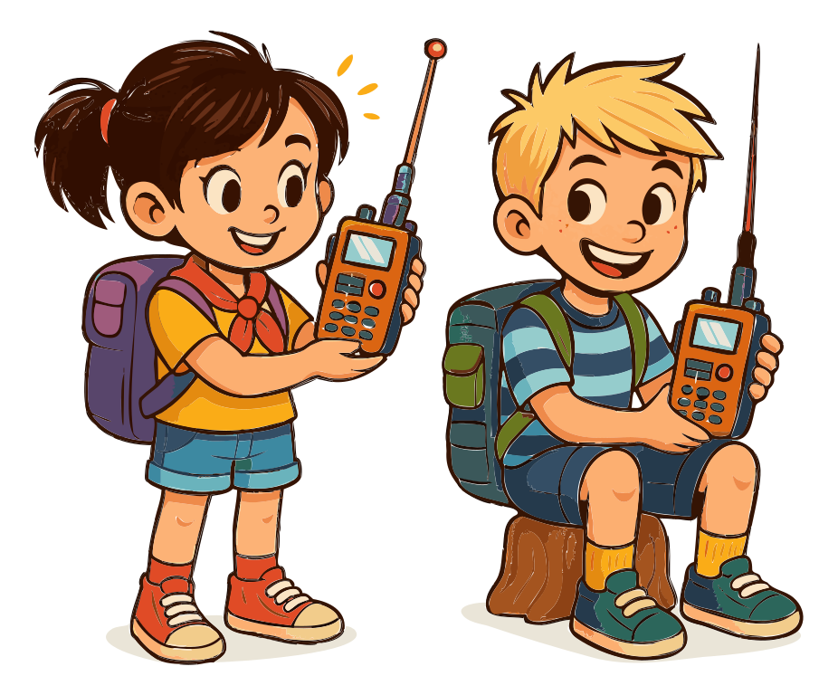

# About Amateur Radio

Amateur radio, often called "ham radio," is more than just a hobby—it's a community of enthusiasts who connect with others, experiment with electronics, and provide vital communication during emergencies. Unlike the internet, cell towers, or the electrical grid, amateur radio can operate independently, keeping you connected no matter where you are or what’s happening around you. Whether you’re chatting with a neighbor, tinkering with a new antenna, or helping out in a crisis, amateur radio opens up a world of possibilities.

> You might see "HAM" radio written in all caps, and that’s understandable—there’s been confusion over where the term comes from. Some think it’s an acronym, and while it has been used that way, "ham" actually started as a playful jab at clumsy operators. Over time, it evolved into the friendly term we use today. So, while "HAM" in all caps might irk some old-timers, don’t worry—we won’t give you too much grief. Just know that "ham" works perfectly fine, lowercase and all!

## A World of Possibilities

{.img-xlarge .img-centered}

Imagine staying in touch when everything else is down—no cell service, no internet, not even power. With amateur radio, you’re not just using someone else’s network; you’re creating your own. Whether you’re deep in the mountains or in the middle of a city blackout, your radio keeps you connected.

Ham radio operators are known for making things work, even in the toughest conditions. On a remote hike where your phone has no signal, a simple, portable radio can still get you in touch with others. In emergencies, when other communication systems fail, amateur radio becomes a lifeline, linking people and communities.

As a Technician class operator, you'll have access to VHF and UHF frequencies, perfect for local and regional communication. With repeaters, you can extend your range even further, making amateur radio a tool for adventure and exploration, no matter where you are.

## More Than Just a Hobby

{.float-right .img-pgcap}

Sure, amateur radio is fun, but it’s also a vital tool in emergencies. When disasters strike and cell towers go down, ham radio operators often step in to keep communication lines open.

For example, during Hurricane Maria in 2017, amateur radio operators in Puerto Rico provided critical communication support when much of the island's infrastructure was destroyed. They relayed emergency messages, helped coordinate relief efforts, and even assisted in reuniting families who had lost contact during the disaster.

But it’s not just about emergencies. Amateur radio is a community of tinkerers and explorers. You’ll find hams experimenting with new technology, building their own gear, and pushing the limits of what’s possible. Whether you’re in it for the technical challenge, the thrill of independent communication, or the chance to help out in a crisis, amateur radio has something for you.

## A Community of Innovators

Ham radio has a long history of innovation. Many of the technologies we take for granted today were developed or refined by amateur radio enthusiasts. Hams have always been at the forefront of what’s possible with wireless technology.

In 2014, a group of hams made headlines by repurposing an old NASA satellite for amateur use. The ISEE-3 satellite, launched in 1978 and long forgotten, was brought back to life by these innovative hams, showcasing the ingenuity that defines the amateur radio community.

## A Hobby for Everyone

{.float-left .img-pgcap}

Whether you’re into the technical side of things, enjoy making long-distance contacts, or just want to be prepared in case of an emergency, amateur radio has something to offer. It’s a hobby that spans generations, bringing together people of all ages who share a love for radio communication.

As you explore amateur radio, you’ll find a community ready to help you learn, grow, and connect. Whether it’s through local club meetings or global contests, there are endless opportunities to make new friends and discover new aspects of the hobby.

## The purpose of Amateur Radio {#purpose-intro}

The Federal Communications Commission (FCC) regulates and enforces the rules for the Amateur Radio service in the United States and it was established with specific purposes *which you may need to know for the exam*. These form the basis and purpose of our hobby and service:

1. Advancing skills in both the technical and communication aspects of radio.
2. Expanding the pool of trained operators, technicians, and electronic experts.
3. Enhancing international goodwill through global communications.
4. Providing a voluntary noncommercial communication service to the public, especially in times of emergency.
5. Contributing to the advancement of the radio art.

These purposes highlight the multifaceted nature of amateur radio - it's not just a hobby, but a service with important technical, social, and public safety roles. As you progress in amateur radio, you'll find opportunities to fulfill each of these purposes, whether you're experimenting with new technologies, making friends across the globe, or helping your community during emergencies.

---

Understanding the passion and potential of amateur radio is exciting, but how do you actually get started? The journey begins with the Technician Class license exam—a gateway that might seem daunting but is actually your first real adventure in ham radio. Let's demystify the exam process and show you that with the right approach, you'll be on the airwaves before you know it.
