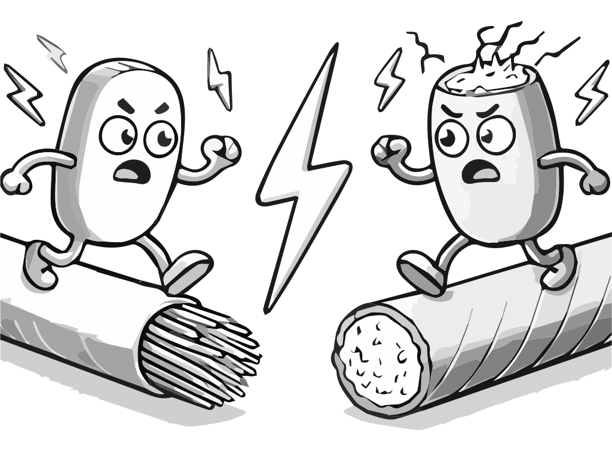

### Section 1.1: Electrical Basics

Electricity is the lifeblood of amateur radio. To understand how our equipment works and to operate it effectively, we need to grasp some fundamental electrical concepts. Let's start with the basics: conductors and insulators.

#### Conductors and Insulators

In the world of electricity, materials fall into two main categories: conductors and insulators.

**Conductors** are materials that allow electricity to flow through them easily.  Think of them as highways for electrons. Most metals are good conductors because they have many free electrons that can move around easily. This is why we use metals like copper in our radio equipment - those free electrons make it easy for electrical current to flow. A fun fact: silver is actually a better conductor than copper, but its high price makes it impractical for most applications!

**Insulators**, on the other hand, are materials that resist the flow of electricity. They act like barriers, keeping electricity where we want it and preventing it from going where we don't want it. Materials like glass, plastic, and rubber are good insulators.

You can find examples of conductors and insulators working together all around you. Look at any electrical cord in your house - the copper wires inside are conductors, carrying electricity to your appliances, while the plastic coating around the wires is an insulator, keeping that electricity safely contained. In amateur radio, we use both conductors and insulators together in similar ways to build safe and effective stations.