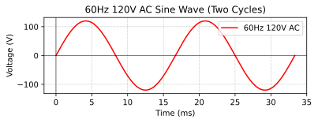

### Section 1.2: Electrical Units and Quantities

To understand how our radios work, we need to familiarize ourselves with some basic electrical quantities. Let's start with the "big three": voltage, current, and resistance.

#### Voltage, Current, and Resistance

While we often compare electricity to water flowing through pipes, this analogy isn't perfect. Let's look at what's really happening:

- **Voltage** ($E$ or $V$) is like electrical "pressure" - *it's the force that causes electron flow in a circuit*, and we measure it in **volts (V)**.  
  - Voltage is also sometimes called **electromotive force (EMF)**, because it creates the conditions that allow current to flow.
  - Voltage is always measured *between two points*. When we say a car battery is 12V, we mean there's a **12-volt difference** between its positive and negative terminals.

- **Current** ($I$) is *the flow of electrons in an electric circuit*, measured in **amperes (A)**.   Here's what's interesting:
  - While individual electrons move quite slowly through a conductor (about half an inch per minute!), the movement of electrical charges is nearly instantaneous - like a long tube filled with marbles. Push one in at one end, and one pops out the other end almost immediately.
  - In amateur radio, you might deal with:
    - **Milliamps (mA)** in low-power circuits
    - **A few amps** powering a mobile transceiver
    - **15-20 amps** for a high-power HF amplifier

- **Resistance** ($R$) is *how much a material opposes current flow by converting electrical energy into heat*, measured in **ohms ($\Omega$)**.  
  - Think of resistance as a fundamental property that affects how electrical energy moves through a circuit:
    - *Conductors* like copper wire have *very low resistance*, allowing current to flow easily
    - *Insulators* like rubber or glass have *very high resistance*, blocking current flow
    - *Resistors* are components with specific, controlled resistance values used to:
      - Limit current in LED circuits to prevent burnout
      - Divide voltage in measurement circuits
      - Convert electrical energy to heat in applications like dummy loads

These three quantities are fundamentally linked as explained by **Ohm's Law**, which we'll cover in **Section 1.3**.

#### Voltage Drop

When current flows through a resistive component or wire, some voltage is "used up" in the process. This decrease in voltage is called **voltage drop**.

It's similar to water pressure decreasing as water flows through a pipe - the longer or narrower the pipe, the more pressure is lost. In electrical terms, when current flows through resistance, voltage decreases along the path.

This concept is important in amateur radio because:
- Long power cables to your radio can result in lower voltage at the radio than at the power source
- Higher current draw (like during transmission) increases voltage drop

This is why most mobile ham installations use thick, short power cables - to minimize voltage drop when operating equipment that draws significant current. This is a direct application of how resistance affects current and voltage in real-world amateur radio setups.

#### Frequency {#12frequency}

Now that we understand these basic DC electrical concepts, let's look at alternating current and frequency.

In amateur radio, we often deal with **alternating current (AC)**, which smoothly changes direction in a sine wave pattern, unlike DC which flows constantly in one direction.

AC occurs naturally when a magnet rotates near a wire. As the magnet's north pole approaches the wire, current flows one way. When the south pole approaches, current flows the opposite way. This continuous rotation creates the smooth sine wave pattern shown in the diagram. This is the basic principle behind generators that produce the electricity powering our homes and the alternating currents in our radio circuits.

The diagram shows two complete **cycles** of AC - each starting at zero, rising to a positive peak, falling through zero to a negative peak, then returning to zero. *The number of these cycles completed per second is called frequency, measured in Hertz (Hz)*.  

Some examples:
- Household power: **60 Hz** (60 cycles per second)
- AM radio stations: around **1000 kHz** (1,000,000 cycles per second)
- FM radio and many ham bands: **MHz range** (millions of cycles per second)

Understanding *frequency* is crucial in amateur radio because it determines *which bands you can use* and *how far your signals can travel*.

#### Power

Power is *the rate at which electrical energy is used or generated in a circuit*.  It's measured in **watts (W)**  and is calculated using the **Power Law**, which we'll cover in **Section 1.3**.

In amateur radio, power is important because:

- **More power = Greater transmission range.** A stronger signal reaches farther.
- **More power = More heat.** High-power radios need proper cooling.
- **More power = Higher energy demands.** Your power supply must handle your radio's needs.

#### Decibels

Instead of always talking in watts, hams often use **decibels (dB)** to express power changes. Decibels make it easy to compare signal strengths:

- **+3 dB** means power *doubles*. 
- **-3 dB** means power *is cut in half*.
- **+10 dB** means power *increases by ten times*. 

Some real-world examples:
- A power increase from **5W to 10W** is a **+3 dB gain**.
- A decrease from **12W to 3W** is a **-6 dB loss**. 
- Going from **20W to 200W**? That's a **+10 dB boost**.

#### Metric Prefixes and Electrical Units

In amateur radio, we often deal with very large or very small numbers. Instead of writing out all the zeros, we use **metric prefixes**:

| Prefix | Symbol | Multiplier | Example |
|--------|--------|------------|---------|
| pico   | p      | $10^{-12}$ | 1 pF = 0.000000000001 F |
| nano   | n      | $10^{-9}$  | 1 nF = 0.000000001 F |
| micro  | μ      | $10^{-6}$  | 1 μF = 0.000001 F |
| milli  | m      | $10^{-3}$  | 1 mV = 0.001 V |
| (none) | -      | $10^0$     | 1 A = 1 A |
| kilo   | k      | $10^3$     | 1 kHz = 1,000 Hz |
| mega   | M      | $10^6$     | 1 MHz = 1,000,000 Hz |
| giga   | G      | $10^9$     | 1 GHz = 1,000,000,000 Hz |

Here are some common conversions that may appear on the exam:

| Original               | Equivalent             | Question ID |
|------------------------|------------------------|-------------|
| 1.5 amperes            | 1500 milliamperes      | T5B01       |
| 1500 kHz               | 1.5 MHz                | T5B02       |
| 1 kilovolt             | 1000 volts             | T5B03       |
| 1 microvolt            | 0.000001 volts         | T5B04       |
| 500 milliwatts         | 0.5 watts              | T5B05       |
| 3000 milliamperes      | 3 amperes              | T5B06       |
| 3.525 MHz              | 3525 kHz               | T5B07       |
| 1,000,000 picofarads   | 1 microfarad           | T5B08       |
| 28400 kHz              | 28.400 MHz             | T5B12       |
| 2425 MHz               | 2.425 GHz              | T5B13       |

All of these conversions are worth memorizing for the exam:
- *1.5 amperes equals 1500 milliamperes* 
- *1500 kHz equals 1.5 MHz* 
- *1 kilovolt equals 1000 volts* 
- *1 microvolt equals one one-millionth of a volt* 
- *500 milliwatts equals 0.5 watts* 
- *3000 milliamperes equals 3 amperes* 
- *3.525 MHz equals 3525 kHz* 
- *1,000,000 picofarads equals 1 microfarad* 
- *28400 kHz equals 28.400 MHz* 
- *2425 MHz equals 2.425 GHz* 

#### AC and DC

Electricity comes in two types:

- **Direct Current (DC)** flows *in one direction*, like from a **battery** or power supply. Most radios run on **12V DC**.
- **Alternating Current (AC)** *constantly reverses direction, alternating between positive and negative directions*, like **household power**. 

Most ham gear runs on **DC power**, but **radio signals themselves are AC**—they alternate at **radio frequencies**.

*Resistance opposes all types of current flow*, including direct current, alternating current, and RF current. 

#### Impedance

> **Key Information:** *Impedance is the opposition to AC current flow*  and, like resistance, it's measured in *ohms ($\Omega$)*. 

In a **DC circuit**, resistance simply opposes the flow of electricity. But in an **AC circuit**, the story gets more complex.

*Capacitance describes the ability to store energy in an electric field*  and is measured in *farads*. 

*Inductance describes the ability to store energy in a magnetic field*  and is measured in *henrys*. 

In electrical circuits that include capacitors and/or inductors, the effect these components have on alternating current will vary with frequency. This frequency-dependent opposition to current flow is called **reactance**.

- **Inductive reactance** increases as frequency increases
- **Capacitive reactance** decreases as frequency increases

**Impedance** combines both resistance and reactance, giving us the total opposition to AC current flow in a circuit.

A *resonant circuit consists of an inductor and a capacitor in series or parallel*.  At resonance, the inductive and capacitive reactances are equal in magnitude but opposite in effect, creating interesting and useful circuit behaviors.

Amateur radio equipment is typically designed to work with specific impedance values. For example, most transceivers are designed to connect to a **50-ohm** system. When impedances aren't properly matched:

- Power transfer becomes less efficient
- Some energy may be reflected back toward the source
- Equipment may need to reduce power output to protect itself

These principles apply to many parts of your radio system, including antennas, which exhibit properties of resistance, capacitance, and inductance.

---

#### **Wrapping It All Up**

Understanding these electrical quantities will help you make sense of your radio gear and pass the exam. As you continue your ham radio journey, these ideas will come up again and again, so keep this knowledge handy!
