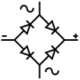

### Section 2.2: Semiconductors

Semiconductors are the building blocks of modern electronics. They’re special materials that can act as both a conductor (letting electricity flow) and an insulator (blocking electricity), depending on how they’re used. This unique property allows us to create all sorts of devices that control electricity in useful ways.

### Diodes: One-Way Streets

A diode is like a one-way street for electricity—it only allows current to flow in one direction. Think of it as a one-way valve in plumbing: water (or in this case, electrical current) can flow through, but only one way. If you try to push current the other way, the diode blocks it.

Diodes are used in many circuits, especially in converting AC (alternating current) to DC (direct current). When you plug your radio into the wall, the power supply uses diodes to turn the AC from the outlet into the DC that your radio needs.

- **Forward Voltage Drop:** When a diode is conducting (letting current flow), there’s a small voltage drop across it. This is known as the forward voltage drop. The amount of this drop depends on the type of diode:
  - **Silicon Diodes** typically have a forward voltage drop of about 0.7 volts.
  - **Schottky Diodes**, which are often used in high-speed switching, have a lower forward voltage drop, usually around 0.2 to 0.3 volts.
  - **Zener Diodes** are designed to allow current to flow in the reverse direction when a specific reverse voltage (called the Zener voltage) is reached. They are often used for voltage regulation in circuits.
  
- **Diode Terminals:** Diodes have two terminals:
  - **Anode**: The positive side where current enters.
  - **Cathode**: The negative side where current exits. The cathode is often marked with a stripe.

- **Key Points:**
  - **Current Flow:** Diodes allow current to flow in only one direction.
  - **Markings:** The cathode (negative side) is often marked with a stripe.
  - **Forward Voltage Drop:** The forward voltage drop is lower in some diode types (like Schottky diodes) than in others (like silicon diodes).

#### Rectifiers: Turning AC into DC

A rectifier is a specific type of circuit that uses diodes to convert AC (which flows back and forth) into DC (which flows in only one direction). This process is crucial in power supplies, where the alternating current from the wall outlet needs to be converted into the direct current that most electronic devices require.

In a basic rectifier circuit, diodes are arranged so that they only allow current to pass when it’s flowing in the desired direction, effectively “chopping up” the AC into DC. In a "full bridge" rectifier two paths are created through the diodes so that whichever direction current flows in it will always flow out the same direction.

- **Key Points:**
  - **Function:** Rectifiers convert AC into varying DC using diodes.
  - **Application:** Rectifiers are commonly used in power supplies for radios and other electronics.

#### Light-Emitting Diodes (LEDs): Let There Be Light

An LED is a special kind of diode that emits light when current flows through it. LEDs are used as visual indicators in almost all electronic devices, from the power light on your computer to the blinking lights on your radio. When current passes through the LED in the forward direction, it lights up, making it easy to see whether your circuit is working.

- **Key Points:**
  - **Visual Indicator:** LEDs emit light when current flows through them in the correct direction.

#### Transistors: The Workhorses of Electronics

Transistors are like tiny electronic switches or amplifiers. They can turn a small signal into a larger one, making them essential in all sorts of circuits, from radios to computers. They generally made from three regions of semiconductor material.

There are two main types of transistors: Bipolar Junction Transistors (BJTs) and Field-Effect Transistors (FETs).

- **Bipolar Junction Transistors (BJTs):** These have three parts called the emitter, base, and collector. Imagine the base as the control gate. By applying a small current to the base, you can control a larger current flowing between the emitter and collector. This makes BJTs great for amplifying signals.
  
- **Field-Effect Transistors (FETs):** Instead of using a small current to control the transistor, FETs use an electric field. They also have three parts, but they’re called the gate, drain, and source. The gate controls the flow of current between the drain and source, much like how a faucet controls the flow of water. FETs are common in circuits where power efficiency is important and are often used in Solid State Relays (SSRs).

- **Key Points:**
  - **Transistor Types:** BJTs have an emitter, base, and collector. FETs have a gate, drain, and source.
  - **Function:** Transistors can act as switches or amplifiers, providing power ***gain*** in circuits.

> "gain" is the term we use to describe the transistor's ability to amplify a signal

Transistor tale: The first transistor, invented at Bell Labs in 1947, was about the size of a paperclip and was jokingly called a "crystal triode." Today, a single microprocessor chip can contain billions of transistors, each thousands of times smaller than a human hair!

#### Integrated Circuits: Miniature Electronic Worlds

An Integrated Circuit (IC) is like a tiny city of electronic components all packed into a single chip. Inside an IC, you might find transistors, diodes, resistors, and capacitors all working together to perform a specific function. ICs are used everywhere in modern electronics because they allow complex circuits to fit into very small spaces.

- **Key Points:**
  - **Combination of Components:** An IC combines multiple components into one small package.
  - **Function:** ICs can perform complex tasks like processing signals or controlling devices.

By understanding these basic semiconductor devices—diodes, LEDs, transistors, and ICs—you’ll have a solid foundation for understanding how modern electronics work. Whether you’re building a simple circuit or troubleshooting a problem with your radio, these components will be essential tools in your ham radio toolkit.
