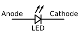

### Section 2.2: Semiconductors

Semiconductors are special materials that make modern electronics possible. They're special materials that can act as both a conductor (letting electricity flow) and an insulator (blocking electricity), depending on how they're used. This unique property allows us to create all sorts of devices that control electricity in useful ways.

#### Diodes: One-Way Electronic Streets

> **Key Information:** 
> - A *diode allows current to flow in only one direction* 
> - The *cathode lead (negative side) is often marked with a stripe* 
> - The *forward voltage drop is lower in some diode types than others* 

{.img-small .float-right .img-bw}

A diode has two electrodes:
- *Anode*: The positive connection
- *Cathode*: The negative connection, marked with a stripe 

Think of a diode like a one-way street - traffic (electrical current) can only flow in one direction. When current flows through a diode, not all the voltage makes it through - this loss is called the forward voltage drop (remember voltage drop from Section 1.2?). This drop causes the diode to heat up as electrical energy converts to thermal energy. Different types of diodes have different amounts of voltage drop - for instance, Schottky diodes have a lower forward voltage drop than regular silicon diodes.

One common use of diodes is in a *rectifier*, which changes alternating current (AC) into a varying direct current (DC) signal. 

#### Light-Emitting Diodes (LEDs): Diodes That Shine

> **Key Information:** An LED produces light when *forward current* flows through it. 

{.img-small .float-right .img-bw}

LEDs are special diodes that light up when current flows through them. They're commonly used as indicator lights on radio equipment - that power light on your transceiver is an LED! 

#### Transistors: The Heart of Modern Electronics

> **Key Information:** 
> - *Transistors can be used as electronic switches* 
> - *Transistors can provide power gain* (ability to amplify signals) 
> - A transistor contains *three regions of semiconductor material* 
> - FET stands for *Field Effect Transistor* 

There are two main types of transistors, and it's important to know the names of their parts:

1. **Bipolar Junction Transistor (BJT)**
   - Three parts: *Emitter, Base, and Collector* 
   - Often used for amplifying signals

2. **Field-Effect Transistor (FET)**
   - Three parts: *Gate, Drain, and Source* 
   - Often used as voltage-controlled switches

**Understanding Gain**: When we talk about transistors providing "gain," we mean their *ability to amplify a signal* - making a small signal bigger.  This is one of their most important functions in radio equipment.

#### Integrated Circuits (ICs): Many Components in One

> **Key Information:** An integrated circuit *combines several semiconductors and other components into one package*. 

Think of an IC as a tiny electronic city, where many components (transistors, diodes, resistors, etc.) work together in a single chip. This technology makes modern radio equipment possible by packing complex circuits into small spaces.

#### Semiconductor Review

Let's review the key semiconductor components and their main features:

1. **Diodes**
   - One-way current flow
   - Cathode marked with stripe
   - Different types have different voltage drops

2. **LEDs**
   - Light up with forward current
   - Used as indicators

3. **Transistors**
   - Three semiconductor regions
   - Two main types with different terminal names:
     - BJT: Emitter, Base, Collector
     - FET: Gate, Drain, Source
   - Can amplify signals (gain)
   - Can act as switches

4. **Integrated Circuits**
   - Multiple components in one package
   - Make complex circuits possible

Remember: While semiconductors can seem complex, understanding their basic functions and terminal names will help you both with the exam and in your amateur radio activities.

