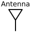
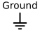

### Section 2.3: Other Components

As we venture further into the world of electronic components, we encounter a diverse cast of characters that play vital roles in amateur radio equipment. Let's meet some of these unsung heroes that work alongside the resistors, capacitors, and semiconductors we've already befriended.

#### Transformers: The Voltage Jugglers

Imagine a seesaw at a playground, where a small child on one end can lift a much heavier adult on the other. Transformers work on a similar principle, but with electrical energy instead of playground physics.

Transformers consist of two or more coils of wire wound around a common core, usually made of iron. They're the masters of voltage conversion, capable of stepping voltage up or down while maintaining (almost) the same power. This ability makes them crucial in various amateur radio applications:

1. **Power supplies**: Transformers help convert the high voltage from your wall outlet to the lower voltages your radio equipment needs.
2. **Impedance matching**: In audio circuits, transformers can match the impedance of different stages for optimal power transfer.
3. **Antenna tuners**: Some antenna tuners use transformers to help match your antenna to your radio.

Fun fact: The largest transformer in the world weighs over 800 tons and can handle about 1 billion watts of power - enough to supply electricity to a small city! Thankfully, the transformers in your ham shack are much, much smaller.

#### Lamps: Simple Light Indicators

Lamps are basic light-emitting devices used in electronic circuits. In the context of amateur radio equipment:

- They serve as visual indicators, lighting up to show that power is on or a particular function is active.
- On schematics, lamps are typically represented by a circle with a cross inside or a symbol resembling a light bulb.
  

While modern equipment often uses LEDs for these purposes, understanding how lamps are represented in circuits remains important for reading schematics, especially of older equipment.

#### Relays: The Electromagnetic Switches

If transistors are the traffic lights of the electronic world, relays are like drawbridges. They use electromagnets to mechanically open or close electrical contacts, allowing one circuit to control another.

In amateur radio, relays shine in several applications:

1. **Antenna switching**: Relays can quickly switch between different antennas or between transmit and receive modes.
2. **Amplifier control**: They help manage the complex sequencing required when using high-power amplifiers.
3. **Automatic antenna tuners**: Many autotuners use a bank of relays to switch different combinations of inductors and capacitors.

Relay revelation: The first practical relay was invented by Joseph Henry in 1835. It paved the way for long-distance telegraphy, which you could consider a predecessor to amateur radio!

#### Crystals: The Frequency Guardians

Quartz crystals might look like small, unassuming slivers of material, but they're the unsung heroes of frequency stability in radio equipment. Thanks to a property called piezoelectricity, these crystals vibrate at a very precise frequency when electricity is applied.

In your ham radio adventures, you'll find crystals:

1. **Oscillators**: Crystals form the heart of stable oscillator circuits, generating precise frequencies for transmitters and receivers.
2. **Filters**: Crystal filters provide excellent selectivity in receivers, helping to separate desired signals from interference.

Crystal clear fact: Some high-end radios have a small case around the frequency reference crystal with a heater. The vibrating frequency of a crystal changes with temperature, and by closely regulating the temperature of the crystal, you can attain very high stability and accuracy of the frequency displayed on the radio. This feature, known as a temperature-compensated crystal oscillator (TCXO) or oven-controlled crystal oscillator (OCXO), is crucial for maintaining precise frequency control in advanced amateur radio operations.

#### Antennas: The Signal Radiators

In the world of electrical components, antennas stand out as unique elements that convert electrical energy into electromagnetic waves and vice versa. At its simplest, an antenna is a conductor or system of conductors designed to transmit or receive radio signals.

In your radio circuits, antennas serve as the interface between your equipment and free space. They can be as simple as a wire of a specific length or as complex as multi-element arrays. The key thing to remember is that antennas are resonant circuits, with their electrical characteristics heavily dependent on their physical dimensions and the frequency of operation.

We will discuss antennas including common types and basic design in a future chapter.

#### Ground: The Reference Point

In electrical circuits, "ground" refers to a common reference point from which other voltages are measured. It's often represented by a special symbol on schematics. While it can be a physical connection to the Earth, in many circuits, it's simply a common return path for current.

In radio equipment, a good ground connection can help reduce noise and provide a path for static electricity and induced currents to dissipate safely. It's an integral part of many circuit designs, working silently alongside other components to ensure proper operation.

We will cover this more in a later topic about safety!

#### Types of Wire: More Than Just Conductors

When setting up your ham shack or building equipment, you'll encounter various types of wire. Let's look at a few important ones:

1. **Standard Wire**: Your basic conductor, usually copper, that comes in different gauges (thicknesses). The thicker the wire, the more current it can safely carry.

2. **Stranded Wire**: Made up of multiple thin strands of wire twisted together. It's more flexible than solid wire, making it great for applications where the wire needs to bend frequently.

3. **Shielded Wire**: This is your signal's bodyguard. Shielded wire typically has one or more insulated inner conductors, surrounded by a conductive layer (the shield) and then an outer insulating jacket. The shield is usually made of braided wire or metal foil.

   So, why would you use shielded wire? Here are the main reasons:

   - **Prevent coupling of unwanted signals**: The shield acts like a barrier, keeping external electromagnetic interference (EMI) from getting into your signal path. It's like having a force field around your signal!
   - **Contain your own signals**: Just as it keeps unwanted signals out, the shield also keeps your signals from leaking out and potentially interfering with other nearby equipment.
   - **Reduce noise**: In audio applications, shielded wire can significantly reduce annoying hum and noise picked up from nearby electrical fields.

   In amateur radio, you might use shielded wire for:

   - Connecting your radio to external devices like computers or audio equipment
   - Wiring up control circuits in your shack
   - Running signal lines near potential sources of interference

   Remember, while shielded wire is great for many applications, it's not always necessary or even the best choice. For high-frequency applications or long runs, other solutions like coaxial cable might be more appropriate.

4. **Magnet Wire**: This thin wire is coated with a layer of insulation. It's often used for winding coils and inductors.

Choosing the right type of wire for each application in your ham shack is crucial for optimal performance and safety. It's all part of the fun of building and customizing your own gear!

### Conclusion

From resistors and capacitors to diodes and transistors, from transformers and relays to antennas and ground connections, each component in your radio equipment plays a crucial role. Understanding these basic building blocks is key to comprehending how your gear works, troubleshooting issues, and even designing your own circuits.

As you continue your journey in amateur radio, you'll encounter these components again and again in various configurations. Each time you key up your mic or tune across the bands, remember that you're witnessing the harmonious interplay of these electrical elements, working together to make the magic of radio communication possible.

Now that you're familiar with these fundamental components, you're well-equipped to delve deeper into the fascinating world of radio electronics. Keep exploring, and don't be afraid to experiment – that's how all great discoveries in this field have been made!
