### Section 2.4: Circuit Diagrams and Schematic Symbols

When you first look at a circuit diagram, it might seem like a cryptic maze of lines and symbols. But fear not! These schematics are actually a universal language for electronics enthusiasts, and with a bit of practice, you'll be reading them like a pro.

#### The Blueprint of Electronics

Think of a schematic diagram as a map of an electronic circuit. Instead of roads and buildings, we have symbols representing various components, connected by lines that show how electricity flows between them. It's like a secret code that allows engineers and hobbyists to communicate complex circuit designs efficiently, providing a map of how all of the components are connected to each other.

Let's decode some common symbols you'll encounter:

#### Passive Components: Resistors, Capacitors, and Inductors

These components are the backbone of most circuits, controlling the flow and storage of electrical energy.

**Resistor**: 
Represented by a zigzag line or a rectangle. It's the traffic cop of the circuit, controlling current flow.

&nbsp;

**Capacitor**: 
Shown as two parallel lines. If one of the lines is curved, it represents a polarized capacitor (like an electrolytic capacitor).

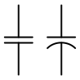

&nbsp;

**Inductor**: 
Drawn as a series of loops or coils. It's the component that stores energy in a magnetic field.

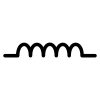

&nbsp;

**Variable Capacitor & Variable Inductor**:
These components allow for tuning circuits, such as in radios, by adjusting their capacitance or inductance.

| Component Type       | Schematic Symbol                                         |
|----------------------|----------------------------------------------------------|
| Variable Capacitor    | 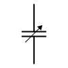 |
| Variable Inductor     | 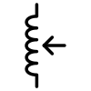 |

&nbsp;

#### Active Components: Diodes, Transistors, and LEDs

Active components are crucial for amplifying signals, controlling current flow, and converting energy from one form to another.

**Diode**: 
Appears as a triangle pointing at a line. Remember, current flows in the direction the triangle points!

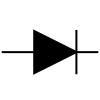

**LED (Light Emitting Diode)**: 
Similar to a regular diode, but with two arrows pointing away to represent light emission.

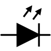

**Transistor**: 
Usually shown as a circle with three lines attached. The specific arrangement depends on the type of transistor (NPN, PNP, etc.).

| Transistor Type  | Schematic Symbol                                         |
|------------------|----------------------------------------------------------|
| NPN Transistor   | 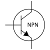 |
| PNP Transistor   | 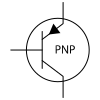 |

&nbsp;

#### Power Components: Batteries, Transformers, and Ground

These components are related to the power management and flow within circuits.

**Battery**: 
Represented by long and short parallel lines. The longer line is the positive terminal, the shorter one is negative.

**Transformer**:
Depicted as two sets of coils with lines between them, representing the primary and secondary windings.

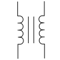

**Ground**: 
Shown as a horizontal line with smaller vertical lines below it, or sometimes as a downward-pointing triangle. It's the reference point for voltage measurements in the circuit.

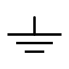

&nbsp;

#### Signal and Control Components: Antennas, Switches, and Potentiometers

These components are essential for controlling the flow of signals and adjusting the behavior of circuits.

**Antenna**: 
There are a few variations, but the one we see in the examples in the question pool looks like a triangle with the "tip" of the triangle towards the circuit.

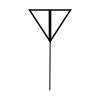

**Switches**:

| Switch Type           | Schematic Symbol                                         |
|-----------------------|----------------------------------------------------------|
| SPST (Single Pole, Single Throw) | 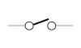 |
| SPDT (Single Pole, Double Throw) | 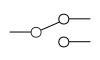 |

**Potentiometer / Variable Resistor**: 
This variable resistor is shown as a resistor symbol with an arrow through it.

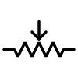

#### Reading Between the Lines

The lines connecting these symbols represent wires or traces on a circuit board. A dot where lines cross means they're connected, while a "bump" where one line arcs over another means they're not.

Remember, schematics are about electrical connections, not physical layout. Components that are far apart on the diagram might be right next to each other in the actual device.

As you dive deeper into amateur radio, you'll encounter more complex schematics. Don't be intimidated! Start by identifying familiar symbols and tracing the connections. With practice, you'll be unraveling the mysteries of radio circuits in no time.

Mastering schematic diagrams is like gaining X-ray vision into your radio equipment. Whether you're troubleshooting a problem, modifying a circuit, or designing your own creation, this skill will serve you well. So next time you see a circuit diagram, don't just see symbols - visualize the flow of electrons, the switching of states, and the transformation of signals. That's when the true magic of electronics comes alive!
