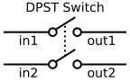

### Section 2.4: Circuit Diagrams: Putting It All Together

By now, you’ve gotten to know a lot of different components—resistors, capacitors, transistors, and more. You've seen their symbols sprinkled throughout earlier sections, and hopefully, they’re starting to feel familiar. Now it’s time to gather everything in one place and focus on how these symbols are used in **circuit diagrams**.

Think of this as the "big picture" moment, where we take all the pieces and show you how they connect in real-world circuits.

#### What’s a Circuit Diagram?

A circuit diagram, also called a **schematic**, is like a blueprint for electronics. Instead of using pictures of the actual parts, it uses symbols to represent each component. These diagrams show how everything fits together—like a map for current to flow. Once you know how to read them, circuit diagrams are your key to understanding any electronic device, no matter how complicated.

You’ve already been introduced to many of these symbols, but now let’s round them all up and review how they look and what they do in a circuit.

#### The Symbols You Know and Love (or at least, recognize!)

Here’s a quick review of the schematic symbols we’ve talked about so far. These symbols represent real-world components, and by now, you’ve seen them in action in different circuits.

#### Passive Components

- **Resistor**: Remember the humble resistor? It controls the flow of current and is represented by a zig-zag line (or sometimes a rectangle, depending on the style). You’ll see these everywhere in circuits.

  

- **Variable Resistor (Potentiometer)**: A variable resistor, also known as a potentiometer, lets you adjust resistance in a circuit. Its symbol is like a resistor, but with an arrow through it to show you can change its value.

  

- **Capacitor**: Capacitors, which store electrical energy, come in two varieties—polarized and non-polarized. The symbol for a non-polarized capacitor looks like two parallel lines, while a polarized capacitor has one straight line and one curved line. You’ll notice these pop up when you need to store charge or filter signals.

  

- **Variable Capacitor**: A variable capacitor looks like a regular capacitor symbol but with an arrow through it, meaning you can adjust its value.

  

- **Inductor**: An inductor stores energy in a magnetic field. Its symbol looks like a coiled spring, which makes sense since most inductors are actually coils of wire. You’ll see inductors in circuits dealing with things like oscillation or filtering.

  

- **Variable Inductor**: A variable inductor looks like a regular inductor symbol (coiled wire) but with an arrow through it, meaning you can adjust its value.

  

- **Transformer**: A transformer moves energy between circuits, and its symbol shows two coils side by side. You’ll usually see lines between the coils to show how energy is transferred.

  

- **Lamp**: You might also come across a lamp symbol, which looks like a circle with a little cross inside. This is used for lights in the circuit. Note that these are being mostly replaced by LEDs these days, but you should know the symbol anyway – particularly because it may come up on the exam!

  

- **Antenna**: The antenna symbol looks like a straight line with curved lines at the top, representing the signal being broadcast or received. You’ll see this when a circuit is meant to transmit or receive radio waves.

  

#### Semiconductors

- **Diode**: Diodes are the traffic cops of the electronics world, letting current flow in only one direction. The symbol is a triangle pointing into a line—just follow the arrow to see which way the current flows.

  

- **Light Emitting Diode (LED)**: Oh, and there’s the Light Emitting Diode (LED), a diode that lights up when current passes through it. The symbol for an LED is the same as a regular diode, but with little arrows pointing outward to show it gives off light.

  

- **Transistor**: Transistors are the real workhorses of modern electronics. Whether they’re switching things on and off or amplifying signals, they’re everywhere. You’ve got two main types: NPN and PNP. Their symbols have arrows to show the direction of current flow, so keep an eye on those!

| Transistor Type  | Schematic Symbol                                         |
|------------------|----------------------------------------------------------|
| NPN Transistor   |  |
| PNP Transistor   |  |

#### Other Important Components

- **Switch**: A switch controls whether a circuit is open or closed. Its symbol shows a break in the line where the circuit can be turned on or off. There are different types, like SPST (single-pole, single-throw) or SPDT (single-pole, double-throw), depending on how many circuits the switch controls.

   
   
   
   

- **Battery**: The battery symbol shows the positive and negative terminals using a long line (positive) and a short line (negative). Multiple sets of lines mean multiple cells in the battery.

  

- **Ground**: Ground is where your circuit “anchors.” It’s the common return path for current. The symbol usually looks like a set of stacked lines or a downward-pointing triangle, and you’ll see it in almost every circuit diagram.

  

### How to Read a Circuit Diagram Without Overthinking It

So how do you make sense of all these symbols when they’re all connected by lines? Don’t worry, it’s easier than it looks! Here’s how to break it down:

1. **Start with the Power Source**: Most circuit diagrams will have a power source like a battery or voltage supply. Start there, and see how the current flows through the rest of the circuit.

2. **Follow the Lines**: The lines in a circuit diagram are wires connecting the components. Follow them from one symbol to the next to trace the path that current will take.

3. **Look for Patterns**: Once you’ve seen a few diagrams, you’ll start to recognize common patterns. Some circuits might be amplifiers, others might be oscillators or filters. These groups of components work together in specific ways.

4. **Pay Attention to Labels**: Components are often labeled with things like R1, C2, or ANT. These labels help you keep track of what’s what, especially when the circuit gets more complex.

### Practice Makes Perfect

To get comfortable with reading circuit diagrams, practice is key. Try drawing a few simple circuits on your own—just a battery, a resistor, and an LED, for example. Or look up common circuits online and see if you can follow along with how the current flows. Before you know it, you’ll be reading schematics like a pro!

Circuit diagrams are one of the most important tools for anyone working with electronics. Once you’ve got the hang of reading these symbols and understanding the layout, the sky’s the limit. Keep practicing, and soon you’ll be able to decode even the most complicated circuits with ease!

---

Mastering schematic diagrams is like gaining X-ray vision into your radio equipment. Whether you're troubleshooting a problem, modifying a circuit, or designing your own creation, this skill will serve you well. So next time you see a circuit diagram, don't just see symbols - visualize the flow of electrons, the switching of states, and the transformation of signals. That's when the true magic of electronics comes alive!