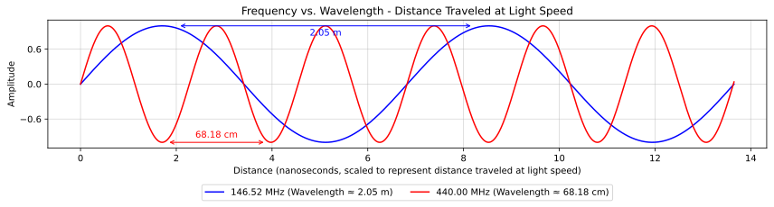

### Section 3.1: Frequency and Wavelength

Imagine you're at a concert, listening to a bass guitar playing a low note. You can feel the deep, slow vibrations in your chest. Now, picture a flute playing a high note—it's a quick, light sound that seems to dance in the air. This difference in pitch is all about frequency—how many times the sound wave vibrates in a second.

Radio waves work in a similar way, but instead of sound, they're electromagnetic waves traveling through space at the speed of light. Let’s dive into the key concepts of frequency, wavelength, and polarization to understand how they relate to radio signals.

#### What is RF?

You’ve probably heard the term **RF** tossed around, but what does it actually mean? **RF stands for Radio Frequency** – basically, it’s a fancy way of saying "radio signals." RF covers all types of radio signals, whether they’re used for voice, data, or other forms of wireless communication. So when someone mentions RF, they’re talking about the entire range of frequencies that we hams and other radio operators use to send our signals through the air.

Whether you’re tuning in to your favorite FM station, chatting on a repeater, or sending data over a satellite link, you’re working with RF. It’s the bread and butter of all radio communication, and it’s what makes all this cool stuff possible.

#### Understanding Frequency

The frequency of a radio wave is how many times it completes a cycle in one second, measured in Hertz (Hz). One Hertz means one cycle per second.

Just like musical notes, radio frequencies span a wide range:

- **Low frequencies** (like AM radio) are the bass guitar of the radio world, with wavelengths that can be kilometers long.
- **High frequencies** (like microwaves and the radios used for wireless networking or cell phones) are more like the flute, with wavelengths that might be just a few millimeters.

#### Wavelength and Its Relationship with Frequency

Wavelength is the distance a radio wave travels during one complete cycle of its frequency. Think of it as how far the wave moves through space before it starts the next cycle. The higher (faster) the frequency, the shorter the distance the wave travels in one cycle, and thus, the shorter the wavelength. Conversely, lower frequencies have longer wavelengths because each wave travels farther before completing a cycle.

Here’s the cool part: frequency and wavelength are linked by the speed of light, and the relationship is simple:

Wavelength (in meters) = Speed of light (in meters per second) / Frequency (in Hz)

Or, to put it in a handy formula:

$$\lambda = \frac{c}{f}$$

Where:
- $\lambda$ (lambda) is the wavelength in meters
- c is the speed of light (approximately 300,000,000 meters per second)
- f is the frequency in Hz

Since $f$ is on the bottom of the fraction, the higher the frequency the shorter the wavelength. For example, a 2-meter amateur radio band operates around 144 MHz. Let's calculate its wavelength:

$$\lambda = \frac{300,000,000}{144,000,000} = 2.08 \text{ meters}$$

Pretty close to 2 meters, right? That's why it's called the 2-meter band!

**TIP**: It's most common to think of frequencies in MHz (1 million Hz), and the approximate speed of light is $300\times10^6$ (300 million Hz), so you can drop the million off both and just think of it as:

Wavelength (in meters) = 300 / Frequency (in MHz)

or

$$\lambda = \frac{300}{144} = 2.08 \text{ meters}$$

It's the same thing, but 300 is easier to remember than 300 million!

#### The Relationship Between Electric and Magnetic Fields

Now, let’s talk about what’s happening inside those radio waves. Radio waves are a type of electromagnetic wave, which means they have both electric and magnetic fields. These fields are like two dance partners—they’re always at right angles to each other and move together at the speed of light. This perpendicular relationship is key to how radio waves travel through space.

#### Polarization and the Electric Field

The polarization of a radio wave is defined by the orientation of its electric field. If the electric field vibrates up and down, the wave is vertically polarized. If it vibrates side to side, the wave is horizontally polarized. This is important because the orientation of your antenna needs to match the polarization of the incoming signal for the best reception. We'll talk more about polarization in Section 4.2.

#### Resonance and Antenna Design

Resonance in radio is like finding the perfect rhythm when you're swinging on a playground swing. When you swing at just the right frequency, you go higher and higher with less effort. In radio, when an antenna's length matches the wavelength of the radio wave (or a fraction of it), it resonates, allowing for efficient transmission and reception.

This is why antenna length is so important in amateur radio. A resonant antenna is like a tuning fork for radio waves, vibrating in sympathy with the incoming or outgoing signal. For example, a half-wave dipole antenna for the 2-meter band would be about 1 meter long (half of 2.08 meters). We'll talk more about dipoles and other antennas in Section 4.1!

Understanding frequency, wavelength, and resonance is fundamental to amateur radio. It helps you choose the right antenna for your operating frequency, understand propagation characteristics, and even troubleshoot issues in your setup. As you explore different bands and experiment with various antennas, you'll develop an intuitive feel for these relationships, enhancing your skills as a radio operator.

Remember, every time you tune your radio or adjust your antenna, you're playing with these fundamental principles of physics. It's like conducting an orchestra of electromagnetic waves—and you're the maestro!
