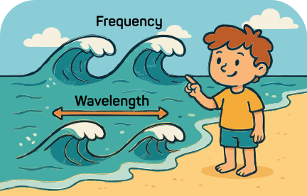

### Section 3.1: Frequency and Wavelength

{.img-pgcap .float-right}

Imagine you're watching waves at the beach. Some waves come in quickly, one after another, while others roll in more slowly with greater distance between them. This difference is all about frequency—how many waves arrive in a given time. Radio waves work in a similar way, but instead of water, they're electromagnetic waves traveling through space at the speed of light.

#### What is RF?

> **Key Information:** *RF* (Radio Frequency) refers to *radio signals of all types*.

You've probably heard the term **RF** tossed around, but what does it actually mean? **RF stands for Radio Frequency** – basically, it's a fancy way of saying "radio signals." RF covers all types of radio signals, whether they're used for voice, data, or other forms of wireless communication.  

As we discussed in Chapter 1, **radio frequency energy (RF) is a form of alternating current (AC), but at much higher frequencies than household electricity**. Instead of moving electrons back and forth in a wire, like AC in your home, RF travels as electromagnetic waves through space, carrying signals across short and long distances.  

Whether you're tuning in to your favorite broadcast station, chatting on a repeater, or sending data over a satellite link, you're working with RF. It's the bread and butter of all radio communication, and it's what makes all this cool stuff possible.  

#### The Nature of Radio Waves

> **Key Information:** 
> - A radio wave has two components: *electric and magnetic fields* 
> - These fields are *at right angles* to each other
> - Radio waves travel at the *speed of light* in free space (approximately *300,000,000 meters per second*)

{.img-centered .img-large}

#### Polarization

> **Key Information:** The *orientation of the electric field* defines a radio wave's polarization. 

Think of a radio wave moving through space like a rope being waved up and down:
- If the electric field moves up and down, the wave is vertically polarized
- If it moves side to side, the wave is horizontally polarized

This is crucial because your antenna needs to match this orientation for best reception.

#### Wavelength and Frequency

> **Key Information:** 
> - *Wavelength gets shorter as frequency increases* 
> - To find wavelength in meters, use this formula: *300 divided by frequency in megahertz* 
> - Amateur radio bands are often identified by their *approximate wavelength in meters* 

Radio waves come in all sorts of sizes. The size of a radio wave—its wavelength—is directly related to its frequency, and understanding this relationship is key to understanding amateur radio bands.

Wavelength is the physical distance a radio wave travels while completing one full cycle. When you hear about the "2-meter band" or the "70-centimeter band," you're hearing about the approximate wavelength of the signals in that band.

The radio spectrum is divided into several frequency ranges that are important to ham radio operators:

- **HF (High Frequency)**: 3-30 MHz, with wavelengths from 100 meters down to 10 meters
  - Includes our 80m, 40m, 20m, 15m, and 10m bands
  - Often allows for long-distance communication due to ionospheric propagation

- **VHF (Very High Frequency)**: 30-300 MHz, with wavelengths from 10 meters down to 1 meter
  - Includes our popular 6m and 2m bands
  - Primarily used for regional communication, with occasional long-distance openings

- **UHF (Ultra High Frequency)**: 300-3000 MHz, with wavelengths from 1 meter down to 10 centimeters
  - Includes our 70cm and 33cm bands
  - Typically used for local communication and specialized applications

The higher the frequency, the shorter the wavelength. This inverse relationship means that as frequency increases, wavelength decreases proportionally. A signal at 144 MHz (2m band) has twice the frequency and half the wavelength of a signal at 72 MHz.

Here's how to calculate wavelength (which we often refer to with the variable lambda, or λ):

$$\text{Wavelength (}\lambda\text{)} = \frac{300}{\text{Frequency in MHz (}f\text{)}}$$

{.img-small .float-right}

Like when we talked about Ohm's law, we can make a simple circle diagram for this relationship as well, though we need to use the symbols for brevity:

To use this helper:
1. Cover up the variable you want to find
2. The remaining pieces show you how to calculate it

   - Cover λ (wavelength): divide $\frac{300}{frequency}$

   - Cover ƒ (frequency): divide $\frac{300}{wavelength}$

For example, let's calculate the wavelength for the 2-meter band (144 MHz):

$$
\begin{align*}
\text{Wavelength} &= \frac{300}{144}\\
&= 2.08 \text{ meters}
\end{align*}$$

That's why we call it the 2-meter band!

#### Resonance and Antenna Design

When an antenna's length matches the wavelength—or certain specific fractions of it, like a quarter wavelength—it resonates like a tuning fork. This physical matching creates optimal conditions for the antenna to absorb or emit electromagnetic energy at that specific frequency, resulting in much more efficient signal transmission and reception.

For example, a half-wave dipole antenna for the 2-meter band would be about 1 meter long (half of 2.08 meters). We'll explore this more when we discuss antennas!

#### Better Understanding, Better Results!

Understanding these relationships helps you:
1. Choose the right antenna length for your frequency
2. Match antenna polarization to incoming signals
3. Understand why different bands behave differently
4. Convert between frequency and wavelength easily

Every time you tune your radio or adjust your antenna, you're working with these fundamental principles. Remember that radio waves:
- Travel at the speed of light
- Have electric and magnetic fields at right angles
- Have wavelengths that get shorter as frequency increases
- Can be polarized vertically or horizontally

These concepts will come up again and again in your amateur radio adventures!
