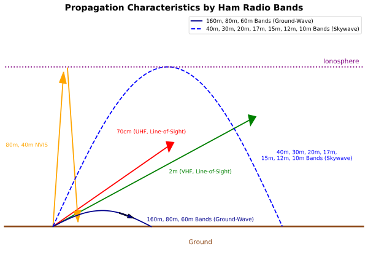

### Section 3.3: How Signals Travel

When you toss a pebble into a pond, you see ripples spreading out in all directions. Radio waves behave in a similar way, but instead of traveling across water, they propagate through space. Different frequencies travel in different ways, and understanding these behaviors helps us communicate more effectively.

> **Key Information**: Basic Wave Behavior
> - The *ionosphere can refract or bend HF and VHF radio waves*
> - The *radio horizon is farther than the visual horizon* because the *atmosphere refracts radio waves slightly*
> - *Long-distance ionospheric propagation is far more common on HF* than on VHF/UHF
> - *UHF signals are rarely heard beyond their radio horizon* because they're *usually not propagated by the ionosphere*

#### Ground Wave Propagation

**Beyond the Test**: Ground wave propagation is like dragging a rope across a field - the signal follows the Earth's surface. While this isn't directly tested, it helps explain why some frequencies travel better over ground than others, particularly at lower frequencies.

#### Line-of-Sight (LOS) Propagation

Line-of-sight is like being able to see someone across a field - if you can see them, you can probably communicate with them. However, several important effects can help or hinder this basic propagation:

> **Key Information - Multipath Effects**: 
> - *VHF signal strengths can vary greatly when moving just a few feet* because *multipath propagation cancels or reinforces signals*
> - *Picket fencing* is the *rapid flutter on mobile signals due to multipath propagation*

When radio signals travel from transmitter to receiver, they often take multiple paths:
- Some signals go directly
- Others bounce off buildings, mountains, or other objects
- These different paths can combine at your antenna:
  - When the signals arrive in phase, they strengthen each other
  - When they arrive out of phase, they can cancel each other
  - Moving your antenna even slightly can change this relationship

This is why you might hear a mobile signal rapidly cutting in and out as you drive - like looking through a picket fence.

> **Key Information - Working Around Obstacles**:
> - When buildings block a repeater signal, you can often *communicate by finding a path that reflects signals* to the repeater
> - *Knife-edge diffraction allows radio signals to travel beyond obstructions*

Just because you can't see your target doesn't mean you can't reach it:
- **Reflections**: Like bouncing a ball off a wall, your signal can bounce off buildings or other surfaces to reach a repeater
- **Knife-edge diffraction**: Radio waves can bend around sharp edges of obstacles (like mountains or buildings), similar to how water flows around a rock in a stream

#### Sky Wave Propagation

> **Key Information**:
> - *Irregular fading of signals is caused by random combining of signals arriving via different paths*
> - Best time for 10-meter band F region propagation: *from dawn to shortly after sunset during high sunspot activity*
> - During peak sunspot cycle, *6 and 10 meters* can use F region propagation

Think of sky wave propagation like bouncing a ball off the ceiling to reach someone across the room. The ionosphere acts as our "ceiling" in the sky, but instead of a hard surface, it's a region of charged particles that bends (or refracts) radio waves back toward Earth. Because the ionosphere isn’t uniform, signals may take different paths, causing variations in signal strength.

For simplicity, this bending effect is often called reflection, though in reality, it’s a gradual refraction through layers of the ionosphere that eventually sends the signal downward.

- Different layers of the ionosphere affect different frequencies
- Time of day and solar activity change how well it reflects signals
- Multiple signal paths can cause fading as they combine in different ways

**Auroral Effects**:
Signals received via auroral reflection are *distorted and signal strength varies considerably*. This is because the aurora is like a shimmering, moving curtain that reflects signals unpredictably.

#### Sporadic E Propagation

> **Key Information**: *Sporadic E causes occasional strong signals on the 10, 6, and 2 meter bands* from beyond the radio horizon.

Think of Sporadic E like catching a lucky bounce off a cloud - it happens occasionally and can give you unexpected long-distance contacts. While you can't predict exactly when it will occur, it's a regular feature of VHF propagation.

#### Tropospheric Ducting

> **Key Information**:
> - *Caused by temperature inversions* in the atmosphere
> - Allows *VHF and UHF communications to ranges of approximately 300 miles regularly*

Imagine a tunnel in the sky that can carry your signal much farther than usual. Temperature inversions create these "ducts" that can guide VHF and UHF signals far beyond their normal range, making long-distance contacts possible on bands that usually work only for local communication.

#### Meteor Scatter

> **Key Information**: The *6 meter band is best suited* for meteor scatter communications.

When meteors burn up in the atmosphere, they leave brief trails that can reflect radio signals. It's like playing ping-pong with a shooting star - the reflections are brief but can allow contacts over surprising distances. The 6 meter band works particularly well for this type of communication.

#### Environmental Effects

Different environmental factors affect different frequencies in various ways:

> **Key Information**: 
> - *Precipitation can decrease range at microwave frequencies*
> - *Fog and rain have little effect* on signals in the *10 meter and 6 meter bands*
> - *UHF and microwave signals are absorbed by vegetation*
> - *Multipath propagation can increase error rates* in data transmissions

Understanding these effects helps you:
- Choose appropriate frequencies for different weather conditions
- Position antennas to minimize absorption by trees and buildings
- Account for potential data errors in digital communications

#### Data Communications 

When using digital modes, multipath propagation can be particularly troublesome because signals arriving via different paths can interfere with each other, increasing error rates. This is why digital modes often include error detection and correction mechanisms.

#### Putting It All Together

All these propagation methods work together to make radio communication possible. Understanding them helps you:
- Choose the right band for your desired communication distance
- Know when conditions might be best for long-distance contacts
- Troubleshoot communication problems
- Take advantage of different propagation modes

Remember: While certain specific effects are important for the exam, understanding how they all work together will make you a better operator. Try to visualize how each type of propagation works, and you'll find both the exam questions and actual operation easier to understand.