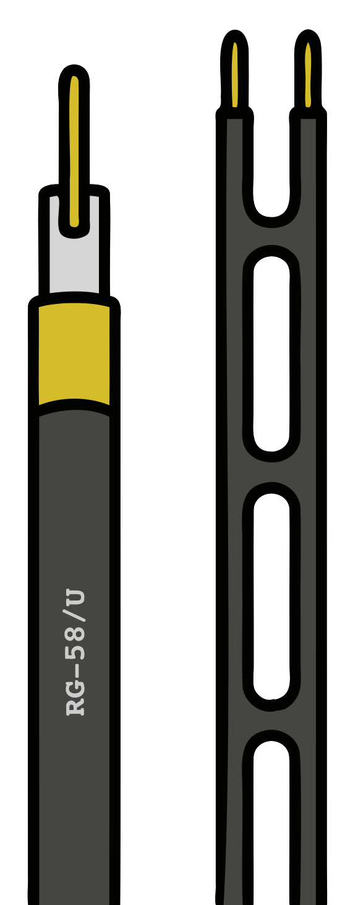

### Section 4.3: Feed Lines  

#### Introduction to Feed Lines  
Ever wondered how the radio waves actually get from your transceiver to your antenna? That's where *feed lines* come in. Think of them as the highways for your radio signals, carrying power from your radio to your antenna as efficiently as possible. Some feed lines are smooth, fast expressways. Others are bumpy backroads that waste your signal before it ever gets to where it needs to go.

#### Coaxial Cable: The Ham Radio Standard  

> **Key Information:** Most amateur radio feed lines are **coaxial cables**, which consist of a center conductor, insulation, a shielding layer, and a protective jacket.

Coaxial cable, or just *coax*, is the go-to feed line for hams. It's easy to use, doesn't require a lot of special handling, and does a great job of getting your signal where it needs to go—at least if you choose the right kind. 

#### Impedance: Why It Matters  

> **Key Information:** Most ham radios and antennas use **50-ohm coax**, while TV and cable systems use **75-ohm coax**, which isn't ideal for amateur radio.

If you've ever looked behind your TV, you might have seen **75-ohm** coax for cable or satellite. Can you use it for ham radio? Technically, yes. Should you? Not really. Ham gear is designed for **50-ohm** coax, so that's what you want to use to keep your setup running smoothly. 

#### Types of Coaxial Cable  

> **Key Information:** Thicker coax usually means *lower loss*. *RG-213* and *LMR-400* have less loss at any given frequency and are great for long runs, while *RG-58* is better for short cables or portable setups.

There are lots of different kinds of coax, and they each have their pros and cons. Here are some common types:  

- **RG-58** – Thin and flexible. Great for short runs or portable use, but it has *higher loss* over distance.  
- **RG-8X** – A little better than RG-58, still flexible but with *less signal loss*.  
- **RG-8 / RG-213 / LMR-400** – Thicker, *low-loss* coax that's great for longer runs and higher frequencies. 
- **RG-59 / RG-6** – The **75-ohm** TV stuff. It *technically* works, but it's not a great choice for ham radio.  
- **Hardline / Heliax** – Heavy-duty, *super low-loss* coax. Used for repeaters and big setups where you can't afford to lose power along the way. *This has the lowest loss at *any* given frequency (including UHF and VHF)* of the coaxial types we've mentioned here. 

#### Understanding Loss in Feed Lines  
> **Key Information:** The higher the frequency, the more **loss** you'll have in coax. A **3 dB loss** means you're losing **half** your power before it reaches the antenna. Power lost in feed lines is converted to heat.

No coax is perfect—some of your power is always lost as heat before it even makes it to the antenna. The higher the frequency, the worse the loss. That's why satellite dishes often put the transmitter *right at the antenna* instead of running a long coax cable.  

#### Potential Problems with Feed Lines  
> **Key Information:** Water, UV damage, loose connectors, and too many adapters can all cause *signal loss* and mess up your feed line.

Even the best coax can run into problems. Here are some things to watch out for:  

- **Water intrusion** – Coax and water don't mix. If moisture gets in, performance tanks. *Always weatherproof outdoor connections!* 
- **Poor connections** – Loose or corroded connectors are like potholes in your signal's highway. *Keep them clean and tight!* 
- **High SWR** – We covered SWR earlier, but just remember—if it's too high, you're losing power in your feed line instead of radiating it.  
- **Too many connectors** – Every extra adapter or connection means *more loss*. Keep it simple!  
- **UV Damage** – The sun's **UV rays** can break down coax over time. If it's going outside, make sure it's **UV-resistant** or protect it with conduit or tape. 

#### Alternative Feed Lines: Ladder Line

> **Key Information:** Ladder line has **way less loss** than coax but must be **kept away from metal** or it won't work right.

{.img-xsmall .float-right}

Ladder line is like the sports car of feed lines—super efficient, but kind of picky. It has *way* lower loss than coax, especially at HF, but it has one big catch: **you have to keep it away from metal** or it starts picking up noise and acting weird. It's a fantastic choice if you're using a balanced antenna and have room to route it properly.

#### Special Types of Coax  
> **Key Information:** Air-core coax has **low loss** but requires **special techniques** to keep moisture out.

Some high-end coax uses **air** instead of solid insulation between the center conductor and shield. This helps reduce loss, but if **moisture gets in, it's game over**. That's why this type of coax is often **pressurized with dry air or nitrogen** to keep water out. 

#### Choosing the Right Feed Line 

> **Key Information:** For *longer runs*, use *low-loss coax* like *RG-213* or *LMR-400* to keep your signal strong.

Consider these factors when choosing coax:  
- **How long is the run?** Longer runs = *more loss*. Use thicker, low-loss coax.  
- **What frequency are you using?** Higher frequencies suffer *more loss*.  
- **How much power are you running?** Some coax handles heat and power better than others.  
- **Will it be outside?** If so, use **UV-resistant, weatherproof** coax or protect it properly.  

---

Your feed line is just as important as your antenna. You could have the best antenna in the world, but if your coax is terrible, most of your power gets wasted before it even gets there.  

So when you're setting up your station, **don't cheap out on your feed line!** Pick the right coax, protect it from the elements, and keep those connectors tight. Your signal (and everyone trying to hear you) will thank you!
