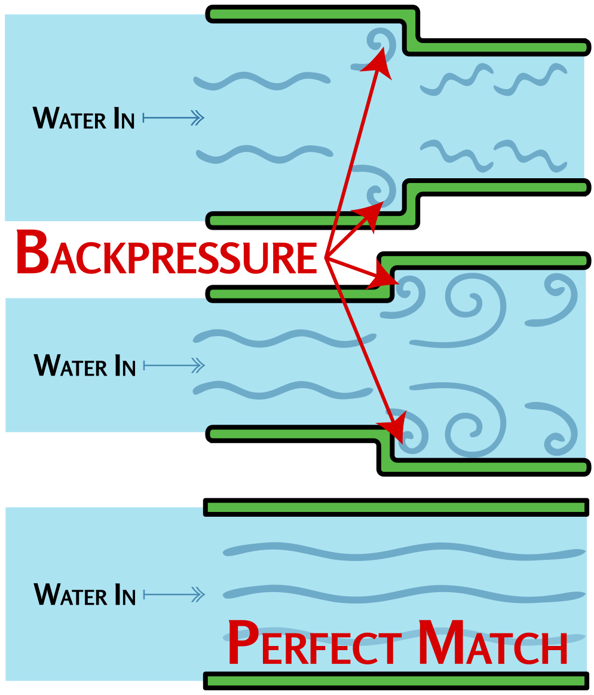

### Section 4.5: Standing Wave Ratio (SWR)

Standing Wave Ratio, or SWR, is a critical concept in ensuring your antenna system is working efficiently. Let's break it down into manageable chunks:

#### What is SWR?

> **Key Information:** SWR is a **measure of how well a load is matched to a transmission line**. A reading of **1:1** on an SWR meter indicates a **perfect impedance match** between the antenna and feed line.  

{.img-pgcap .float-right}

SWR is essentially a report card for the impedance match in your antenna system. It tells you how well the impedance of your transmitter matches the impedance of your feed line and antenna combined. When these impedances match (typically at 50 ohms in amateur radio), maximum power transfers from your transmitter to your antenna system.

Think of your radio system like water flowing through pipes. Your transmitter pushes the signal (water) through your feed line (pipe) to your antenna. When the pipes are the right size (good impedance match), water flows smoothly. But if there's a mismatch, some water gets pushed back, creating backpressure - just like RF energy being reflected back to your transmitter. This backpressure is what SWR measures.

SWR is measured as a ratio - here's what different readings mean:

- **1:1 SWR**: Perfect Match! All power is being accepted by your feed line and antenna.
- **Up to 1.5:1 SWR**: Great! Most of your power is getting through.
- **2:1 SWR**: Acceptable but not ideal. Some power is being reflected.
- **3:1 or higher SWR**: Your *impedance does not match*. A significant amount of power is being reflected. 

#### Why Does SWR Matter?

> **Key Information:** A benefit of low SWR is **reduced signal loss**. Most solid-state transmitters **reduce output power as SWR increases** to **protect the output amplifier transistors**.  

Why should you care about SWR? It's all about efficiency and equipment safety. The lower your SWR, the more of your radio's power actually makes it to your antenna and out into the world. High SWR means some of that power is bouncing back to your radio instead of being transmitted.

This reflected power creates two significant problems:

1. **Wasted Energy**: Power reflected back to your transmitter doesn't contribute to your signal, reducing your effective communication range.

2. **Equipment Damage**: More seriously, reflected power can overheat and damage your transmitter's output amplifier components. This is why *most solid-state transmitters automatically reduce output power as SWR increases beyond a certain level*.

Modern radios have protection circuits that detect high SWR and reduce power or shut down if necessary, but it's best not to rely on them—especially with cheaper transmitters. Keeping your SWR low ensures your radio stays efficient and safe for years to come.

#### Common Causes of High SWR

> **Key Information:** A loose connection in the antenna or feed line can cause *erratic changes in SWR*. 

What causes high SWR? Here are some common culprits:

1. **Antenna Length**: Your antenna isn't the right length for the frequency you're using.
2. **Feed Line Issues**: There's a problem with your feed line — maybe it's damaged or water has gotten in.
3. **Nearby Metal Objects**: Your antenna is too close to metal objects. Remember, antennas don't like to be crowded!
4. **Loose or Corroded Connections**: A little oxidation can cause big problems.

#### Measuring SWR

> **Key Information:** An *antenna analyzer* or a *directional wattmeter* can be used to determine if an *antenna is resonant* at the desired frequency and to *measure SWR*.  

How do you check your SWR? Many modern radios have built-in SWR meters. If yours doesn't, you can get an external SWR meter or an antenna analyzer. These tools are great to have in your ham radio toolbox. Another option is using a directional wattmeter—measure how much power is leaving your radio (forward power) and how much power is coming back from the antenna (reflected power), and you can calculate your SWR.

#### SWR and Handheld Radios

It's worth noting that checking SWR on a monopole (such as most antennas on a Handheld Transceiver) can be tricky. The antenna on an HT uses your body as part of the ground plane, so when you connect any measuring equipment, you fundamentally change the antenna system itself! This often leads to inaccurate readings and confusion.

For HTs and similar portable setups, it's usually more practical to evaluate antenna performance through actual signal tests rather than relying solely on SWR measurements. If you do want to check SWR, special fixtures that simulate body capacitance can help, but they're not perfect.

#### Troubleshooting High SWR

If your SWR is high, don't panic! Here are some things you can try:

1. **Check Your Connections**: A *loose connection in the antenna or feed line* is both a super easy fix and a super common issue, and it will shoot your SWR sky-high in no time flat!
2. **Adjust the Length of Your Antenna**: Sometimes a little snip or stretch is all you need.
3. **Use an Antenna Tuner**: It's like a matchmaker for your radio and antenna system.
4. **Move Your Antenna**: Give it some space to breathe—away from metal objects!

#### Final Thoughts on SWR

While a low SWR is essential for efficient power transfer, it doesn't tell the whole story about your antenna's radiation effectiveness. You could have a perfect 1:1 SWR with a dummy load (which is just a resistor that converts RF energy to heat), but you wouldn't be making any contacts because a dummy load doesn't radiate!

SWR simply tells you that power is being transferred efficiently from your transmitter to your antenna system - what happens after that depends on the antenna design, height, surroundings, and many other factors. A good antenna with good SWR ensures your power gets to the antenna and then radiates effectively into space.

So next time you're setting up your station, take a moment to check your SWR. It's like making sure the pipe from your water tank isn't leaking before worrying about where the sprinklers are aimed. With a good SWR, you'll know your transmitter power is at least making it to the antenna - the first step in making those exciting contacts!
