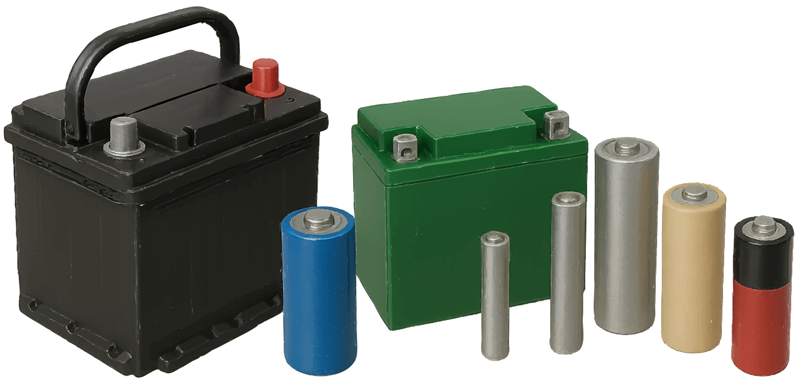

### Section 5.4: Batteries

Ah, batteries—the lifeblood of portable ham radio! Whether you're operating from a mountaintop or preparing for emergencies, these portable powerhouses keep us on the air. But like any good superhero, they come with their own kryptonite. So, let’s unpack the world of batteries and see how to use them safely and effectively.

#### Types of Batteries

First off, let's meet our cast of characters:

> **Key Information:**
> - Rechargeable battery types include: nickel-metal hydride, lithium-ion, lead-acid, and nickel-cadmium
> - Carbon-zinc batteries are not rechargeable

{.img-full .img-centered}

1. **Lead-Acid Batteries**: The old reliable. You'll find these in cars and as backup power for your shack. They're like the dependable workhorse of the battery world. *They're rechargeable and can deliver high currents.*
   
2. **Lithium-Ion (Li-ion)**: The star of modern handheld radios. They pack a punch in a small package, but they can be a bit temperamental. *These are rechargeable and have a high energy density.*
   
3. **Lithium Iron Phosphate (LiFePO4)**: The new kid on the block. They're safe, stable, and last forever (well, almost). *Also rechargeable, they're known for their long life and safety.*
   
4. **Nickel-Metal Hydride (NiMH)**: Often found in AA or AAA sizes. They're the eco-friendly option and were extremely common before Li-ion batteries caught on and became ubiquitous. *Rechargeable and a good alternative to disposables.*

5. **Nickel-Cadmium (NiCd)**: The classic rechargeable. Once the go-to for cordless phones and older handheld radios. They have a nominal voltage of **1.2 volts per cell**, just like NiMH batteries. However, they can suffer from the "memory effect" if not fully discharged before recharging. *Due to environmental concerns over cadmium—a toxic heavy metal—they've been largely replaced by NiMH batteries.* You might still come across them in older devices, but they're becoming less common.

6. **Alkaline**: The one-hit wonders. Great for emergencies (you can buy them at the store!), but once they're done, they're done. **These non-rechargeable batteries have a nominal voltage of 1.5 volts per cell**, providing a bit more oomph than their rechargeable counterparts.

7. **Carbon-Zinc Batteries**: The old-school disposables. These are some of the earliest types of dry cell batteries. *Non-rechargeable with a nominal voltage of 1.5 volts per cell*, they have a shorter lifespan and lower capacity compared to alkaline batteries. Think of them as the great-grandparent of modern batteries—important historically but less relevant today.

#### A Note on Voltages

It's worth noting that batteries of different types may have different voltages per cell, even if they are the same size! Always check things out before connecting them!

#### Battery Safety Tips

Now, let's talk safety. Each of these battery types has its own quirks:

> **Key Information:** Shorting the terminals of *any* battery can cause burns, fire, or an explosion 

**Lead-Acid Batteries**:
- These guys can produce hydrogen gas, especially when charging. Always use them in well-ventilated areas. You don't want your shack turning into a blimp!
- They contain sulfuric acid. Treat them like you would a grumpy cat—with respect and protective gear.
- The terminals can deliver a whopping amount of current if shorted. Remove your jewelry and use insulated tools—you definitely don’t want to be the human fuse in this circuit! (And do not ask the authors of this book the melting point of sterling silver jewelry. They would have absolutely no personal reason to know that. None at all.)
- Each cell in a lead-acid battery produces about 2.1 volts. So, a typical "12-volt" battery actually measures around 12.6 volts when fully charged and has a working voltage range of 12.0-12.8V.

***Warning***: Avoid creating sparks near a charging lead-acid battery. The hydrogen gas it emits is flammable, and a spark could lead to an explosion — not the kind of bang you want in your shack! For this reason many people prefer to avoid keeping lead-acid batteries indoors.

> 🔥 Here's a real-world cautionary tale: While attempting to connect lead-acid batteries in parallel to build a battery bank, an operator once reversed the wiring. The result? A smoking cable hot enough to melt rubber. Fortunately, the damage was limited—but it's a vivid reminder to always double-check your connections and use proper fusing.
>
> There's ample evidence that even experienced operators can make mistakes like this—including some who go on to write books on the subject.

**Lithium-Ion Batteries**:
- Overcharging is a big no-no. It can lead to overheating or even fire. Stick to the charger that came with your radio.
- If they get punctured or damaged, treat them like a ticking time bomb. Dispose of them properly and quickly.
- They're not fans of extreme temperatures. Kind of like Goldilocks—not too hot, not too cold.
- Each cell in a lithium-ion battery produces 3.7 volts, so if you see a "12 volt" lithium-ion battery it is probably using some electronics to get the voltage where you want it.

> 🔥 One more cautionary tale: A young (11yo) radio enthusiast was once experimenting with 18650 Lithium-Ion battery cells–on his bed, no less–while playing with a motor stripped from a scooter.
> 
> 
> {.float-right .img-pgcap}
> The exact details are unclear, but somehow the cells shorted. One moment everything was fine, and the next, the battery casing was across the room, a softball-sized burn had melted through the quilt, and the air was filled with a harsh chemical smell.
>
> Fortunately, no one was hurt and the damage was limited to some bedding, but it's a stark reminder: Lithium-Ion batteries can and do fail violently when mishandled. Despite common claims that they “don’t explode,” they can absolutely vent with flame under the right conditions.

**Lithium Iron Phosphate (LiFePO4) Batteries**:
- These are the laid-back cousins of Li-ion. Safer, but they still prefer their own special chargers.
- They're not fans of charging in extreme cold. Think of them as the battery equivalent of a person who hates getting out of bed on a winter morning.
- Each cell in a Lithium Iron Phosphate battery produces about 3.2 volts. A typical "12-volt" battery is actually 12.8V and will usually be charged to 14.6V to get to full capacity.
- Over or undercharging a single LiFePO4 cell can ruin it!

> **Key Information:** Charging or discharging a battery too quickly can cause overheating or out-gassing 

#### How Long Will Your Battery Last?

When you're out in the field or during a power outage, knowing how long your equipment can run on a battery is crucial. This is where understanding your battery's ampere-hour (Ah) rating and your equipment's current draw comes into play.

> **Key Information:** Battery life can be determined by dividing the battery ampere-hour rating by the average current draw of the equipment

To determine how long your battery will last, you can use the following method:

- **Battery Life Calculation**: Divide the battery's ampere-hour (Ah) rating by the average current draw of your equipment.

This method will give you an estimate of how long your equipment can run before the battery is depleted. 

For example, if you have a 12Ah battery and your radio draws an average of 2A:

$$\begin{align*}
\text{Battery Life (hours)} &= \frac{12 \text{Ah}}{2A}\\
&= 6 \text{ hours}\\
\end{align*}$$

This means your battery could power your equipment for about 6 hours under these conditions. Keep in mind that this is a rough estimate and actual performance can vary based on factors like temperature, battery age, and usage patterns.

**Note**: For some batteries, particularly lead-acid batteries, the battery might not last as long as the calculation suggests if you're drawing a lot of current due to something called Peukert's Law. Basically, the harder you push the battery, the less total capacity you'll get out of it.

#### General Battery Wisdom

1. Use the right charger for each battery type. It's not a one-size-fits-all situation.
2. Be careful when leaving batteries charging unattended—if your charger malfunctions, you could end up with a dangerous situation.
3. Store batteries in a cool, dry place. They're not wine; they don't get better with age and heat.
4. Keep battery terminals covered when not in use. Accidental shorts are no joke and can be extremely dangerous.
5. Don't mix old and new batteries. It's like pairing a marathon runner with a couch potato in a three-legged race — the new batteries can end up overcompensating, which might cause them to overheat or leak.
6. Be mindful of what you connect to it! *Charging or discharging a battery too quickly can cause it to overheat, release toxic gases (outgas), or even, in extreme cases (we're looking at you, Lithium-Ion!), explode.*

#### Emergency Preparedness

For emergency preparedness:

- Keep a stash of fresh batteries for your go-kit.
- Regularly test and cycle your rechargeables. If you never use them, you're likely to find they aren't working when you need them!
- Have a plan for charging during extended power outages. Solar chargers can be a ham's best friend.

#### Take care of your batteries!

Batteries are incredible tools that let us take our hobby anywhere – but they demand respect. Treat them right, and they'll keep your radios powered and your conversations flowing, whether you're ragchewing from your backyard or providing emergency communications after a disaster.

Stay safe, stay charged, and happy hamming!
