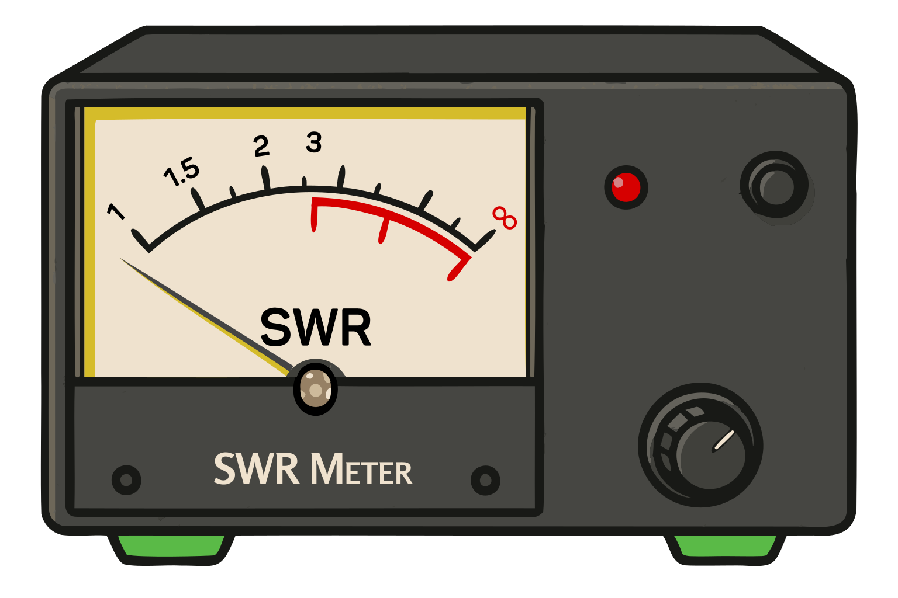

### Section 6.1: Station Accessories

Welcome to the toy store of ham radio! Let's talk about the gadgets and gizmos that'll make your shack sing. As a new Technician, you might feel like a kid in a candy store with all the options out there, so let's focus on the must-haves and nice-to-haves for your VHF/UHF adventures.

#### Power Supplies

Unless you're running solely on batteries, you'll need a power supply. When setting up a mobile rig, power is crucial. 

> **Key Information:**
> - For a typical 50-watt output mobile FM transceiver, you'll need a power supply rated at 13.8 volts at 12 amperes 
> - The function of a voltage regulator circuit is to control the amount of voltage from a power supply 
> - Short, heavy-gauge wires should be used for a transceiver's DC power connection to minimize voltage drop when transmitting 

This power supply plugs into a wall socket and delivers the DC power your radio needs. Inside, voltage regulators ensure your radio gets a steady, consistent voltage regardless of fluctuations.

Always keep the wires between your power supply and radio short and reasonably heavy gauge to minimize voltage drop and avoid wasting energy as heat.

#### Surge Protectors

Speaking of power, don't forget a good surge protector. It's like a shock absorber for your equipment, softening the blow of unexpected power spikes before they reach your radio's delicate circuits.

#### Digital Interfaces  

For digital enthusiasts, connecting your radio to your computer can open up a whole new world of communication. This little box acts as your bridge to digital modes, unlocking exciting possibilities. When setting up your radio for digital modes, *you'll be working with three main signals: receive audio, transmit audio, and push-to-talk (PTT).*  

#### Antenna Analyzers, SWR Meters, and Power Meters

{.img-pgcap .float-right}

Let's talk about antenna analyzers, SWR meters, and power meters. These tools help you tune your antennas and ensure your equipment is operating efficiently.

> **Key Information:**
> - When selecting an accessory SWR meter, you should consider the frequency and power level at which the measurements will be made 
> - An RF power meter should be installed in the feed line, between the transmitter and antenna 

An antenna analyzer is like a Swiss Army knife for antenna work, while SWR meters and power meters are more straightforward. They connect "inline" between your transmitter and antenna to measure outgoing and reflected power. This tells you how well your antenna is performing.

When choosing these meters, make sure they're compatible with your frequency range and power levels. As you grow in the hobby, these tools will become invaluable companions in your shack.

#### Mobile Antennas

For mobile operation, several antenna mounting options are available:
- Mag mounts (easy installation, no drilling)
- Lip mounts (clamp to edge of hood/trunk)
- Drill mounts (permanent, better performance)
- Glass mounts (no metal surface needed)

Choose based on your needs and vehicle type. Proper installation is key for both performance and safety. There are even mounts which you can use to put the antenna from your handheld transceiver on the roof of your vehicle!

#### Mobile and Portable Operation Accessories

When operating from a vehicle or on the go with your handheld transceiver (HT), a few accessories can dramatically improve your experience:

For handheld operation:
- Speaker-microphones let you keep your radio on your belt while operating
- Earpieces or headsets are invaluable during public service events, bicycle mobile operation, or in noisy environments
- Tactical PTT buttons can be attached to handlebars or clothing for easier operation when mobile
- Extended battery packs for long operating sessions

For mobile installations:
- External speakers improve audio clarity over road and engine noise
- Microphone extension cables allow flexible microphone placement
- Mounting brackets keep your radio secure and within reach while driving
- Headsets can reduce distraction while operating mobile, though you should always take care with any such operation!

These accessories not only make operation more comfortable but can be critical for effective communication during public service events or emergencies when you need to hear and be heard clearly.

---

Remember, you don't need all this stuff to get started. A radio, an antenna, and a power source are all you really need to join the conversation. As your interests grow, you can add accessories that enhance your specific operating style.

Happy hamming, and we'll catch you on the air!
