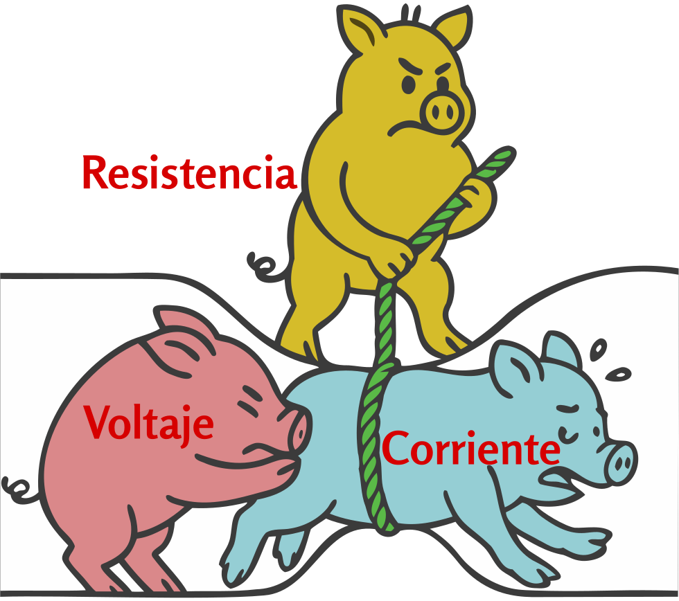
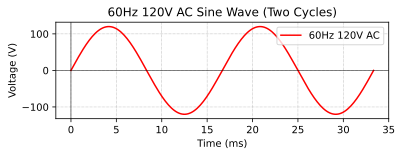

### Sección 1.2: Unidades y cantidades eléctricas

Para entender cómo funcionan nuestras radios, necesitamos familiarizarnos con algunas cantidades eléctricas básicas. Empecemos con las “tres grandes”: voltaje, corriente y resistencia.

#### Voltaje, corriente y resistencia

{.img-pgcap .float-right}

**Voltaje** ($E$ o $V$) es como la “presión” eléctrica: *es la fuerza que causa el flujo de electrones en un circuito*, y se mide en **voltios (V)**. 
- El voltaje también se llama a veces **fuerza electromotriz (FEM)**, porque crea las condiciones que permiten que fluya la corriente.
- El voltaje siempre se mide *entre dos puntos*. Cuando decimos que una batería de auto es de 12V, queremos decir que hay una **diferencia de 12 voltios** entre sus terminales positivo y negativo.

**Corriente** ($I$) es *el flujo de electrones en un circuito eléctrico*, medido en **amperios (A)**.   Los electrones individuales en realidad se mueven bastante despacio a través de un conductor — alrededor de media pulgada por minuto — pero el movimiento de la carga eléctrica es casi instantáneo, como un tubo largo lleno de canicas: empujas una en un extremo y casi de inmediato sale otra por el otro extremo.

En radioafición podrías trabajar con:
- **Miliamperios (mA)** en circuitos de baja potencia.
- **Unos pocos amperios** para alimentar un transceptor móvil.
- **15-20 amperios** para un amplificador de HF de alta potencia.

**Resistencia** ($R$) es *cuánto se opone un material al flujo de corriente al convertir energía eléctrica en calor*, y se mide en **ohmios ($\Omega$)**. Piensa en la resistencia como una propiedad fundamental que afecta cómo se mueve la energía eléctrica por un circuito:
- Los *conductores*, como el alambre de cobre, tienen *muy baja resistencia*, lo que permite que la corriente fluya con facilidad.
- Los *aislantes*, como el caucho o el vidrio, tienen *muy alta resistencia*, bloqueando el flujo de corriente.
- Las *resistencias* son componentes con valores de resistencia específicos y controlados que se usan para:
  - Limitar la corriente en circuitos con LED para evitar que se quemen.
  - Dividir voltaje en circuitos de medición.
  - Convertir energía eléctrica en calor en aplicaciones como cargas ficticias.

Estas tres cantidades están fundamentalmente relacionadas, como explica la **Ley de Ohm**, que veremos en la **Sección 1.3**.

#### Caída de voltaje

Cuando la corriente fluye a través de un componente resistivo o un cable, parte del voltaje se “usa” en el proceso. Esta disminución del voltaje se llama **caída de voltaje**.

Es similar a la disminución de la presión del agua cuando fluye por una tubería: cuanto más larga o estrecha sea la tubería, más presión se pierde. En términos eléctricos, cuando la corriente fluye a través de una resistencia, el voltaje disminuye a lo largo del camino.

Este concepto es importante en radioafición porque:
- Los cables de alimentación largos hacia tu radio pueden producir un voltaje más bajo en la radio que en la fuente de alimentación.
- Un mayor consumo de corriente (como durante la transmisión) aumenta la caída de voltaje.

Por eso la mayoría de las instalaciones móviles de radioafición usan cables de alimentación gruesos y cortos: para minimizar la caída de voltaje cuando se opera equipo que consume una corriente significativa.

#### Frecuencia {#12frequency}

Hasta ahora hemos hablado de la electricidad en términos constantes, sin cambios. Pero en radioafición pasamos mucho tiempo tratando con electricidad que cambia, a menudo muy rápidamente.

En radioafición trabajamos con frecuencia con **corriente alterna (CA)**, que cambia suavemente de dirección siguiendo un patrón de onda sinusoidal, a diferencia de la CC, que fluye constantemente en una sola dirección.

{.img-centered .img-full}

La CA ocurre de forma natural cuando un imán gira cerca de un cable. Cuando el polo norte del imán se acerca al cable, la corriente fluye en una dirección. Cuando se acerca el polo sur, la corriente fluye en la dirección opuesta. Esa rotación continua crea el patrón suave de onda sinusoidal que se muestra en el diagrama. Este es el principio básico de los generadores que producen la electricidad que alimenta nuestros hogares y de las corrientes alternas en nuestros circuitos de radio.

El diagrama muestra dos **ciclos** completos de CA: cada uno empieza en cero, sube hasta un pico positivo, baja pasando por cero hasta un pico negativo y luego vuelve a cero. *El número de estos ciclos completados por segundo se llama frecuencia, medida en Hercio*.  

Algunos ejemplos:
- Energía doméstica: **60 Hz** (60 ciclos por segundo).
- Estaciones de radio AM: alrededor de **1000 kHz** (1.000.000 de ciclos por segundo).
- Radio FM y muchas bandas de radioaficionados: **rango de MHz** (millones de ciclos por segundo).

Entender la *frecuencia* es crucial en radioafición porque determina *qué bandas puedes usar* y *qué tan lejos pueden viajar tus señales*.

#### Potencia

La potencia es *la tasa a la que se usa la energía eléctrica en un circuito*.  Se mide en **vatios (W)**. 

En radioafición, la potencia es importante porque:

- **Más potencia = mayor alcance de transmisión.** Una señal más fuerte llega más lejos.
- **Más potencia = más calor.** Las radios de alta potencia necesitan refrigeración adecuada.
- **Más potencia = mayores demandas de energía.** Tu fuente de alimentación debe poder cubrir las necesidades de tu radio.

#### Decibelios

En lugar de hablar siempre en vatios, los radioaficionados suelen usar **decibelios (dB)** para expresar cambios de potencia. El decibelio es una *unidad logarítmica* que hace mucho más fácil expresar y trabajar con razones muy grandes o muy pequeñas. En lugar de multiplicar niveles de potencia, podemos simplemente sumar o restar valores en dB, lo cual es especialmente útil en sistemas de radio donde las señales pueden amplificarse y atenuarse varias veces.

Esto es lo que significan los decibelios en la práctica:

- **+3 dB** significa que la potencia *se duplica*. 
- **-3 dB** significa que la potencia *se reduce a la mitad*.
- **-6 dB** significa que la potencia *se reduce a la mitad dos veces (dividida entre cuatro)*.
- **+10 dB** significa que la potencia *aumenta diez veces*. 
- **+20 dB** significa que la potencia aumenta cien veces.

Algunos ejemplos del mundo real:
- Un aumento de potencia de **5W a 10W** es una **ganancia de +3 dB**.
- Una disminución de **12W a 3W** es una **pérdida de -6 dB**. 
- ¿Pasar de **20W a 200W**? Eso es un **aumento de +10 dB**.

La ventaja de la escala de decibelios es que comprime números grandes en un rango más manejable, facilitando entender y hablar de ganancias y pérdidas de señal a lo largo de un sistema de radio.

#### CA y CC

La electricidad viene en dos tipos:

- **Corriente continua (CC)** fluye *en una sola dirección*, como desde una **batería** o una fuente de alimentación. La mayoría de las radios funcionan con **12V CC**.
- **Corriente alterna (CA)** *invierte constantemente la dirección, alternando entre direcciones positiva y negativa*, como la **energía doméstica**. 

La mayoría de los equipos de radioafición funcionan con **alimentación de CC**, pero **las propias señales de radio son CA**: alternan a **frecuencias de radio**. Las señales de radiofrecuencia (RF) son simplemente señales de CA a frecuencias muy altas usadas para comunicación inalámbrica.

*La resistencia se opone a todos los tipos de flujo de corriente*, incluyendo corriente continua, corriente alterna y corriente de RF. 

#### Impedancia

> **Información Clave:** La impedancia es la oposición al flujo de corriente de CA.  Como la resistencia, se mide en ohmios ($\Omega$). 

En un **circuito de CC**, la resistencia simplemente se opone al flujo de electricidad. Pero en un **circuito de CA**, la historia se vuelve más compleja.

*La capacitancia describe la capacidad de almacenar energía en un campo eléctrico*  y se mide en *faradios (F)*. 

*La inductancia describe la capacidad de almacenar energía en un campo magnético*  y se mide en *henrios (H)*. 

Los componentes físicos que presentan estas propiedades se llaman **capacitores** e **inductores**; los veremos en la Sección 2.1. Por ahora, el enfoque está en cómo se comportan dentro de un circuito.

Cuando los capacitores o inductores están en un circuito de CA, se oponen a la corriente de forma distinta a diferentes frecuencias. Este tipo de oposición dependiente de la frecuencia se llama **reactancia**.

- **La reactancia inductiva** aumenta a medida que aumenta la frecuencia.
- **La reactancia capacitiva** disminuye a medida que aumenta la frecuencia.

**La impedancia** combina tanto resistencia como reactancia, dándonos la oposición total al flujo de corriente de CA en un circuito.

Un *circuito resonante consiste en Un inductor y un condensador conectados ya sea en serie (uno tras otro) o en paralelo (lado a lado)*.  A una frecuencia específica, las dos reactancias son iguales pero actúan en direcciones opuestas, de modo que se cancelan exactamente. Esto crea un equilibrio eléctrico que permite que las señales de esa frecuencia pasen con facilidad (en serie) o queden bloqueadas (en paralelo). Esa frecuencia se llama **frecuencia resonante**, y este fenómeno se conoce como **resonancia**.

La mayoría de los equipos de radioafición están construidos alrededor de un sistema de 50 ohmios. Cuando las impedancias no están correctamente adaptadas:

- La transferencia de potencia se vuelve menos eficiente.
- Parte de la energía puede reflejarse de regreso hacia la fuente.
- El equipo puede necesitar reducir su potencia de salida para protegerse.

Estos principios se aplican a muchas partes de tu sistema de radio, incluidas las antenas, que presentan propiedades de resistencia, capacitancia e inductancia.

#### Prefijos métricos y unidades eléctricas

En radioafición, a menudo manejamos números muy grandes o muy pequeños. En lugar de escribir todos los ceros, usamos **prefijos métricos**:

| Prefijo | Símbolo | Multiplicador | Ejemplo |
|:------:|:------:|:----------:|:-------:|
| pico   | p      | $10^{-12}$ | 1 pF = 0,000000000001 F o una billonésima de faradio |
| nano   | n      | $10^{-9}$  | 1 nF = 0,000000001 F o una milmillonésima de faradio |
| micro  | μ      | $10^{-6}$  | 1 μF = 0,000001 F o una millonésima de faradio |
| mili   | m      | $10^{-3}$  | 1 mV = 0,001 V o una milésima de voltio |
| (ninguno) | -   | $10^0$     | 1 A = 1 A |
| kilo   | k      | $10^3$     | 1 kHz = 1.000 Hz o mil hertz |
| mega   | M      | $10^6$     | 1 MHz = 1.000.000 Hz o un millón de hertz |
| giga   | G      | $10^9$     | 1 GHz = 1.000.000.000 Hz o mil millones de hertz |

> **Información Clave:**
> * La abreviatura kHz significa “kilohercio”. 
> * La abreviatura MHz significa “megahercio”. 

Nota: Las unidades F (faradio) y H (henrio) se refieren a la capacitancia y la inductancia mencionadas arriba, que exploraremos con más detalle en la Sección 2.1.

Aquí hay algunas conversiones comunes que pueden aparecer en el examen:

         

|          ID de pregunta         | Original               | Equivalente             |
|:----------------------------:|------------------------|------------------------|
| T5B01 | 1,5 amperios           | 1500 miliamperios      |
| T5B02 | 1,500,000 hercios      | 1500 kHz               |
| T5B03 | 1 kilovoltio           | 1000 voltios           |
| T5B04 | 1 microvoltio          | Una millonésima parte de un voltio |
| T5B05 | 500 milivatios         | 0,5 vatios             |
| T5B06 | 3000 miliamperios      | 3 amperios             |
| T5B07 | 3,525 MHz              | 3525 kHz               |
| T5B08 | 1.000.000 picofaradios | 1 microfaradio         |
| T5B12 | 28400 kHz              | 28.400 MHz             |
| T5B13 | 2425 MHz               | 2,425 GHz              |

¡Vale la pena memorizar todas las conversiones de esta tabla para el examen!

---

Eso cubre el vocabulario: voltaje, corriente, resistencia, potencia y las unidades que usamos para medirlos. En la siguiente sección veremos cómo estas cantidades se conectan entre sí mediante dos fórmulas sencillas que cualquiera que trabaje con electricidad debería entender.
