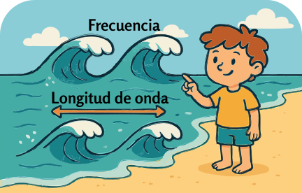

### Sección 3.1: Frecuencia y longitud de onda

{.img-pgcap .float-right}

Observa las olas en la playa. Algunas llegan rápidamente, una tras otra, mientras que otras vienen más despacio y con mayor distancia entre ellas. Son dos cosas diferentes: qué tan seguido llegan las olas (frecuencia) y la distancia entre ellas (longitud de onda). Como veremos, ambas describen la misma onda y están relacionadas. Las ondas de radio funcionan de manera parecida, pero en lugar de agua son ondas electromagnéticas que viajan por el espacio a la velocidad de la luz.

#### ¿Qué es RF?

Si pasas mucho tiempo leyendo sobre radioafición, verás aparecer el término **RF**. **RF significa radiofrecuencia** — básicamente, una forma elegante de decir "señales de radio". RF abarca todo tipo de señales de radio, ya se usen para voz, datos u otras formas de comunicación inalámbrica.

Como vimos en el Capítulo 1, **la energía de radiofrecuencia (RF) es una forma de corriente alterna (CA), pero a frecuencias mucho más altas que la electricidad doméstica**. En lugar de mover electrones de un lado a otro en un cable, como la CA de tu casa, la RF viaja como ondas electromagnéticas a través del espacio, llevando señales a distancias cortas y largas.

Ya sea que estés sintonizando tu estación de radiodifusión favorita, conversando en un repetidor o enviando datos por un enlace satelital, estás trabajando con RF. Es el pan de cada día de toda comunicación por radio.

#### La naturaleza de las ondas de radio

> **Información clave:**
> - Una onda de radio tiene dos componentes: campos eléctricos y magnéticos. 
> - Estos campos están en ángulo recto entre sí. 
> - Las ondas de radio viajan a la velocidad de la luz en el espacio libre (aproximadamente *300,000,000 metros por segundo*). 
> - Todas las frecuencias de radio viajan a la misma velocidad en el espacio libre: VHF, UHF, microondas y todas las demás frecuencias. 

{.img-centered .img-large}

¿Qué son exactamente estos campos? Un *campo* es una región del espacio donde una fuerza puede actuar sobre las cosas. Has sentido el más familiar durante toda tu vida: la gravedad es un campo alrededor de la Tierra. Los campos eléctricos actúan sobre cargas eléctricas (como la atracción estática de un globo frotado contra tu cabello), y los campos magnéticos actúan sobre materiales magnéticos (como un imán en tu refrigerador). Una onda de radio son esos dos campos oscilando juntos: cuando uno cambia, crea el otro, y todo el patrón viaja hacia afuera desde la antena a la velocidad de la luz.

Aunque todas las frecuencias de radio viajan a la misma velocidad en el vacío del espacio libre, las ondas de radio pueden reducir su velocidad al pasar por ciertos materiales — vidrio, agua o el interior de un cable coaxial — de modo que una señal viaja un poco más despacio por un cable que por el espacio vacío. Pero en el espacio libre, ya sea una señal de HF a 3,5 MHz o una señal de microondas a 10 GHz, todas viajan exactamente a la misma velocidad: la velocidad de la luz.

#### Polarización

> **Información clave:** La orientación del campo eléctrico define la polarización de una onda de radio. 

Imagina que sostienes un extremo de una cuerda y la sacudes hacia arriba y hacia abajo para enviar una onda a lo largo de ella: el movimiento de la onda es vertical, así que diríamos que es una onda polarizada verticalmente. Si sacudes la cuerda de lado a lado, la onda queda polarizada horizontalmente. Una onda de radio funciona de manera similar: la "dirección de la sacudida" es la dirección hacia la que apunta su campo eléctrico.

Esto es crucial porque tu antena necesita coincidir con esa orientación para lograr la mejor recepción.

#### Longitud de onda y frecuencia

> **Información clave:**
> - La longitud de onda se acorta según aumenta la frecuencia. 
> - Para encontrar la longitud de onda en metros, usa esta fórmula: 300 dividido por la frecuencia en megahercios. 
> - Las bandas de radioafición a menudo se identifican por su *longitud de onda aproximada en metros*. 

Las ondas de radio vienen en todo tipo de tamaños. El tamaño de una onda de radio — su longitud de onda — está directamente relacionado con su frecuencia, y entender esta relación es clave para comprender las bandas de radioafición.

La longitud de onda es la distancia física que recorre una onda de radio mientras completa un ciclo completo. Cuando escuchas hablar de la "banda de 2 metros" o la "banda de 70 centímetros", se está hablando de la longitud de onda aproximada de las señales en esa banda. Veremos los detalles del espectro de radioafición en la próxima sección.

Cuanto más alta es la frecuencia, más corta es la longitud de onda. Esta relación inversa significa que, a medida que la frecuencia aumenta, la longitud de onda disminuye proporcionalmente. Una señal a 144 MHz (banda de 2 m) tiene el doble de frecuencia y la mitad de longitud de onda que una señal a 72 MHz.

Así se calcula la longitud de onda (a la que a menudo nos referimos con la variable lambda, o λ):

$$\text{Longitud de onda (}\lambda\text{)} = \frac{300}{\text{Frecuencia en MHz (}f\text{)}}$$

{.img-small .float-right}

Al igual que cuando hablamos de la ley de Ohm, también podemos hacer un diagrama circular simple para esta relación, aunque necesitamos usar los símbolos por brevedad:

Para usar esta ayuda:
1. Cubre la variable que quieres encontrar
2. Las piezas restantes te muestran cómo calcularla

   - Cubre λ (longitud de onda): divide $\frac{300}{frequency}$.

   - Cubre ƒ (frecuencia): divide $\frac{300}{wavelength}$.

Por ejemplo, calculemos la longitud de onda para la banda de 2 metros (144 MHz):

$$
\begin{align*}
\text{Longitud de onda} &= \frac{300}{144}\\
&= 2.08 \text{ metros}
\end{align*}$$

¡Por eso la llamamos la banda de 2 metros!

#### Resonancia y diseño de antenas

Cuando la longitud de una antena coincide con la longitud de onda — o con ciertas fracciones específicas de ella, como un cuarto de onda — resuena como un diapasón. Esta coincidencia física crea condiciones óptimas para que la antena absorba o emita energía electromagnética en esa frecuencia específica, lo que produce una transmisión y recepción de señales mucho más eficiente.

Por ejemplo, una antena dipolo de media onda para la banda de 2 metros mediría aproximadamente 1 metro de largo (la mitad de 2,08 metros). ¡Exploraremos esto más cuando hablemos de antenas!

---

Ahora que entendemos cómo se relacionan la longitud de onda y la frecuencia, veamos cómo se divide realmente el espectro de radio, y por qué diferentes partes de él se comportan de maneras tan distintas.
