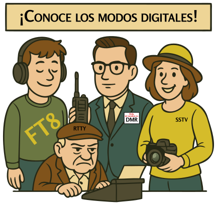

### Sección 3.5: Modos digitales y video

{.img-pgcap .float-right}

Si los modos de voz son como hacer una llamada telefónica, los modos digitales son como enviar mensajes de texto o correos electrónicos por las ondas de radio. Algunos modos llevan voz como datos digitales; otros envían texto, reportes de posición o imágenes; y unos pocos incluso pueden enviar video en movimiento. Los modos digitales han sido una parte creciente de la radioafición durante décadas, y al principio la cantidad de ellos puede parecer abrumadora. Nos enfocaremos en los que aparecen en el examen y te daremos una idea de para qué sirve cada uno.

Una nota antes de empezar: esta sección cubre mucho terreno, y no necesitas memorizarlo todo. Lo único que necesitas recordar para el examen está resaltado en los bloques de Información clave. Todo lo demás está aquí para darte contexto — una idea de lo que existe y cómo encajan estos modos — para que cuando los encuentres en el aire o en una conversación sepas de qué está hablando la gente.

> **Información clave:** Los modos de comunicación digital incluyen radio por paquetes, IEEE 802.11 y FT8, entre otros. 

#### Radio por paquetes

> **Información clave:** Las transmisiones de radio por paquetes incluyen una suma de comprobación que permite la detección de errores, un encabezado que contiene el indicativo de la estación a la que se envía la información y solicitud automática de repetición en caso de error. 

La radio por paquetes es el modo digital original para enviar datos por radioafición. La idea central es sencilla: tu mensaje se divide en pequeños fragmentos llamados paquetes, cada uno con una dirección de destino e información de verificación de errores, y esos paquetes se envían por el aire. La estación receptora los vuelve a ensamblar para formar el mensaje original.

La radio por paquetes fue muy importante en las décadas de 1980 y 1990, antes de que internet se generalizara. Todavía se usa hoy en algunas aplicaciones, especialmente en comunicaciones de emergencia.

#### APRS (Sistema Automático de Reporte por Paquetes)

> **Información clave:**
> - APRS puede transmitir datos de posición GPS, datos meteorológicos y mensajes de texto. 
> - APRS proporciona comunicaciones digitales tácticas en tiempo real junto con un mapa que muestra la ubicación de las estaciones. 

APRS es una forma especializada de radio por paquetes construida alrededor de mensajería consciente de ubicación. Las estaciones con receptores GPS transmiten sus posiciones periódicamente como balizas, y toda la red se muestra en mapas compartidos que cualquiera puede sintonizar. Es como Twitter combinado con Google Maps, pero para radio: extremadamente útil para comunicaciones en eventos, servicio público y seguimiento de estaciones móviles.

#### PSK31

> **Información clave:** PSK significa modulación por desplazamiento de fase (*Phase Shift Keying*). 

*PSK* (*Phase Shift Keying*, modulación por desplazamiento de fase) es ideal para conversaciones en tiempo real de teclado a teclado. PSK31 opera a una velocidad de símbolo de 31,25 baudios, aproximadamente igual a la velocidad típica de escritura. Es tan estrecho que los contactos pueden espaciarse a solo 100 Hz, permitiendo que muchas señales quepan donde cabría una sola transmisión de voz.

#### RTTY (Radioteletipo)

RTTY es el abuelo de los modos digitales, con origen en la década de 1930. Es esencialmente una máquina de escribir basada en radio. Todavía es popular en concursos y entre algunas agencias de noticias.

#### PACTOR

PACTOR es un modo digital versátil que cambia automáticamente entre velocidades y métodos de codificación según las condiciones. Hay varias versiones, con PACTOR III ofreciendo un rendimiento robusto para aplicaciones como correo electrónico por radio.

#### Radio Móvil Digital (DMR)

> **Información clave:**
> - DMR usa multiplexación por tiempo para poner dos señales de voz digitales en un solo canal de repetidor de 12,5 kHz. 
> - Un código de color DMR es un código de acceso que debe programarse en un transmisor DMR para acceder a un repetidor específico. 
> - Un grupo de conversación es un identificador usado por DMR para organizar el tráfico de radio de modo que quienes quieren escuchar al grupo no sean molestados por otro tráfico de radio. 
> - Únete a un grupo de conversación DMR programando tu radio con el ID o código del grupo. 
> - Para seleccionar un grupo específico de estaciones en un radio DMR, introduce el código de identificación del grupo. 
> - Un "code plug" de DMR son datos de configuración cargados en tu radio para acceder a repetidores y grupos de conversación. 

DMR es un potente modo de voz digital que efectivamente duplica la capacidad de un repetidor al entrelazar dos conversaciones en el mismo canal: cada una recibe ranuras de tiempo alternas tan rápidas que los oyentes no notan que están compartiendo.

Lo que hace único a DMR es cómo organiza su tráfico:
- **Grupos de conversación**: Un identificador usado para organizar el tráfico de radio de modo que los usuarios que quieren escuchar al grupo no sean molestados por otro tráfico. Te unes programando tu radio con el ID o código del grupo.
- **Códigos de color**: Un código de acceso que debe programarse en tu radio para acceder a un repetidor específico.
- **Code plugs**: Datos de configuración cargados en tu radio que contienen información de acceso para repetidores y grupos de conversación.

Las redes DMR se usan ampliamente tanto para comunicación local como mundial mediante sistemas enlazados por internet.

#### System Fusion y C4FM

System Fusion es el sistema de voz digital de Yaesu, que usa una modulación llamada C4FM (Modulación de Frecuencia Continua de Cuatro Niveles). Su característica destacada es el cambio transparente entre FM digital y analógica: un radio Fusion puede detectar automáticamente si una señal entrante es digital o analógica y cambiar de modo según corresponda. Fusion funciona con el sistema de enlace por internet WIRES-X de Yaesu para comunicación digital mundial.

#### D-STAR (Tecnologías Digitales Inteligentes para Radio Amateur)

> **Información clave:** Antes de transmitir en D-STAR, debes programar tu indicativo en el transceptor. 

D-STAR es un sistema completamente digital de voz y datos desarrollado por la Liga de Radioaficionados de Japón, y a diferencia de System Fusion, no vuelve a analógico: es digital de principio a fin. Su característica distintiva es el enrutamiento por indicativo: introduces el indicativo de otro radioaficionado, y la red D-STAR decide por qué repetidor enlazado enrutar tu señal para alcanzarlo. Por eso tu propio indicativo debe estar programado en el radio: cada transmisión D-STAR lo lleva como parte de la información de enrutamiento.

#### Puntos de acceso para modos digitales

> **Información clave:** Un punto de acceso de modo digital permite la comunicación con una red de voz o datos digitales. 

Un punto de acceso (*hotspot*) es un dispositivo pequeño y de baja potencia que actúa como tu propio repetidor personal: se conecta por internet a redes digitales de voz o datos, como DMR, D-STAR o System Fusion, para que puedas llegar a esas redes desde casa sin necesitar un repetidor local dentro de alcance. Eso hace que los puntos de acceso sean especialmente útiles para operadores en áreas sin buena cobertura de repetidores digitales, o para acceder a grupos de conversación que no están disponibles en ningún repetidor cercano.

#### Interfaces computadora-radio

> **Información clave:**
> - Una interfaz computadora-radio para modos digitales necesita audio de recepción, audio de transmisión y activación del transmisor. 
> - La entrada y salida de audio de un transceptor que opera FT8 se conectan a la salida y entrada de audio de una computadora que ejecuta software FT8. 
> - Una de las conexiones requeridas de computadora a transceptor para modos digitales es la "entrada de línea" de la computadora al conector de altavoz del transceptor. 

La mayoría de los modos digitales se ejecutan en una computadora conectada a tu radio, y la conexión maneja tres tareas a la vez: audio en ambas direcciones y una señal para decirle al radio cuándo transmitir. Los pares de audio suelen ser el conector de altavoz del radio alimentando a la computadora, y la salida de audio de la computadora alimentando la entrada de micrófono o datos del radio.

#### WSJT-X y FT8

> **Información clave:**
> - FT8 es un modo digital capaz de operar con baja relación señal-ruido. 
> - El software WSJT-X soporta Tierra-Luna-Tierra, balizas de propagación de señal débil y dispersión meteórica, junto con otros modos. 

FT8 es uno de los modos digitales de aficionados más populares, diseñado para funcionar en condiciones de señal extremadamente débil: señales muy por debajo del nivel de ruido que serían inutilizables para voz. Es parte del conjunto de software WSJT-X, que también soporta Tierra-Luna-Tierra (rebote lunar), dispersión meteórica y modos de balizas de señal débil.

#### Modos de video

> **Información clave:** NTSC se refiere a una señal analógica de TV a color de barrido rápido. 

Hay dos opciones principales para enviar imágenes y video:

- **Televisión de Barrido Rápido (FSTV)** usa *NTSC*, el mismo formato analógico que se usaba para la televisión de radiodifusión en EE. UU. antes del cambio digital. FSTV requiere un ancho de banda considerable, por lo que normalmente se usa en frecuencias UHF y de microondas.
- **Televisión de Barrido Lento (SSTV)** se parece más a enviar una postal: transmite una imagen fija en un período que puede ir desde unos pocos segundos hasta un par de minutos. SSTV funciona en bandas HF con equipo mínimo, y los radioaficionados incluso la han usado para recibir imágenes desde la Estación Espacial Internacional.

#### Redes mesh

> **Información clave:** Una red mesh de radioaficionados es una red de datos de radioafición que usa equipo Wi-Fi comercial con firmware modificado. 

Las redes mesh de aficionados toman hardware Wi-Fi comercial, le cargan firmware modificado y lo usan para operar dentro de bandas de radioafición en lugar de las bandas Wi-Fi estándar. Las redes mesh enrutan automáticamente alrededor de fallas: si un nodo cae, el tráfico encuentra otro camino, lo que las hace populares para comunicaciones de emergencia y redes construidas por la comunidad.

#### ARQ (Solicitud Automática de Repetición)

> **Información clave:** ARQ es un método de corrección de errores en el que la estación receptora detecta errores y envía una solicitud de retransmisión. 

Ya has visto ARQ en acción: es el mecanismo que hace confiable a la radio por paquetes. La idea aparece en muchos modos digitales: una transmisión sale, el receptor la revisa en busca de errores y, si algo está mal, el receptor solicita automáticamente que se repita.

---

Los modos digitales seguirán evolucionando: lo que hoy es actual parecerá anticuado en diez años, y habrá modos que nadie ha inventado todavía. Para el examen, concéntrate en los términos y conceptos clave de arriba. Para la afición, prueba algunos modos y descubre cuáles te gustan.
