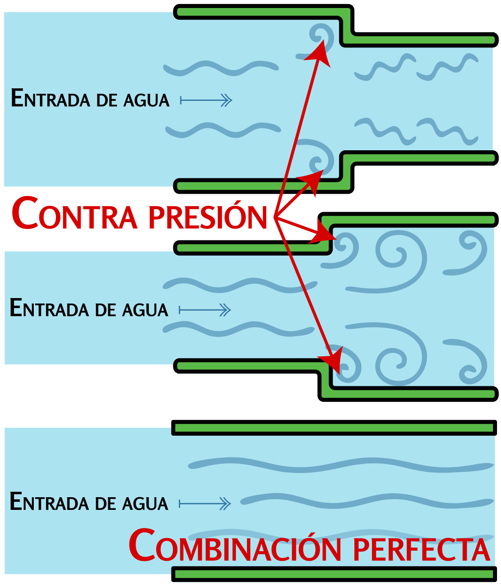

### Sección 4.5: Relación de Onda Estacionaria (ROE ("SWR"))

La Relación de Onda Estacionaria, o ROE ("SWR"), es un concepto crítico para asegurar que tu sistema de antena funcione de manera eficiente. Vamos a desglosarlo en partes manejables:

#### ¿Qué es la ROE?

> **Información clave:**
> - La ROE ("SWR") es una medida del grado de adaptación de una carga a una línea de transmisión. 
> - Una lectura de 1:1 en un medidor de ROE ("SWR") indica un ajuste de impedancia perfecto entre la antena y la línea de alimentación. 
> - Una lectura de ROE ("SWR") de 4:1 indica un desajuste de impedancia. 

La ROE es esencialmente una calificación para la adaptación de impedancia en tu sistema de antena. Te dice el grado de adaptación entre la impedancia de tu transmisor y la impedancia combinada de tu línea de alimentación y tu antena. Cuando estas impedancias coinciden (típicamente a 50 ohmios en radioafición), se transfiere la máxima potencia desde tu transmisor a tu sistema de antena.

{.img-pgcap .float-right}

Piensa en tu sistema de radio como agua fluyendo por tuberías. Tu transmisor empuja la señal (agua) por tu línea de alimentación (tubería) hacia tu antena. Cuando las tuberías tienen el tamaño correcto (buena adaptación de impedancia), el agua fluye suavemente. Pero si hay un desajuste, parte del agua es empujada hacia atrás, creando contrapresión, igual que la energía RF reflejada de vuelta hacia tu transmisor. Esa energía reflejada es lo que realmente te indica la ROE: es la consecuencia práctica del desajuste de impedancia.

La ROE se mide como una relación; esto es lo que significan diferentes lecturas en la práctica:

- **ROE 1:1**: Ajuste de impedancia perfecto. Toda la potencia está siendo aceptada por tu línea de alimentación y antena.
- **Hasta ROE 1.5:1**: Excelente. La mayor parte de tu potencia está pasando.
- **ROE 2:1**: Aceptable, pero no ideal. Parte de la potencia se está reflejando.
- **ROE 3:1 o mayor**: Una cantidad significativa de potencia se está reflejando.
- **ROE 4:1**: Un claro desajuste de impedancia; vale la pena investigarlo antes de seguir transmitiendo.

Ten en cuenta que estos umbrales son guías aproximadas, no reglas estrictas.

#### ¿Por qué importa la ROE?

¿Por qué debería importarte la ROE? Todo se trata de eficiencia y seguridad del equipo. Cuanto más baja sea tu ROE, más potencia de tu radio llega realmente a tu antena y sale al mundo. Una ROE alta significa que parte de esa potencia rebota de regreso a tu radio en lugar de transmitirse.

Esta potencia reflejada crea dos problemas importantes:

1. **Energía desperdiciada**: La potencia reflejada de vuelta a tu transmisor no contribuye a tu señal, reduciendo tu alcance efectivo de comunicación.

2. **Daño al equipo**: Más seriamente, la potencia reflejada puede sobrecalentar y dañar los transistores del amplificador de salida RF de tu transmisor. Cuanto mayor sea la potencia de salida y más largas sean las transmisiones, mayor será el peligro.

> **Información clave:** La mayoría de los transmisores de estado sólido reducen la potencia de salida a medida que aumenta la ROE para proteger los transistores del amplificador de salida RF. Esto significa que una ROE alta es una causa común de baja potencia RF de salida en un transceptor de estado sólido.  

Los radios modernos tienen circuitos de protección que detectan una ROE alta y reducen la potencia o se apagan si es necesario, pero es mejor no depender de ellos, especialmente con transmisores más económicos. Mantener baja tu ROE asegura que tu radio permanezca eficiente y seguro durante años.

#### Causas comunes de ROE alta

> **Información clave:** Una conexión suelta en la antena o línea de alimentación puede causar cambios erráticos en la ROE. 

¿Qué causa una ROE alta? Estos son algunos culpables comunes:

1. **Longitud de la antena**: Tu antena no tiene la longitud correcta para la frecuencia que estás usando.
2. **Problemas con la línea de alimentación**: Hay un problema con tu línea de alimentación; quizá está dañada o le ha entrado agua.
3. **Objetos metálicos cercanos**: Tu antena está demasiado cerca de objetos metálicos. Recuerda: ¡a las antenas no les gusta estar amontonadas!
4. **Conexiones sueltas o corroídas**: Un poco de oxidación puede causar grandes problemas, y una conexión suelta en particular puede producir lecturas de ROE que saltan de manera errática.

Si ves ROE alta, empieza por lo fácil: revisa que todos los conectores estén limpios y ajustados, verifica que tu antena tenga la longitud correcta para tu frecuencia y asegúrate de que nada metálico se haya movido demasiado cerca de la antena. Si todo lo demás falla, un sintonizador de antena puede ayudar adaptando impedancias (aunque no arregla el problema subyacente; solo lo oculta al transmisor).

#### Medir la ROE

> **Información clave:**
> - Un analizador de antena puede usarse para determinar si una antena es resonante en la frecuencia de operación deseada. 
> - Un vatímetro direccional puede usarse para determinar la ROE. 

¿Cómo revisas tu ROE? Muchos radios modernos tienen medidores de ROE integrados. Si el tuyo no lo tiene, puedes conseguir un medidor de ROE externo o un analizador de antena. Estas herramientas son excelentes para tener en tu caja de herramientas de radioaficionado. Otra opción es un vatímetro direccional: mide cuánta potencia sale de tu radio (potencia directa) y cuánta vuelve desde la antena (potencia reflejada), y puedes calcular tu ROE.

#### ROE y radios portátiles

Vale la pena señalar que medir la ROE en un monopolo (como la mayoría de las antenas de un Transceptor Portátil) puede ser complicado. La antena de un HT usa tu cuerpo como parte del plano de tierra, así que cuando conectas cualquier equipo de medición, ¡cambias fundamentalmente el sistema de antena mismo! Esto a menudo lleva a lecturas inexactas y confusión.

Para HTs y configuraciones portátiles similares, normalmente es más práctico evaluar el rendimiento de la antena mediante pruebas de señal reales en lugar de depender únicamente de mediciones de ROE. Si aun así quieres revisar la ROE, hay varias formas de hacerlo, pero ninguna es perfecta.

La buena noticia es que una ROE alta suele ser menos riesgosa en un HT que en una estación base de mayor potencia. Los fabricantes saben que los HTs se usan con sus antenas junto a manos, cuerpos y cualquier otra cosa cercana — todo lo cual afecta el sistema de antena — así que están diseñados con más tolerancia a cargas desadaptadas que un equipo de escritorio típico. Y como *la mayoría* de los HTs tienen una salida de potencia relativamente baja (5–8 W es típico, aunque algunos entregan 25 W o más), incluso con potencia reflejada significativa, la energía total que llega al amplificador final normalmente se mantiene muy por debajo de lo que dañaría un radio de 100 vatios.

#### Pensamientos finales sobre la ROE

Una ROE baja por sí sola no prueba que tu antena esté radiando bien; solo prueba que tu sistema está aceptando potencia. Una carga fantasma es una resistencia que absorbe toda la RF que se le entrega como calor. Muestra una ROE perfecta de 1:1, pero no harás ni un solo contacto con ella porque nada de la potencia se radia. Demasiados radioaficionados caen en la trampa de pensar que la ROE es todo lo que importa.

La ROE simplemente te dice que la potencia se está transfiriendo eficientemente desde tu transmisor a tu sistema de antena; lo que pase después depende del diseño de la antena, la altura, el entorno y muchos otros factores. Una buena antena con buena ROE asegura que tu potencia llegue a la antena y luego se radie eficazmente al espacio.

Así que la próxima vez que instales tu estación, tómate un momento para revisar tu ROE. Es como asegurarte de que la tubería desde tu tanque de agua no tenga fugas antes de preocuparte por hacia dónde apuntan los aspersores.

---

Con esto concluimos la Parte 1. Ahora has visto cómo la electricidad, los componentes, las ondas de radio y las antenas encajan para hacer que funcione la radioafición. Saber cómo se comporta la física es una mitad de ser radioaficionado; la otra mitad es saber cómo aplicarla de forma segura y efectiva. De eso trata la Parte 2, comenzando con la seguridad.
