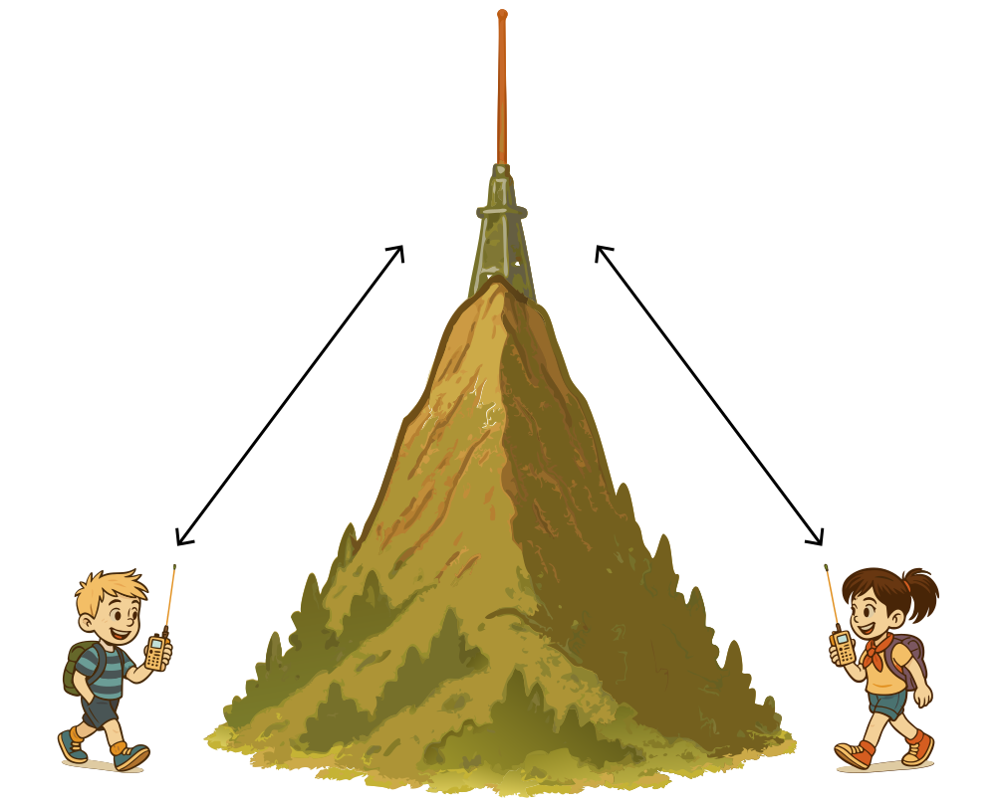

### Sección 6.5: Operación con repetidores

Un repetidor es una estación que escucha en una frecuencia y retransmite lo que oye en otra, normalmente desde un punto elevado. Los repetidores extienden tu alcance mucho más allá de lo que tu portátil o equipo móvil podría lograr por sí solo, lo que los convierte en una de las herramientas más útiles disponibles para un Technician.

#### ¿Qué es un repetidor?

> **Información clave:** Una estación repetidora retransmite simultáneamente la señal de otra estación de radioaficionado en un canal o canales diferentes. 

{.img-med .float-right}

Piensa en una estación de retransmisión de radio ubicada en lo alto de una colina o edificio alto. Escucha en una frecuencia y retransmite simultáneamente lo que oye en otra. Esto extiende tu alcance mucho más allá de lo que tu pequeño portátil o equipo móvil podría hacer por su cuenta.

Ahora, solo una señal puede existir útilmente en una frecuencia dada a la vez, así que el repetidor no puede hablar en la misma frecuencia en la que tú estás hablando. En cambio, cuando transmites a un repetidor, en realidad estás enviando en una frecuencia (la entrada) y escuchando en otra (la salida). No te preocupes: tu radio manejará esto automáticamente si lo configuraste correctamente.

#### Desplazamientos de repetidores

> **Información clave:** El desplazamiento de repetidor es la diferencia entre las frecuencias de transmisión y recepción de un repetidor. Los desplazamientos comunes son más o menos 600 kHz en 2 metros y más o menos 5 MHz en 70 cm.   

Al usar repetidores, necesitas conocer los desplazamientos. Un desplazamiento es la diferencia entre las frecuencias de transmisión y recepción de un repetidor. Tu radio debe configurarse con el desplazamiento correcto para comunicarse eficazmente a través de un repetidor.

Aquí tienes una tabla práctica de desplazamientos comunes de repetidores para varias bandas de radioaficionados:

| Banda | Rango de frecuencia | Desplazamiento común |
|:----:|:---------------:|:-------------:|
| 6m   | 50–54 MHz       | -500 kHz o -1 MHz |
| 2m   | 144–148 MHz     | *±600 kHz* |
| 1.25m| 222–225 MHz     | -1.6 MHz |
| 70cm | 420–450 MHz     | *±5 MHz* |
| 33cm | 902–928 MHz     | -12 MHz o -25 MHz |
| 23cm | 1240–1300 MHz   | -12 MHz o -20 MHz |

Recuerda que estos son los desplazamientos más comunes, pero puede haber excepciones:

- En 2 metros, los repetidores por encima de 147 MHz normalmente usan desplazamiento positivo, mientras que los de abajo usan desplazamiento negativo.
- Algunas áreas pueden usar desplazamientos no estándar debido a la coordinación local de frecuencias.
- Ciertos repetidores, especialmente en bandas menos comunes, pueden usar frecuencias divididas que no siguen estos desplazamientos estándar.

Muchos radios modernos pueden establecer automáticamente el desplazamiento correcto según la frecuencia que ingreses, pero siempre es bueno verificar. En caso de duda, consulta un directorio local de repetidores o pregunta a otro radioaficionado de tu área.

#### La función inversa

> **Información clave:** La función inversa en un transceptor VHF/UHF te permite escuchar en la frecuencia de entrada de un repetidor. 

Cuando usas un repetidor normalmente, escuchas en su frecuencia de salida. La función inversa intercambia temporalmente tus frecuencias de transmisión y recepción para que escuches en la frecuencia de *entrada* en su lugar; es decir, escuchas directamente a quien está transmitiendo hacia el repetidor. Esto es útil para determinar si puedes escuchar directamente a la otra estación sin el repetidor (lo que significa que potencialmente podrían hablar en simplex), o para solucionar problemas y ver si un repetidor funciona correctamente. En algunos casos también puede permitirte hablar con la otra estación sin el repetidor, aunque esto solo debe hacerse con cuidado para evitar interferir con el repetidor.

#### Acceder a repetidores

> **Información clave:** La mayoría de los repetidores usan tonos CTCSS o códigos DCS para acceso. CTCSS (Continuous Tone-Coded Squelch System) es un tono subaudible transmitido junto con el audio normal de voz para abrir el silenciador de un receptor. Las dificultades para acceder a un repetidor podrían deberse a desplazamiento incorrecto, tono CTCSS equivocado o código DCS equivocado.  

Muchos repetidores requieren un tono CTCSS (Continuous Tone-Coded Squelch System), a menudo llamado tono PL (Private Line), o un código DCS (Digital Coded Squelch) para acceder. CTCSS es un tono subaudible (de baja frecuencia) transmitido junto con el audio normal de voz para abrir el silenciador de un receptor. DCS, por otro lado, es un flujo continuo de datos digitales de baja velocidad.

Ambos tienen el mismo propósito: ayudan a prevenir interferencias y activaciones no intencionadas del repetidor. Tu radio debe estar configurado para transmitir el tono CTCSS o código DCS correcto para que el repetidor siquiera reconozca tu señal. Consulta un directorio local de repetidores o la información del club para saber qué sistema usa un repetidor específico.

También encontrarás DTMF en la operación con repetidores. Como discutimos en la Sección 6.4, DTMF usa dos tonos de audio simultáneos, la misma tecnología usada en teléfonos de tonos. A diferencia de CTCSS o DCS, DTMF no se usa para el acceso básico al repetidor, sino para controlar funciones del repetidor, activar enlaces a otros sistemas o acceder a sistemas conectados a internet como IRLP (que discutiremos más adelante en esta sección).

Si tienes problemas para acceder a un repetidor cuya salida sí puedes escuchar, podría haber varias razones:

- Estás usando el *desplazamiento incorrecto*.
- Falta el *tono CTCSS* o el *código DCS*, o estás usando uno equivocado.
- Estás demasiado lejos o en una mala ubicación para que tu señal alcance el repetidor.
- Tu radio no tiene suficiente potencia para alcanzar el repetidor.

Siempre verifica dos veces todos los ajustes al programar un repetidor nuevo en tu radio.

#### Cómo funcionan las conversaciones por repetidor

> **Información clave:** Al llamar a otra estación en un repetidor, di el indicativo de la estación y luego identifícate con tu indicativo. 

Así fluye una conversación típica por repetidor:

1. Transmites en la frecuencia de entrada (tu radio agrega el desplazamiento y tono correctos).
2. El repetidor capta tu señal y la retransmite en la frecuencia de salida.
3. Otros radioaficionados del área te escuchan en la frecuencia de salida del repetidor.
4. Cuando responden, transmiten en la frecuencia de entrada, y el repetidor retransmite su señal en la frecuencia de salida, completando el ciclo de comunicación.

Llamar a alguien en un repetidor es simple: solo di el indicativo de la estación con la que quieres hablar y luego identifícate con tu indicativo. Por ejemplo: “W1ABC, aquí K2XYZ.” Esto es más una convención que una regla, pero es una forma apropiada de llamar la atención de alguien en un repetidor.

#### Etiqueta del repetidor

La etiqueta del repetidor es importante porque estos son recursos compartidos:

- Escucha antes de transmitir para evitar interrumpir conversaciones en curso.
- Mantén las transmisiones razonablemente cortas y deja pausas para que otros se unan.
- Identifícate usando tu indicativo según lo requieren las reglas de la FCC.
- Si quieres unirte a una conversación en curso, espera una pausa y di tu indicativo.

Como con cualquier equipo, el dueño del repetidor puede establecer las reglas para su uso (sujetas a las regulaciones de la FCC). Ten en cuenta que cada repetidor puede ser un poco diferente en las convenciones que la gente sigue.

#### Llamar en un repetidor

> **Información clave:** Para indicar que estás escuchando en un repetidor y buscando un contacto, usa tu indicativo seguido de la palabra “escuchando”. 

En general, en realidad no llamamos “CQ” en un repetidor; no hay razón por la que no pudiéramos hacerlo, pero suele estar mal visto con distintos niveles de intensidad por diferentes miembros de la comunidad. En cambio, para indicar que estás escuchando en un repetidor y buscando un contacto, usa tu indicativo seguido de la palabra “escuchando” o “a la escucha”. Por ejemplo: “K2XYZ escuchando.”

Aquí hay algunas otras frases comunes:

- “Aquí KD7BBC, móvil y monitoreando” — indica tanto que te estás moviendo como que estás en la frecuencia, presumiblemente dispuesto a hablar con alguien si quiere.
- “K1BEN a la escucha” — versión más corta de lo mismo.
- “Aquí AC7DM. ¿Alguien disponible para charlar mientras conduzco?” — más casual, pero sigue estando bien.
- “Aquí NV7V, ¿podría obtener un reporte de señal?” — indica que no buscas un QSO, solo confirmar qué tan bien estás entrando al repetidor.

Los detalles específicos no importan, siempre que sea fácil de entender y no sea engañoso.

#### Repetidor vs. comunicación directa

Al comunicarte a través de un repetidor, usas dos frecuencias diferentes: la entrada y la salida del repetidor. Esto es diferente de la comunicación directa de estación a estación en una sola frecuencia.

> **Información clave:** Simplex describe una estación de radioaficionado que transmite y recibe en la misma frecuencia. 

A veces, se apartan frecuencias designadas específicamente para contactos simplex, de modo que los radioaficionados que pueden escucharse directamente no ocupen un repetidor innecesariamente. Cubriremos la operación simplex y estas frecuencias designadas con más detalle más adelante en el libro.

#### Sistemas de repetidores enlazados

> **Información clave:** Una red de repetidores enlazados es una en la que las señales recibidas por un repetidor son transmitidas por todos los repetidores de la red. 

Antes pensamos en una sola estación de retransmisión de radio ubicada en un lugar alto y discutimos lo útil que podría ser. Pero imagina lo que podríamos hacer con una red de estaciones de radio instaladas en distintas cimas de colinas a lo largo de una región amplia. En una configuración tradicional, cada repetidor serviría solo a su área local. Pero en una red de repetidores enlazados, las señales recibidas por un repetidor son transmitidas por todos los repetidores de la red.

Es como tener un mensaje de grupo: cuando una persona envía un mensaje, todos en el grupo lo reciben sin importar su ubicación. Del mismo modo, cuando transmites a un repetidor en una red enlazada, tu transmisión se retransmite por toda la red de repetidores conectados, extendiendo mucho tu alcance de comunicación.

Los repetidores enlazados son especialmente valiosos para:

- Comunicaciones de emergencia en áreas amplias.
- Redes de clubes que abarcan múltiples ciudades o condados.
- Eventos especiales donde se necesita coordinación en una región grande.
- Permitir que operadores móviles permanezcan conectados mientras viajan largas distancias.

#### Repetidores enlazados a internet y sistemas VoIP

> **Información clave:** Voz sobre Protocolo de Internet (VoIP) es un método de entregar comunicaciones de voz por internet usando técnicas digitales. 

Algunos repetidores no solo están enlazados por conexiones de radio tradicionales: usan internet para conectarse con otros repetidores a enormes distancias. Esto se hace usando Voz sobre Protocolo de Internet (VoIP).

> **Información clave:** Una estación de radioaficionado que conecta otras estaciones de radioaficionado a internet se llama puerta de enlace. 

Las estaciones de puerta de enlace son los puentes entre el mundo de la radio y el internet, permitiendo comunicación global.

Dos sistemas VoIP populares mencionados en el banco de preguntas son IRLP y EchoLink:

**IRLP (Internet Radio Linking Project)**

> **Información clave:**
> - El Internet Radio Linking Project (IRLP) es una técnica para conectar sistemas de radioafición, como repetidores, por medio de internet. 
> - El acceso por radio a nodos IRLP se logra usando señales DTMF. 

Ingresarás códigos usando el teclado de tu radio para conectarte a varios nodos IRLP alrededor del mundo.

**EchoLink**

> **Información clave:**
> - EchoLink es un protocolo que permite a una estación de radioaficionado transmitir a través de un repetidor sin usar un radio para iniciar la transmisión. 
> - Antes de usar el sistema EchoLink, debes registrar tu indicativo y proporcionar prueba de licencia. 

Puedes usar software en tu computadora o teléfono inteligente para conectarte directamente al sistema. El paso de verificación de licencia asegura que solo radioaficionados con licencia puedan acceder.

---

Un conocimiento práctico de repetidores cubre la mayor parte de lo que un Technician necesita para salir al aire. La siguiente sección pasa de operar a mantener: reparación básica, pruebas y las herramientas que te ayudan a averiguar qué está mal cuando algo deja de funcionar.
