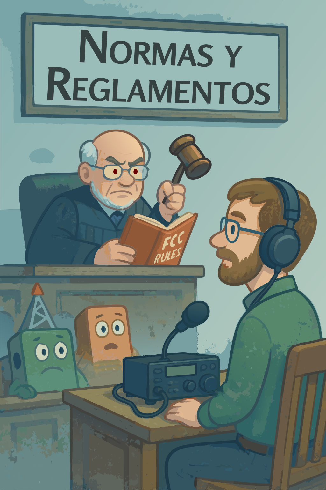

## Capítulo 8: Normas y Reglamentos

{.img-pgcap .float-right}

El capítulo anterior cubrió cómo operar una estación; este cubre las reglas bajo las cuales operas. Las regulaciones de radioafición de la FCC están en la Parte 97 del Código de Regulaciones Federales, y rigen todo: desde quién puede estar al aire hasta qué frecuencias están disponibles y cómo se identifican las estaciones. La mayoría de las reglas existen por razones sensatas: mantener el espectro utilizable para todos, prevenir interferencia perjudicial, apoyar las comunicaciones de emergencia, y una comprensión práctica de ellas forma parte de ser un operador responsable.

Una cosa que vale la pena tener presente durante todo el capítulo: las reglas de la FCC *siempre* se aplican a las estaciones de aficionados. Cuando hay excepciones —por ejemplo, para emergencias— están escritas *dentro* de las reglas, no fuera de ellas. La Parte 97 es un documento completo, y operar "fuera de las reglas" nunca es la respuesta.
