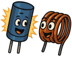

### Section 2.1: Basic Components

When you peek inside a piece of radio gear, you'll see a lot of small parts arranged on a circuit board. Before we look at the individual parts, it's worth understanding the two basic ways any of them can be connected.

#### Circuit Configurations: Series and Parallel

> **Key Information:**
> - In series circuits, current is the same through all components. 
> - In parallel circuits, voltage is the same across all components. 

Every circuit connects components in one of two arrangements (or some mix of both):

- **Series** means the components are wired end-to-end, so there's only one path for current to follow. Since there's just one path, the same current flows through every component.
- **Parallel** means the components are wired across the same two points, giving current multiple paths it can take. Each path sees the same voltage, but the current can split between them.

For the Technician exam, those two facts are all you need. The deeper details — how resistors, capacitors, and inductors specifically behave when combined in series or parallel — are General class material, so we'll keep it surface level here. With that out of the way, let's meet the components themselves.

#### Resistors

> **Key Information:** A resistor opposes the flow of current in any circuit (including a DC circuit). 

*Resistors* are the most common component in electronic circuits, and the simplest: they resist current. The through-hole kind you see in older equipment and hobbyist projects are small cylindrical parts with colored bands around them; the bands encode the resistance value using a standard color code. (You can learn how to read it elsewhere, if you care — you don't need that for the exam.) Modern equipment more often uses tiny surface-mount resistors with their values printed as numbers, but the function is the same.

Common applications in amateur radio include:

1. Dividing voltages to protect delicate components
2. Limiting current to sensitive parts
3. Setting operating points in amplifier circuits

#### Capacitors and Inductors: The Energy Storage Twins

{.img-pgcap .float-right}

A battery stores energy chemically. Capacitors and inductors also store energy, and they do it with fields rather than chemistry — and they each use a different kind of field. That's the one big thing to know about these two components, and it's most of what the exam asks.

##### Capacitors

> **Key Information:**
> - A capacitor stores energy in an electric field. 
> - A capacitor consists of conductive surfaces (usually metal plates) separated by an insulator. 

The physical structure — two conductors with an insulator between them — is what gives a capacitor its ability to hold a charge. Put a voltage across the plates and charge builds up on them, creating an electric field between the plates that stores energy. Remove the voltage and the stored energy stays there until something gives it somewhere to go.

Capacitors come in all sorts of shapes and sizes, from tiny ceramic discs to large cylindrical cans. Their storage capacity is measured in *farads (F)*, though most real-world radio circuits use much smaller values — microfarads (µF) or picofarads (pF).

In amateur radio, capacitors show up in a lot of roles:

1. Smoothing out fluctuations in power supplies (converting AC into clean DC)
2. Blocking unwanted signals or noise, including keeping RF out of audio circuits
3. Helping select or tune specific frequencies in a circuit

WARNING: Capacitors often retain charge for a time after you disconnect power - we'll cover this more in Chapter 5, but messing around with recently-powered capacitors can be pretty dangerous!

##### Inductors

> **Key Information:**
> - Inductors store energy in a magnetic field. 
> - They are typically constructed as a coil of wire. 
> - They are used with capacitors to make a resonant circuit. 

Where a capacitor stores energy in an electric field between plates, an *inductor* stores it in a magnetic field that forms around a coil of wire when current flows through it. That's why nearly every inductor you'll see looks like a coil — the coil shape concentrates the magnetic field and makes the storage effect stronger.

Inductors play a few important roles in radio circuits, including signal filtering, impedance matching, and (together with capacitors) forming the *resonant circuits* that let a radio select one specific frequency out of the many it's receiving. That last one is a big deal — it's how your radio picks a station out of the noise, and we'll come back to it in later chapters.

In terms of retaining charge, Inductors behave differently from Capacitors: they store energy only while current is flowing. Break the current path suddenly, though, and the collapsing field can produce a brief high-voltage spike — usually managed by the circuit, but worth knowing about.

#### Potentiometers

> **Key Information:** A potentiometer is used to control resistance  and is often used as a volume control. 

A *potentiometer* is a resistor you can adjust. As you turn the knob or slide the control, the resistance changes — which makes it useful anywhere you want a continuously-variable setting rather than a fixed value. In amateur radio, they commonly show up as:

1. Volume controls
2. Squelch controls
3. Transmit power adjustments

#### Switches

> **Key Information:**
> * An SPDT (Single Pole, Double Throw) switch allows a single circuit to be switched between one of two other circuits. 
> * You'll also need to recognize an SPST (Single Pole, Single Throw) switch on a circuit diagram. 

{.img-small .float-right .mb-1 .img-bw}

{.img-small .float-right .clear .img-bw}

Switches are described using two terms:

- **Poles**: how many separate circuits the switch controls
- **Throws**: how many positions each circuit can be connected to

So an SPST (Single Pole, Single Throw) switch is your classic on/off switch — one circuit, one position (besides off). An SPDT (Single Pole, Double Throw) switch is similar, but instead of just on/off, it routes the one input between two possible outputs. Think of it like a railroad switch with one incoming track (the pole) that can connect to either of two outgoing tracks (the throws).

In amateur radio, switches show up for things like turning equipment on and off, selecting between antennas, changing bands or modes on a transceiver, and activating features like noise blankers or attenuators.

---

With components in hand, the next question is what else might be inside a radio — and that's where semiconductors come in.
