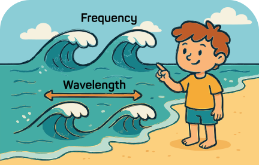
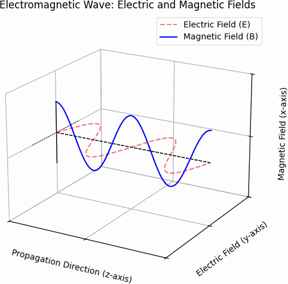

### Section 3.1: Frequency and Wavelength

{.img-pgcap .float-right}

Watch waves at the beach. Some waves come in quickly, one after another, while others roll in more slowly with greater distance between them. Those are two different things: how often waves arrive (frequency) and the distance between them (wavelength). As we'll see, both describe the same wave, and they're linked. Radio waves work in a similar way, but instead of water, they're electromagnetic waves traveling through space at the speed of light.

#### What is RF?

If you spend much time reading about ham radio, you'll see the term **RF** come up. **RF stands for Radio Frequency** — basically, a fancy way of saying "radio signals." RF covers all types of radio signals, whether they're used for voice, data, or other forms of wireless communication.

As we discussed in Chapter 1, **radio frequency energy (RF) is a form of alternating current (AC), but at much higher frequencies than household electricity**. Instead of moving electrons back and forth in a wire, like AC in your home, RF travels as electromagnetic waves through space, carrying signals across short and long distances.

Whether you're tuning in to your favorite broadcast station, chatting on a repeater, or sending data over a satellite link, you're working with RF. It's the bread and butter of all radio communication.

#### The Nature of Radio Waves

> **Key Information:**
> - A radio wave has two components: electric and magnetic fields. 
> - These fields are at right angles to each other. 
> - Radio waves travel at the speed of light in free space (approximately *300,000,000 meters per second*). 
> - All radio frequencies travel at the same velocity in free space — VHF, UHF, microwaves, and all other frequencies. 

{.img-centered .img-large}

What are these fields, exactly? A *field* is a region of space where a force can act on things. You've felt the most familiar one your whole life — gravity is a field around the Earth. Electric fields act on electrical charges (like the static tug of a balloon rubbed on your hair), and magnetic fields act on magnetic materials (like a magnet on your fridge). A radio wave is the two fields oscillating together — as one changes, it creates the other, and the whole pattern travels outward from the antenna at the speed of light.

While all radio frequencies travel at the same speed in the vacuum of free space, radio waves can be slowed down when passing through certain materials — glass, water, or the inside of coaxial cable — so a signal travels slightly slower through a cable than it would through empty space. But in free space, whether it's a 3.5 MHz HF signal or a 10 GHz microwave signal, they all travel at exactly the same speed: the speed of light.

#### Polarization

> **Key Information:** The orientation of the electric field defines a radio wave's polarization. 

Picture holding one end of a rope and shaking it up and down to send a wave along its length — the wave's motion is vertical, so we'd call that a vertically polarized wave. Shake the rope side to side instead, and the wave is horizontally polarized. A radio wave works similarly: the "direction of shake" is the direction its electric field points.

This is crucial because your antenna needs to match this orientation for best reception.

#### Wavelength and Frequency

> **Key Information:**
> - Wavelength gets shorter as frequency increases. 
> - To find wavelength in meters, use this formula: 300 divided by frequency in megahertz. 
> - Amateur radio bands are often identified by their *approximate wavelength in meters*. 

Radio waves come in all sorts of sizes. The size of a radio wave — its wavelength — is directly related to its frequency, and understanding this relationship is key to understanding amateur radio bands.

Wavelength is the physical distance a radio wave travels while completing one full cycle. When you hear about the "2-meter band" or the "70-centimeter band," you're hearing about the approximate wavelength of the signals in that band. We'll dig into the details of the amateur radio spectrum in the next section.

The higher the frequency, the shorter the wavelength. This inverse relationship means that as frequency increases, wavelength decreases proportionally. A signal at 144 MHz (2m band) has twice the frequency and half the wavelength of a signal at 72 MHz.

Here's how to calculate wavelength (which we often refer to with the variable lambda, or λ):

$$\text{Wavelength (}\lambda\text{)} = \frac{300}{\text{Frequency in MHz (}f\text{)}}$$

{.img-small .float-right}

Like when we talked about Ohm's law, we can make a simple circle diagram for this relationship as well, though we need to use the symbols for brevity:

To use this helper:
1. Cover up the variable you want to find
2. The remaining pieces show you how to calculate it

   - Cover λ (wavelength): divide $\frac{300}{frequency}$.

   - Cover ƒ (frequency): divide $\frac{300}{wavelength}$.

For example, let's calculate the wavelength for the 2-meter band (144 MHz):

$$
\begin{align*}
\text{Wavelength} &= \frac{300}{144}\\
&= 2.08 \text{ meters}
\end{align*}$$

That's why we call it the 2-meter band!

#### Resonance and Antenna Design

When an antenna's length matches the wavelength — or certain specific fractions of it, like a quarter wavelength — it resonates like a tuning fork. This physical matching creates optimal conditions for the antenna to absorb or emit electromagnetic energy at that specific frequency, resulting in much more efficient signal transmission and reception.

For example, a half-wave dipole antenna for the 2-meter band would be about 1 meter long (half of 2.08 meters). We'll explore this more when we discuss antennas!

---

Now that we understand how wavelength and frequency relate to each other, let's look at how the radio spectrum is actually divided up — and why different parts of it behave so differently.
